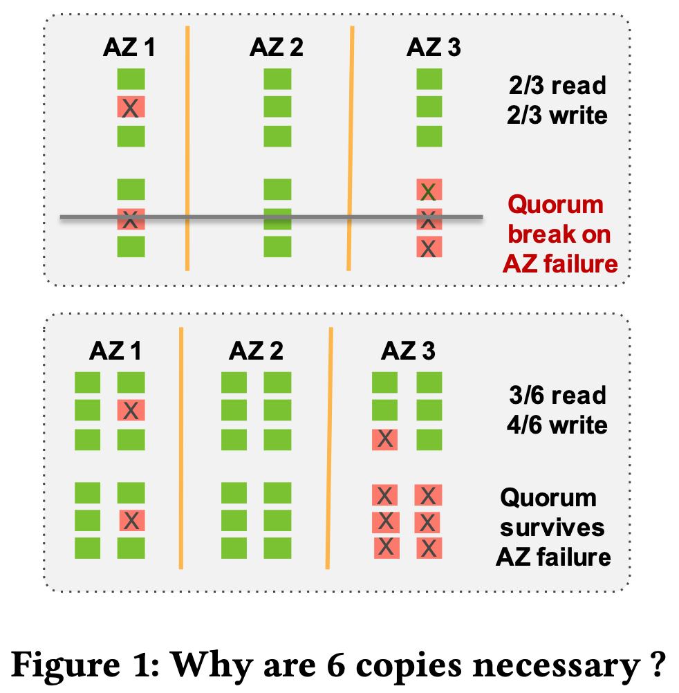
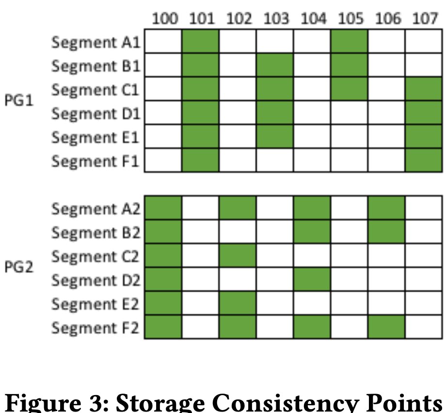
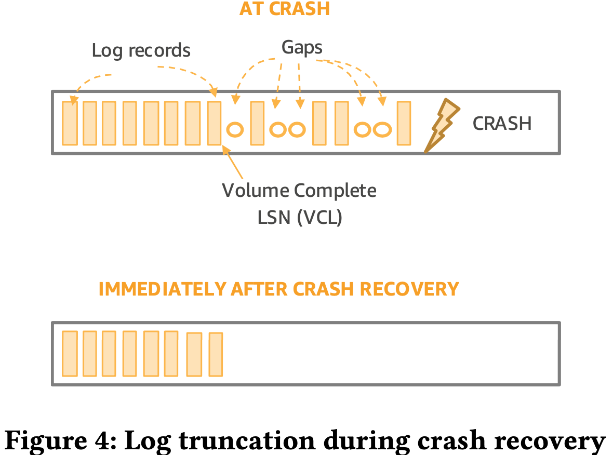
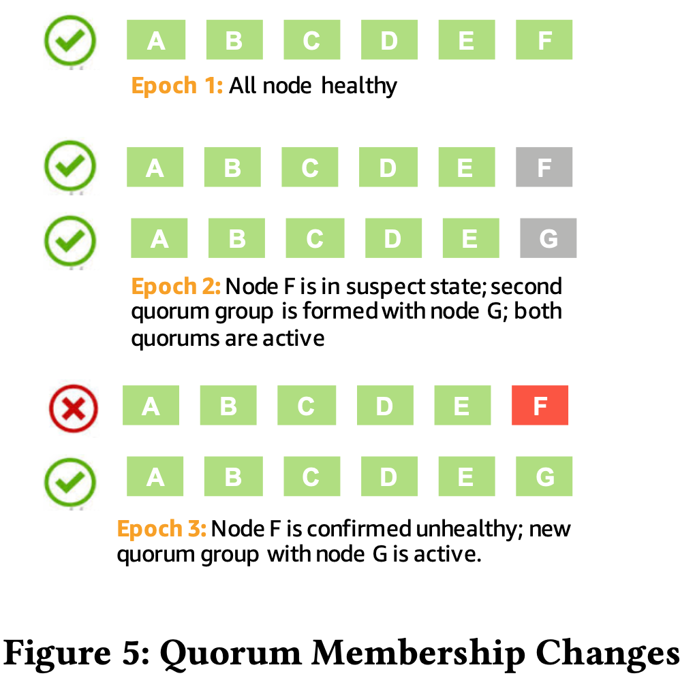

# Amazon Aurora: On Avoiding Distributed Consensus for I/Os, Commits, and Membership Changes

## ABSTRACT

High-throughput cloud-native OLTP. It pushes redo processing to a multi-tenant scale-out storage service, purpose-built for Aurora. Reduces networking traffic, avoids checkpoints and crash recovery, enables failovers to replicas without loss of data, and enables fault-tolerant storage that heals without database involvement. 

Paper presents how Aurora avoids Distributed consensus algorithms for commits, reads, replication, and membership changes and **amplify cost of underlying storage**.

## 1 INTRODUCTION

Revist *Amazon Aurora- Design Considerations for High Throughput Cloud-Native Relational Databases*

Supports “AZ+1” failures, resulting in 6 copies of data, spread across 3 AZs, a 4/6 write quorum, and a 3/6 read quorum. 

2PC, Paxos can be expensive and incur additional network overheads. 

How Aurora as a single-writer databases leverages 

1. **only quorum I/Os**
2. **locally observable state**
3. **monotonically increasing log ordering**

to provide high performance, non-blocking, fault-tolerant I/O, commits, and membership changes.

## 2 MAKING WRITES EFFICIENT

### 2.1 Aurora System Architecture

Aurora storage is partitioned into segments that individually store the redo log for their portion of the database volume as well as coalesced data blocks. Segments (<10GB) in Aurora are the minimum unit of failure. Segments are replicated into protection groups.

**segment := redolog + table space data pages (addressable data blocks)**

See *Amazon Aurora- Design Considerations for High Throughput Cloud-Native Relational Databases 3.3 Storage Service Design Points*

How to lose the ability to repair a quorum? Two independent segment failures as well as an AZ failure in the same 10 second period to lose the ability to repair a quorum. overly conservative.

### 2.2 Writes in Aurora

Writes that cross the network from the database instance to the storage node are redo log records. 

Redo log application code is run within the storage nodes, materializing blocks in background or on-demand to satisfy a read request.

In database node, changes to data blocks modify the image in the Aurora buffer cache and add redo record to a log buffer. These are periodically flushed to a storage driver to be made durable. They are shuffled to individual write buffers for each storage node storing segments for the data volume. The driver asynchronously issues writes, receives acknowledgments, and establishes consistency points.

Each log record stores the LSN, previous LSN for the segment, previous LSN for the block (page?).

**block chain**: materialize individual blocks on demand. 

**segment chain**: fill in these holes by gossiping. The full log chain provides a fallback path to regenerate storage volume.

boxcar redo log (batch?) improve throughput.

### 2.3 Storage Consistency Points and Commits

Traditional relational database

- write a commit redo log record

- boxcar commits together using group commit

- flush the log. 

2PC commit, or a Paxos commit, or variant,  heavyweight and introduces stalls and jitter into the write path. 

SCL, PGCL, VCL, CPL, VDL, see  *Amazon Aurora- Design Considerations for High Throughput Cloud-Native Relational Databases 4.1 Solution sketch: Asynchronous Processing*.

Example:

PG1 and PG2, consisting of segments A1-F1 and A2-F2. Each solid cell represents a log record acknowledged by a segment, with the odd numbered log records going to PG1 and the even numbered log records going to PG2 (just example, in reality, it refers to odd and even page numbers, //TODO double confirm). PG1’s PGCL is 103 because 105 has not met quorum, PG2’s PGCL is 104 because 106 has not met quorum, and the database’s VCL is 104 which is the highest point at which all previous log records have met quorum.

No consensus is required, no vote in determining whether to accept a write, they must do so, by **advance all kinds of XXL**, **idempotent operations executed as local ephemeral state on the database instance** based on the communication between the database and storage nodes.

System Commit Number (SCN), is below VCL.

**Multiplexing in database instance**: User sessions are multiplexed to worker threads, when a commit is received, the worker thread writes the commit record, puts the transaction on a commit queue, and returns to a common task queue to find the next request to be pro- cessed. When a driver thread advances VCL, it wakes up a dedicated commit thread that scans the commit queue for SCNs below the new VCL and sends acknowledgements to the clients waiting for commit. 

### 2.4 Crash Recovery in Aurora

Manage **consistency points in the database instance** rather than establishing consistency across multiple storage nodes. BIG DIFF from other solutions Spanner/TiDB!

Instance state is ephemeral,  re-compute / construct PGCLs and VCL from local SCL state at storage nodes when recovery.

Increments an epoch. do not accept stale volume epochs.

No redo replay is required.

Undo of previ- ously active transactions is required.

## 3 MAKING READS EFFICIENT

### 3.1 Avoiding quorum reads

To achieve MVCC, a **read view** establishes a logical point in time before which a SQL statement must see all changes and after which it may not see any changes other than its own.

Aurora MySQL does this by establishing the most recent SCN and a list of transactions active as of that LSN. Establish most recent SCN and a list of transactions active as of that LSN. Data blocks seen by a read request must be at or after the read view LSN and back out any transactions either active as of that LSN or started after that LSN.

Aurora can do snapshot isolation easily.

When to clear undo? undo records may not be purged until all read views have advanced.

Redo log records for dirty blocks should be made durable before discarding the block from cache. 

Aurora does not do quorum reads. Databases instance knows last durable version of a data block and can request it directly from any of those segments.

### 3.2 Scaling Reads Using Read Replicas

Traditional approach: replication of logical statement updates synchronously if no data loss in failover, asynchronously but introduce replica lag. doubles costs.

Aurora read replicas attach to the storage volume, receive physical redo log stream from single-node writer. update only data blocks present in their local caches. Redo records for uncached blocks can be discarded.

### 3.3 Structural Consistency in Aurora Replicas

A single writer has local state for all writes and can easily coordinate snapshot isolation, consistency points for storage, transaction ordering, and structural atomicity. It is more complex for replicas.

But for read replica, replica read views must lag VDL. Structural changes, like B-Tree splits and merges, must be made visible to the replica atomically.

MTR are performed atomically. Writer in database instance uses latches for each data block. Replicas do not have latching, to create equivalent ordering, log records are only shipped from the writer instance in MTR chunks. At the replica, they must be applied in LSN order, applied only if above the VDL in the writer as seen in the replica, and applied atomically in MTR chunks to the subset of blocks in the cache.

### 3.4 Snapshot Isolation and Read View Anchors in Aurora Replicas

Writer sends VDL to replica. Read views at the replica are built based on VDL points and transaction commit history. Replicas revert active transactions for MVCC using undo, just as on the writer instance.

How to do GC? Protection Group Minimum Read Point LSN (PGM- RPL), representing the lowest LSN read point for any active request on that database instance. Only accept read requests between PGMRPL and SCL.

## 4 FAILURES AND QUORUM MEMBERSHIP

Using Quorum Sets to Change Membership.

## FAQ

Q: Does Aurora supports multi-writer?

A:

Q: How does Aurora split data pages across storage nodes?

A: segment := redolog + table space data pages, range partition?