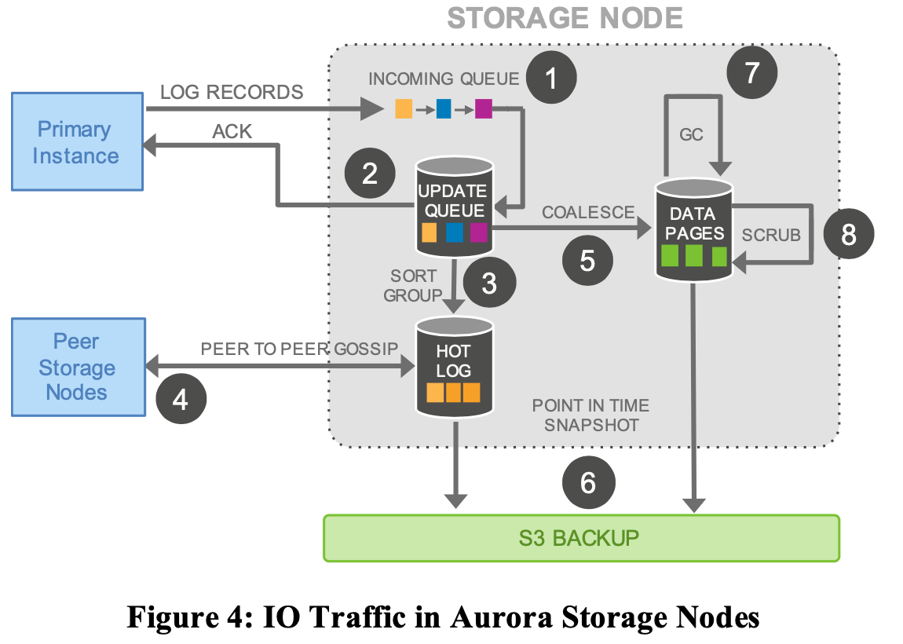

# Amazon Aurora: Design Considerations for High Throughput Cloud-Native Relational Databases

## Highlight

Pushing redo processing to a multi-tenant scale-out storage service, purpose-built for Aurora.

Loosely coupled to a fleet of database instances.

Decoupling compute from storage.

Replicating storage across multiple nodes.

**Architecture**:

Database instances: traditional kernel

- query processor
- transactions
- locking
- buffer cache
- access methods
- undo management

Storage service: off-load below operations to

- redo logging
- durable storage
- crash recovery
- backup/restore

**Pain Points** of traditional database like MySQL in the environment:

- The bottleneck moves to the network between the database tier requesting I/Os and the storage tier that performs these I/Os.

- Synchronous operations imposing stall. e.g. 1) BufferPool miss -> disk read, 2) evicting and flushing dirty pages, 3) checkpoint. These result in stalls and context switches. 

- Transaction commits.

**Advantages** of decoupling compute from storage

Flexiability & Elasticity.

Storage: Availability. Scale-out. Independent fault- tolerant and self-healing service across multiple data-centers. 

High Performance: Only writing redo log records to storage, we are able to reduce network IOPS by an order of magnitude. 

Stablized performance & fast recovery: Anti-Sync in foreground, avoid noise: Move backup and redo recovery from one-time expensive operations in the database engine to continuous asynchronous operations amortized across a large distributed fleet. Near-instant crash recovery without checkpointing. Inexpensive backups that do not interfere with foreground processing.

## 2. DURABILITY AT SCALE

### 2.1 Replication and Correlated Failures

In order to couple with background noise of node, disk and network, use quorum-based voting protocol, Vr + Vw > V,  Vw > V/2. Replicate each data item 6 ways across 3 AZs with 2 copies of each item in each AZ. 

Tolerate

losing an entire AZ and one additional node (AZ+1) without losing data and read availability.

losing an entire AZ without impacting the ability to write data.

### 2.2 Segmented Storage

Reduce MTTR to shrink the window of vulnerability to a double fault.

Partition database volume into small fixed 10GB size segments. Protection Groups (PGs) consists of six 10GB segments. A storage volume is a concatenated set of PGs (EC2 + attached SSD). Up to 64 TB volume size.

Each segment of each PG only sees a subset of log records in the volume.

Segments are unit of independent background noise failure and repair. Can be repaired in 10 seconds on a 10Gbps network link.

### 2.3 Operational Advantages of Resilience

heat management + OS and security patching + software upgrades 

## **3. THE LOG IS THE DATABASE**

### 3.1 The Burden of Amplified Writes

Sequential and synchronous steps with high latency and jitter:

1. Modify data pages in memory. If data page does not sit in memory, load from EBS.
2. Write redo log buffer. (Prepare) Redo log will be applied on the in-memory before-image to produce its after-image.
3. Write binlog.
4. Commit trx (commit).
5. Ack.
6. (Optional, maybe sync or async) If checkpoint or Buffer Pool is full, persist data pages to disk. In addition, a second temporary write of the data page (double-write) to prevent torn pages. 
7. dump_thread captures binlog and send to slave instance.

### 3.2 Offloading Redo Processing to Storage

The only writes that cross the network are redo log records. Model the database as a redo log stream.

Materialize database pages in the background to avoid regenerating them from scratch on demand, this is optional from the perspective of correctness: as far as the engine is concerned, **the log is the database**.

Only pages with a long chain of modifications need to be rematerialized.

Scale out I/Os in an parallel fashion. 

The IO flow **batches** fully ordered log records based on a common destination (a logical segment, i.e., a PG) and delivers each batch to all 6 replicas.

Other benifit besides performance, improves **availability** by minimizing crash recovery time (10G segment in 10 seconds) and eliminates **jitter** caused by background processes such as checkpointing, background data page writing and backups.

checkpoint + replay the log is normal.

### 3.3 Storage Service Design Points

Steps: only steps (1) and (2) are in the foreground path.

1. receive log record and add to an in-memory queue
2. persist record on disk and acknowledge
3. organize records and identify gaps in the log since some batches may be lost
4. gossip with peers to fill in gaps
5. coalesce log records into new data pages
6. periodically stage log and new pages to S3
7. periodically garbage collect old versions
8. periodically validate CRC codes on pages.

Minimize the latency of the foreground write request vs. MySQL background writes of pages and checkpointing have positive correlation with the foreground load on the system.

## 4. THE LOG MARCHES FORWARD

### **4.1 Solution sketch: Asynchronous Processing**

Log Sequence Number (LSN):  monotonically increasing value generated by the database.

At a high level, we maintain points (LSN) of consistency and durability, and continually advance these points.

Storage node gossips with the other members of their PG to fill LSN gap.

SCL (Segment Complete LSN):  low watermark below which all the log records has been received. One storage node's LastLogIndex, this is from single node perspective, Aurora uses SCL to fill gaps across all 6 replicas. 表示最大的保证完整的LSN，即这个Segment在SCL之前是完整、没有空洞的。

PGCL (Protection Group Complete LSN): 每个分片有各自的PGCL,database level's VCL is the largest PGCL.

VCL (Volume Complete LSN): PG. During storage recovery, every log record with an LSN larger than the VCL must be truncated. CommitIndex, from storage nodes perspective as a unified view. storage node这一层多个节点已经同步，并且保证了一致性。

CPL (Consistency Point LSN):

VDL (Volume Durable LSN): the highest CPL that is smaller than or equal to VCL. On recovery, the database talks to the storage service to establish the durable point of each PG and uses that to establish the VDL and then issue commands to truncate the log records above VDL.

For example, even if we have the complete data up to LSN 1007, the database may have declared that only 900, 1000, and 1100 are CPLs, in which case, we must truncate at 1000. We are *complete* to 1007, but only *durable* to 1000.

The database and storage interact as follows:

- Each database-level transaction is broken up into multiple mini-transactions (MTRs) that are ordered and must be performed atomically.
- Each mini-transaction is composed of multiple contiguous log records (as many as needed).
- The final log record of each MTR is tagged as a  CPL consistency point.

### **4.2 NormalOperation**

### *Writes*

Advance VDL, register transactions as committed.

### *Commits*

Complete a commit, if and only if, the latest VDL is greater than or equal to the transaction’s commit LSN. 

As the VDL advances, the database identifies qualifying transactions that are waiting to be committed and uses a dedicated thread to send commit acknowledgements to waiting clients. 

### *Reads*

In MySQL, if buffer cache is full, the system finds a victim page to evict from the cache, and flush to disk. Aurora database does not write out pages on eviction. It enforces a similar guarantee: a page in the buffer cache must always be of the latest version. 

No consensus using a read quorum. When reading a page from disk, the database establishes a *read-point*, representing the VDL at the time the request was issued. issue a read request directly to a segment that has sufficient data.

Protection Group Min Read Point LSN **(**PGMRPL**)** and represents the “low water mark” below which all the log records of the PG are unnecessary. Advance the materialized pages on disk by coalescing the older log records and then safely garbage collecting them.

### *Replicas*

A single writer and up to 15 read replicas can all mount a single shared storage volume.

To minimize lag (<20ms), the log stream generated by the writer and sent to the storage nodes is also sent to all read replicas. Reader discards the log record if records are not present in Buffer Pool.

The replica obeys the following two important rules while applying log records: 

- (a) the only log records that will be applied are those whose LSN is less than or equal to the VDL, 
- (b) the log records that are part of a single mini-transaction are applied atomically in the replica's cache to ensure that the replica sees a consistent view of all database objects.

### **4.3 Recovery**

**NO ARIES**. ARIES: A transaction recovery method supporting fine-granularity locking and partial rollbacks using write-ahead logging. WAL + Checkpoint. This process brings the database pages to a consistent state at the point of failure after which the in-flight transactions during the crash can be rolled back by executing the relevant undo log records. 

redo log applicator decoupled from the database and operates on storage nodes, in parallel, and all the time in the background. 

The database still needs to perform undo recovery to unwind the operations of in-flight transactions at the time of the crash. However, undo recovery can happen when the database is online after the system builds the list of these in-flight transactions from the undo segments.

## **5. PUTTING IT ALL TOGETHER**

keyword: InnoDB, WAL in LSN order, buffer pages, double-write technique to avoid partial page writes, checkpoint, transaction subsystem, lock manager,  B+-Tree implementation and the associated notion of a “mini transaction” (MTR). An MTR is a construct only used inside InnoDB and models groups of operations that must be executed atomically (e.g., split/merge of B+-Tree pages).

Aurora supports exactly the same isolation levels.

Concurrency control is implemented entirely in the database engine.

The storage service presents a unified view of the underlying data.

## FAQ

**Q: How does Aurora scale-out? **

A: segment storage. Segmented redo log. 10GB.

**Q: How to determine what pages to be materialized?**

A: a long chain of modifications? how? does Aurora store page to LSN chain mapping? How to GC redo log if most pages are changed only once in a while? will this lead to long lasting redo log segment? No because "Checkpointing is governed by the length of the entire redo log chain. Aurora page materialization is governed by the length of the chain for a given page." 

Protection Group Min Read Point LSN **(**PGMRPL**)** and represents the “low water mark” below which all the log records of the PG are unnecessary. Advance the materialized pages on disk by coalescing the older log records and then safely garbage collecting them.

**Q: Where does undo log reside?**

A: In database node, not storage node.

**Q: How sharding works in Aurora?**

A: Table space are partitioned by 10G segment. 6 segments form a PG. PG and storage service are N:1. Data pages with Page No. are always routed to specific segment, alongside with redo log where each log record is associated with a page number. //TODO double confirm.

