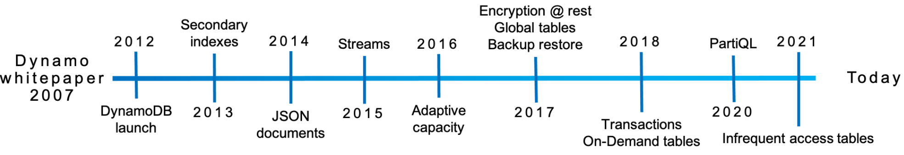
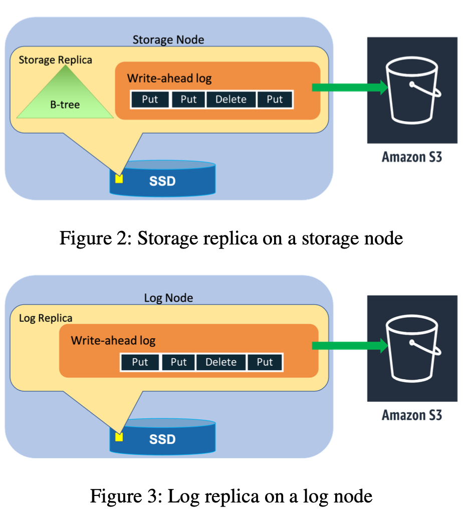
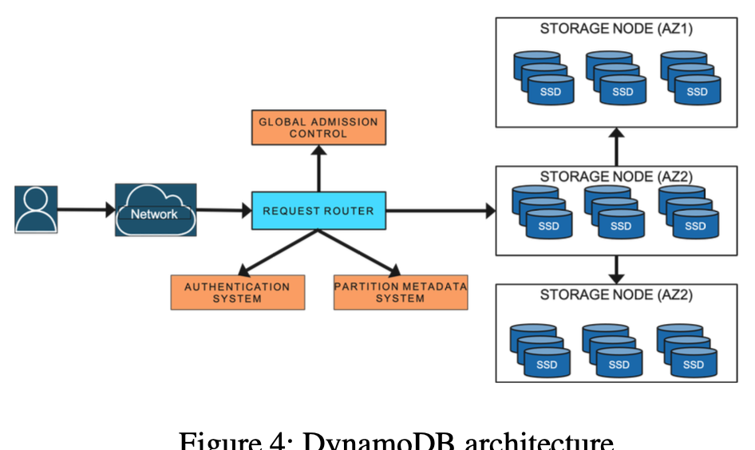
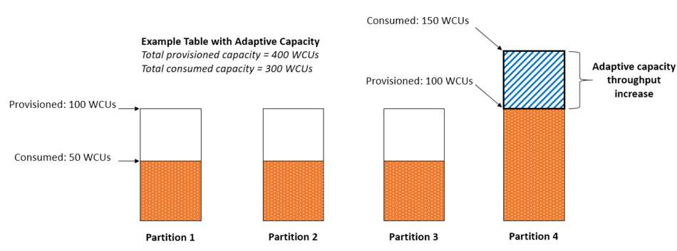
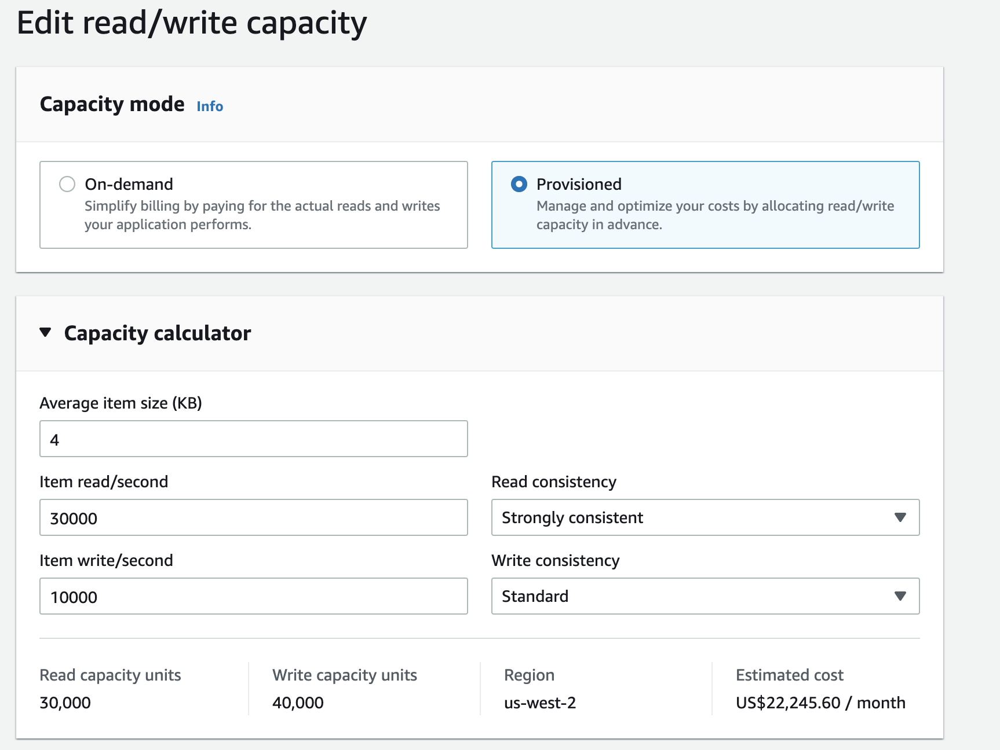
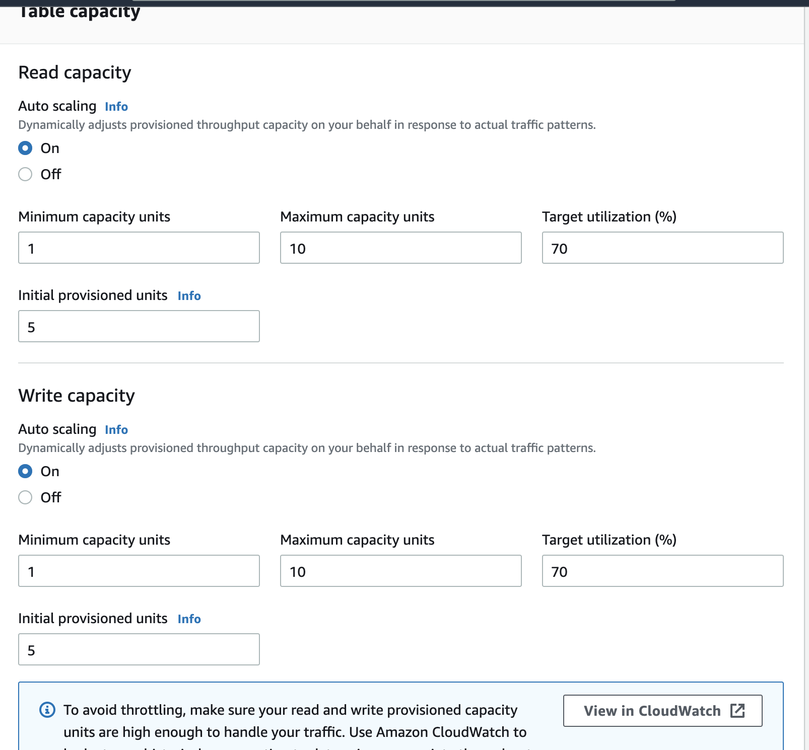

# Amazon DynamoDB: A Scalable, Predictably Performant, and Fully Managed NoSQL Database Service

## Abstract

Amazon DynamoDB is a NoSQL cloud database service that provides consistent performance at any scale. Hundreds of thousands of customers rely on DynamoDB for its fundamen- tal properties: consistent performance, availability, durability, and a fully managed serverless experience. In 2021, during the 66-hour Amazon Prime Day shopping event, Amazon systems - including Alexa, the Amazon.com sites, and Amazon fulfill- ment centers, made trillions of API calls to DynamoDB, peak- ing at 89.2 million requests per second, while experiencing high availability with single-digit millisecond performance. Since the launch of DynamoDB in 2012, its design and im- plementation have evolved in response to our experiences operating it. The system has successfully dealt with issues related to fairness, traffic imbalance across partitions, moni- toring, and automated system operations without impacting availability or performance. Reliability is essential, as even the slightest disruption can significantly impact customers. This paper presents our experience operating DynamoDB at a massive scale and how the architecture continues to evolve to meet the ever-increasing demands of customer workloads.

Dynamo in 2007 != DynamoDB, the AWS service which described in this paper

## 1. Introduction

### What is DynamoDB?

DynamoDB is a cloud-native NoSQL database that supports fast (single-digit millisecond latency), consistent and predictable performance with high availability and reliability and low operational complexity at any scale. 

For more than 10 years, DynamoDB has powered Amazon and AWS key businesses with game-changing features that this paper focuses, such as on-demand capacity, point-in-time backup and restore, multi-Region replication, and atomic transactions.

### System properties
- **Fully managed cloud service**: No patching, No hardware and software management, No configuration and provision, No operation. This is unlike self-managed Dynamo in 2007. 
- **Multi-tenant architecture**: High utilization of resources in Cloud.
- **Boundless scale for tables**
- **Predictable performance**: Due to the distributed nature of data placement and request routing algorithms in DynamoDB, horizontal scaling and auto-partitions and re-partitions.
- **highly available**: data is stored on SSDs and replicated across multiple AZs, SLA of 99.99%, 99.999% for global tables.

### History

Amazon had to start from **first principles** when designing Dynamo in 2007, redesign to DynamoDB. 

Below shows important timelines of DynamoDB with ever-expanding feature set.

## 2. Architecture

A table is a collection of **items**, and each item is a collection of **attributes**. Items in DynamoDB are similar in many ways to rows, records, or tuples in other database systems. Most of the attributes are scala, nested attribute(up to 32 levels deep)

**Primary key ::= partition key + sort key (optional)**.

Partition key: one attribute, a scalar, must be string, number, or binary. hash function determines where to store to item.

Partition key and Sort key: composite primary key. Table with sort key stores items with the same partition key **physically close** together, in **sorted order by** the sort key value.

**Global secondary indexes**: PK can be any two attributes from its table.

**Local secondary indexes**: PK must be the same as the partition key of its table. The sort key can be any other attribute.

Data in a secondary index is eventually consistent with its table. The sort key value does not need to be unique. When you create an index, you define an alternate key for the index (partition key and sort key). You also define the attributes that you want to be projected, or copied, from the base table into the index. DynamoDB copies these attributes into the index, along with the primary key attributes from the base table. 二级索引是独立的表，类似mysql的二级索引，覆盖索引，同时指向pk的key.

ACID **transactions supported**, up to 100 items in single trx.

DynamoDB table is **divided into multiple partitions**. Each partition of the table hosts a **disjoint and contiguous part** of the table’s key-range. **Multiple replicas** distributed across different AZs. **Replication group** uses **Multi-Paxos** with leadership election and renew, lease.

Leader handles write, generate **WAL(write-ahead log)** record and sends it to replicas. A write is acknowledged to the application once a **quorum** of peers persists the log record to their local write-ahead logs.

Storage node ::= B-tree + WAL. **log replicas** (only contain WAL) can exist.

Other services:
- Metadata service: routing, indexes, and replication groups information.
- Request routing service: 
- Autoadmin service: fleet health checks, partition health, scaling of tables, and execution of all control plane requests

## 3. Highlight Designs

### 3.1 Journey from provisioned to on-demand

Background: RCU and WCU

To control throughput, concept of Read capacity units (RCUs) and Write capacity units (WCUs).

One read request unit represents one strongly consistent read request, or two eventually consistent read requests, for an item up to 4 KB in size. 

One WRU represents one write for an item up to 1 KB in size. 

For any operation that returns items, you can request a subset of attributes to retrieve. However, doing so has no impact on the item size calculations. 多读和少读列是没区别的，因为底层是行存引擎。

Pain Point:

DynamoDB enforced a cap on the maximum throughput for a paritition, total throughput of all the partitions <= storage node max throughput. Idea case is uniform distribution of throughput across partitions, but non-uniform access patterns **hot partitions** or **heavily skewed access** result in **spikes** and **throttling** (In extreme cases, throttling can occur if a single partition receives more than 3,000 RCUs or 1,000 WCUs.)

Solution:

- **Bursting**: Absorb **temporal spikes** in workloads at a partition level. Users can retain up to 5 minutes (300 seconds) of unused RCU or WCU. During an occasional burst of read or write, these extra capacity units can be consumed quickly, way out is balancing consumed capacity.

- **Adaptive capacity**: Absorb **long-lived** spikes. But it is reactive and kicked in post-throttling, way out is to placed adaptive capacity with global admission control (GAC) //TBD.

- **Splitting for consumption**: Auto-scale out partitions based on the throughput consumed, partition split.

- **On-demand vs. provisioned mode**: On-demand tables remove the burden from our customers of figuring out the right provision- ing for tables. auto allocates more capacity. pay-per-request pricing

### 3.2 Durability and correctness

Write-ahead logs replicated across three nodes and archived to the durable S3 storage service.

Quick healing of failed nodes by creating log replicas to maintain three replicas.

Extensive use of checksums to detect silent data corruption **data-in-transit**.

Continuous verification of **data-at-rest** across replicas and against archived logs to detect bit rot.

Extensive failure injection and stress testing to catch bugs before production.

### 3.3 Backups and restores

**Full backups** are created using the archived write-ahead logs in S3

**Point-in-time restore** in last 35 days, snapshot + WAL replay.

### 3.4 Availability

Maintaining write availability through write quorums and introducing log replicas when needed. Failure detection. Measuring availability.

## Appendix

### First Principle

First principle introduction.

https://en.wikipedia.org/wiki/First_principle

https://w.amazon.com/bin/view/MakingGreatDecisions/First_Principles_Thinking/

https://www.linkedin.com/pulse/first-principles-thinking-sahil-bloom/

Jeff explains the first principles for Amazon’s retail business, the stable building blocks.

https://www.ideatovalue.com/lead/nickskillicorn/2021/02/jeff-bezos-rule-what-will-not-change/

The First Principles Method Explained by Elon Musk.

https://www.youtube.com/watch?v=NV3sBlRgzTI

Jensen Huang on First Principles.

https://www.youtube.com/watch?v=rRe2tVDyX34
 

