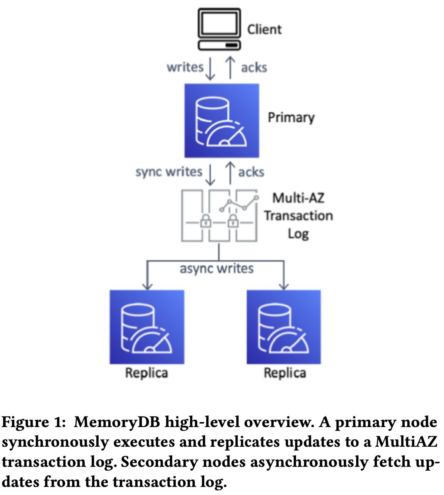
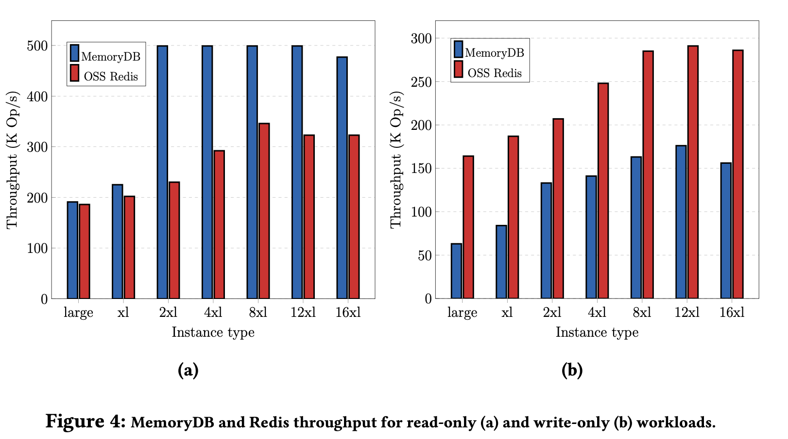
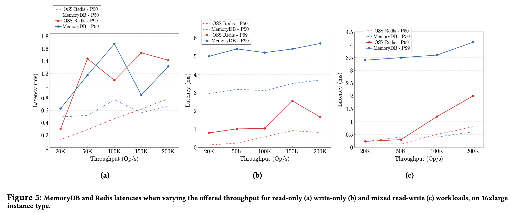

# Amazon MemoryDB: A fast and durable memory-first cloud database

SIGMOD/PODS 2024 https://www.amazon.science/publications/amazon-memorydb-a-fast-and-durable-memory-first-cloud-database

## Abstract

Amazon MemoryDB for Redis is a database service designed for 11 9s of durability with in-memory performance. In this paper, we describe the architecture of MemoryDB and how we leverage open-source Redis, a popular data structure store, to build an enterprise-grade cloud database. MemoryDB offloads durability concerns to a separate low-latency, durable transaction log service, allowing us to scale performance, availability, and durability independently from the in-memory execution engine. We describe how, using this architecture, we are able to remain fully compatible with Redis, while providing single-digit millisecond write and microsecond-scale read latencies, strong consistency, and high availability. MemoryDB launched in 2021.

## Why

Open Source Software (OSS) Redis and Amazon ElastiCache offers in-memory caching solution. There is need for durability of cache, see described use case paper.

## What

- MemoryDB is a fully managed in-memory cloud-based database service. 
- We built MemoryDB to provide in-memory performance with multi-AZs durability, strong consistency, and high availability. 
- MemoryDB ensures strong consistency with 99.99% availability while providing microsecond read and single-digit millisecond write latencies. 
- MemoryDB uses Redis as an in-memory execution engine and offloading data persistence to an internal scale-out transaction log service. Leverage **separation of concerns** design principle.

## Challenges of Maintaining Durability and Consistency in Redis

At Amazon, we design for failures, and although Redis does a good job at maintaining high availability, it can lose data.

**Data Loss During Failover**: Redis uses a quorum-based approach for both failure detection and election of new primaries. Host level Point-in-time snapshots and on-disk transaction log Append-Only File (AOF) allows persistence, but it is not distributed. No mechanism to ensure the elected replica received all acknowledged updates as replication between primary and replica nodes is asynchronous. Cause loss of the writes.

## How MemoryDB does?

### Decoupling Durability

Similar approach to Amazon Aurora.

Eventually consistent copy of the data set.

MemoryDB offloads durability by leveraging a distributed transaction log service. A transaction log provides low-latency and strongly consistent commits across multiple AZs.

We use Redis as an in-memory execution and storage engine but **intercept and redirect its replication stream into the transaction log**, which is responsible for 1) propagation of writes to replicas and 2) leader election.

The replicas read the replication stream sequentially from the transaction log and stream it into Redis.

### Maintaining Consistency

MemoryDB provides linearizability by making propagation to the multi-AZ transaction log synchronous.

Use write-behind logging. Passive replication. Mutations are executed on a primary node before being committed into the transaction log. If fails, no ack.

HIGHLIGHT HERE!!!

**After a client sends a mutation, the reply from the mutation operation is stored in a tracker until the transaction log acknowledges persistence and only then sent to the client. Meanwhile, the Redis workloop can process other operations. Non-mutating operations can be executed immediately but must consult the tracker to determine if their results must also be delayed until a particular log write completes. Hazards are detected at the key level. If the value or data-structure in a key has been modified by an operation which is not yet persisted, the responses to read operations on that key are delayed until all data in that response is persisted. Replica nodes do not require blocking as mutations are only visible once committed to three AZs.**

[Xu's understanding] Tracker stores log, mutation writes to Redis in-memory engine first, then result writes to Tracker's slot, then hold request until log commit callback, and unblock main thread loop (Redis is single-threaded). After log commits, release request and ack to client. Read-after-write is guaranteed.

```
Tracker stores log

+--+--+--+--+--+--+--+--+--+--+
|  |  |  |  |  |  |  |  |  |  |
+--+--+--+--+--+--+--+--+--+--+
```



### Leader Election

No more leader-follower with a majority-based quorum. Leverage the transaction log to build the leader election.

- ensures leader singularity. 
- does not require any cluster quorum for **liveness**, therefore improving availability over Redis cluster bus leadership mechanism. No split-brain.

### Recovery

Recovering replica loads a recent point-in-time snapshot and then replays subsequent transactions.

MemoryDB periodically creates snapshots and stores them durably in S3.

## Evaluation

Performance Benchmark

- Throughput

Read-only workloads (Figure 4a), MemoryDB outperforms Redis. Because MemoryDB Enhanced IO Multiplexing [8] aggregates multiple client connections into a single connection to the engine, improving processing efficiency and delivering higher throughput.

Write-only workloads (Figure 4b), Redis outperforms MemoryDB. Because MemoryDB commits every single write to the multi-AZ transaction log, resulting in higher request latency.



- Latency

Read-only workloads (Figure 5a), Redis and MemoryDB have a similar latency.

Rrite-only (Figure 5b) workloads, Redis delivers sub-millisecond median latencies and up to 3 milliseconds on p99, while MemoryDB delivers 3 milliseconds on median and up to 6 milliseconds on p99. **MemoryDB tradeoffs latency for durability, so a bit slower in write.**



## Appendix

### What is valkey?

https://github.com/valkey-io/valkey

Less than a week after Redis Inc. announced it was [removing the open source license](https://redis.io/blog/redis-adopts-dual-source-available-licensing/) and pulling out of the Redis project, Redis contributors banded together to move the community to The Linux Foundation as the Valkey project. They did this almost immediately after the license change announcement went live, in response to community outcry on GitHub and on social media, asking to fork the project or join an existing fork. More here.
 
### How is memoryDB different than Redis?

Open source Redis allows writes and strongly consistent reads on the primary node of each shard and eventually consistent reads from read replicas. These consistency properties are not guaranteed if a primary node fails, as writes can become lost during a failover and thus violate the consistency model.The consistency model of MemoryDB is similar to open source Redis. However, in MemoryDB, data is not lost across failovers, allowing clients to read their writes from primaries regardless of node failures. Only data that is successfully persisted in the multi-AZ transaction log is visible. Replica nodes are still eventually consistent, with lag metrics published to Amazon CloudWatch.
 


