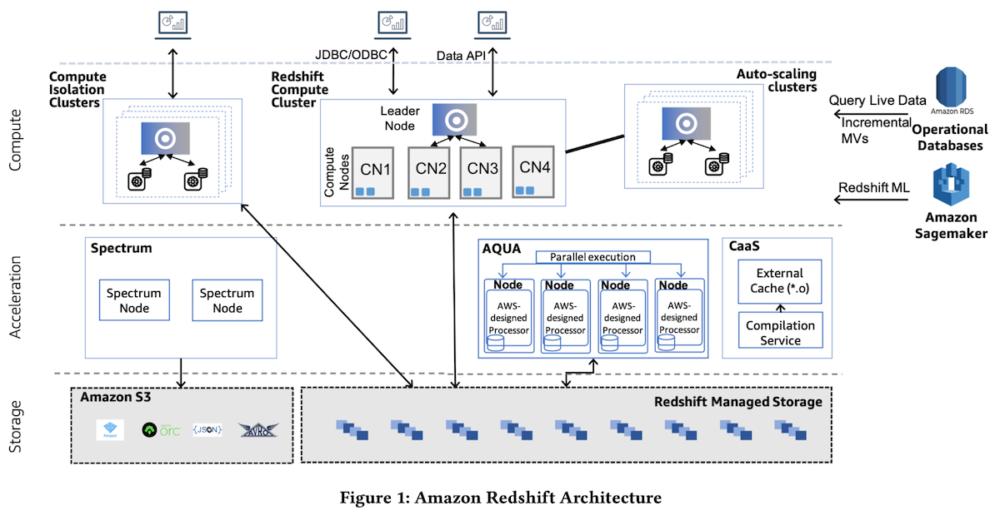
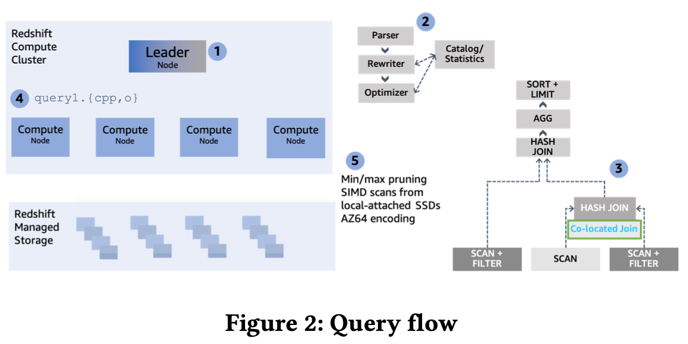
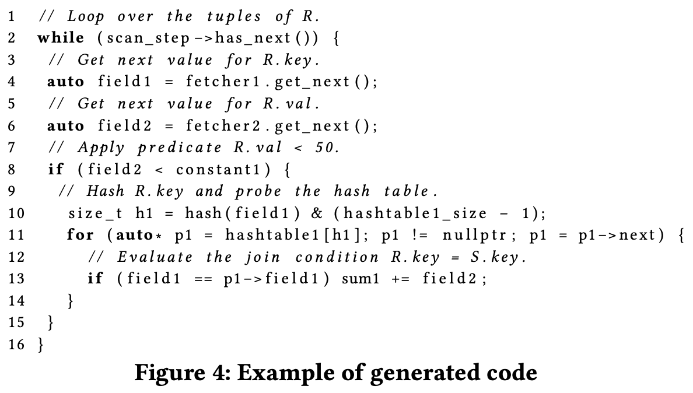
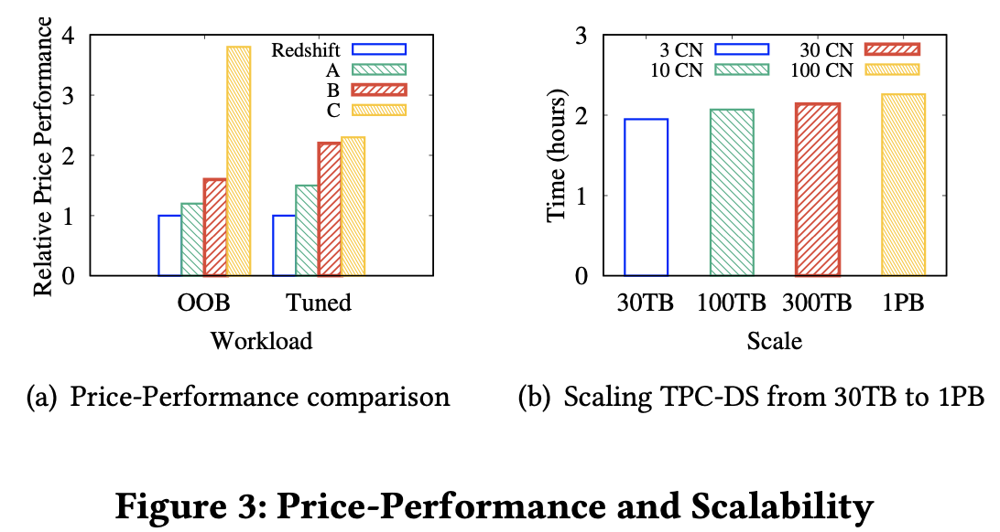
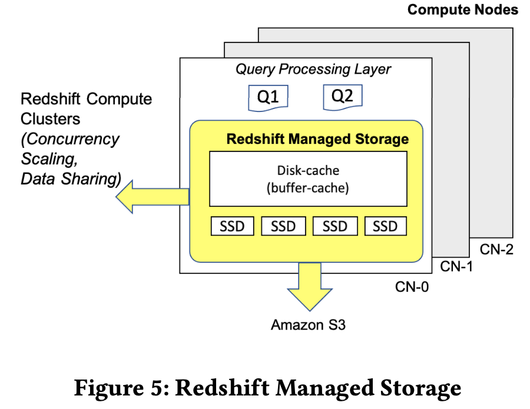

# Amazon Redshift Re-invented

SIGMOD 2022

## ABSTRACT

In 2013, Amazon Web Services revolutionized the data warehousing industry by launching Amazon Redshift, the first fully-managed, petabyte-scale, enterprise-grade cloud data warehouse. Amazon Redshift made it simple and cost-effective to efficiently analyze large volumes of data using existing business intelligence tools. This cloud service was a significant leap from the traditional on-premise data warehousing solutions, which were expensive, not elastic, and required significant expertise to tune and operate. Customers embraced Amazon Redshift and it became the fastest growing service in AWS. Today, tens of thousands of customers use Redshift in AWS’s global infrastructure to process exabytes of data daily.

In the last few years, the use cases for Amazon Redshift have evolved and in response, the service has delivered and continues to deliver a series of innovations that delight customers. Through architectural enhancements, Amazon Redshift has maintained its industry-leading performance. Redshift improved storage and compute scalability with innovations such as tiered storage, multi-cluster auto-scaling, cross-cluster data sharing and the AQUA query acceleration layer. Autonomics have made Amazon Redshift easier to use. Amazon Redshift Serverless is the culmination of autonomics effort, which allows customers to run and scale analytics without the need to set up and manage data warehouse infrastructure. Finally, Amazon Redshift extends beyond traditional data warehousing workloads, by integrating with the broad AWS ecosys- tem with features such as querying the data lake with Spectrum, semistructured data ingestion and querying with PartiQL, streaming ingestion from Kinesis and MSK, Redshift ML, federated queries to Aurora and RDS operational databases, and federated materialized views.

## 1 INTRODUCTION

Customer needs and requirements:

- High-performance execution of complex queries.
- Elastic and scalable computation and storage.
- Easier to use (e.g., ML, auto tuning, auto-workload management, MVs)
- Integrate seamlessly with the AWS ecosystem (e.g., data lake on S3, streaming ingestion, PartiQL, federated queries)

*[XU: AWS mission from Matt CEO, enable customers to focus on business problems, here in the context of RS, focus on BI]*

**Outline of RedShift bright spots structured below.**

1. PERFORMANCE THAT MATTERS
    
    - Code Gen
    - Vectorized Scans, access data blocks and use function calls, no virtual function calls.
    - Reducing Memory Stalls with Prefetching during hash table probing.
    - Inline Expression Functions, string functions are vectorized with SIMD than scalar code.
    - Compilation Service for the same query fragements over multiple clusters.
    - CPU-Friendly Encoding. AZ64 vs. LZO/ZSTD.
    - Adaptive Execution. Use Bloom Filters to build hash table during hash join, so probing can reduce data fetched. Decide BFs on the fly.
    - Advanced Query Accelerator (AQUA). A multi-tenant and computational storage/service for caching hot data in SSDs off-cluster. AWS’s Nitro ASICs for hardware level  compression and encryption, FPGA for filter/agg operations.

2. SCALING STORAGE

    - RMS. Nitro high bandwidth and bare metal perf to compute node. Prefetch/Store data blocks into caches (memory + local SSDs). RMS is decoupled from stateless compute nodes.
    - Decoupling Metadata from Data for Elastic Resize and Cross-Instance Restore
    -  Expand Beyond Local Capacity. Tiered-storage, memory -> local SSDs based on query access pattern (e.g., cache hot data). Adjust memory capacity on-demand.
    - Incremental Commits and Concurrency Control. Superblocks log changes. MVCC. Snapshot isolation for queries.  Serializable isolation for write.

3. SCALING COMPUTE

    - Cluster Re(Size) Scaling. Consistent query performance. No data shuffle or re-distribution. Just metadata change. and re-org data partition assignment to compute nodes.
    - Concurrency Scaling add new compute nodes during high workload and request queueing.
    - Data share among clusters.

4. AUTOMATED TUNING AND OPERATIONS

    - Automatic Table Optimizations on dist key and sort key
    - Automatic Workload Management, ML that predicts query resource requirements and concurrency.
    - Materialized Views
    - Smart Warmpools, Gray Failure Detection and Auto-Remediation


## 2 PERFORMANCE THAT MATTERS

### 2.1 Overall architecture



Keyword: 
- column-oriented
- MPP
- Cluster ::= a single coordinator (leader) node + multiple worker (compute) nodes
- RMS ::= cache in Local SSD + S3
- data distribution/bucketing (RR/hash)
- Concurrency Scaling
- Data Sharing for independent isolated RS
- AQUA accelerator w/ FPGA
- CaaS (Compilation-As-A-Service), code gen for query fragment.

Steps:



1. and 2. SQL parsed, rewritten, and optimized

3. The CBO (cost-based optimizer) includes the cluster’s topology AND the cost of data movement beween compute nodes in its cost model to select an optimal plan. Example, Co-located Join.

    + **Co-located Join**: Planning leverages the underlying distribution keys of participating tables to avoid unnecessary data movement. For instance, if the join key in an equi-join matches the underlying distribution keys of both participating tables, then the chosen plan avoids any data movement by processing the join locally for each data partition.

4. Workload management (WLM) admits optimized plan that will be divided into individual **execution units** which executes sequentially, each consuming intermediate results of previously executed units. 

    Each unit generates C++ code that **interleaves multiple query operators** in a **pipeline** using one or more (nested) loops, compiles it and ships the binary to compute nodes. Each query process executes the same code on a different subset of data. 

5. The columnar data are scanned from locally attached SSDs or hydrated from RMS. 

- Some optimizations:

    + **query predicates over zone maps** i.e., small hash tables that contain the min/max values per block
    + **late materialization**.
    + **SIMD** processing for fast decompression of **light-weight compression** formats (AZ64 encoding) and for applying predicates efficiently.
    + **Bloom filters** and **Prefetching** optimization for hash join.
    + EC2 Nitro hardware: better price-performance ratio

### 2.2 Code Gen

C++ code specific to a query plan. 

Each compiled file, called a **segment**, consists of **a pipeline of operators (called steps)**.

Performance better than Volcano execution model where each operator is im- plemented as an iterator and function pointers or virtual functions pick the right operator at each execution step. ?

Sample: scan → join → aggregate SQL
```
SELECT sum(R.val) FROM R, S WHERE R.key = S.key AND R.val < 50
```



**Code gen outperforms Volcano execution model** with higher throughput per tuple. In Volcano, each operator is implemented as an iterator and function pointers or virtual functions pick the right operator at each execution step. 

### 2.3 Vectorized Scans

Drawbacks: Each column scanned, easily exhausting
the CPU registers. Branch misprediction. Large amount of decompression code. So, SIMD-vectorized scan, **access data blocks** and **evaluate predicates as function calls**.

### 2.4 Reducing Memory Stalls with Prefetching

Memory stalls: cache miss if the hash table is too large to fit in the CPU cache.

Our prefetching mechanism is integrated in the generated code and interleaves each probe in the hash table or Bloom filter with a prefetch instruction. Redshift keeps a circular buffer in the fastest (L1) CPU cache and, for each tuple that arrives, prefetches and pushes it in the buffer. Then, an earlier tuple is popped and pushed downstream to the rest of the steps. Once the buffer is filled up, rather than buffering multiple tuples, individual tuples are processed by pushing and popping one at a time from the buffer.

[*Xu: 2.3 AND 2.4 are not clearly expanded here.*]

### 2.5 Inline Expression Functions

most string functions are vectorized with SIMD code, e.g., LIKE predicates that use the pcmpestri instruction in Intel CPUs,.

UPPER(), LOWER(), and case-insensitive string comparisons, use SIMD code to accelerate the ASCII path and only fall back to (optimized) scalar code when needed

### 2.6 Compilation Service

Minimize the overhead of query compilation. The compilation service caches the compiled objects off-cluster in an external code cache to serve multiple compute clusters that may need the same query segment.

### 2.7 CPU-Friendly Encoding

byte-oriented compression algorithms such as LZO and
ZSTD.

AZ64 achieves compression that is comparable to ZSTD (which compresses better than LZO but is slightly slower) but with faster decompression rate.

For example, a full 3TB TPC-H run improves by 42% when we use AZ64 instead of LZO for all data types that AZ64 supports.



### 2.8 Adaptive Execution

When complex queries join large tables, massive amounts of data might be transferred over the network for the join processing on the compute nodes and/or might be spilled
to disk due to limited memory. 

BFs efficiently filter rows at the source that do not match the join relation, reducing the amount of data transferred over the network or spilled to disk.

At runtime, join operations decide the amount of memory that will be used to build a BF based on the exact amount of data that has been processed. For example, if a join spills data to disk, then the join operator can decide to build a larger BF to achieve lower false-positive rates. Reduce spilling in the probing phase.

```
//build Table
for row in t1:
    hashValue = hash_func(row)
    put (hashValue, row) into hash-table;

//probe Table
for row in t2:
    hashValue = hash_func(row)
    t1_row = lookup from hash-table 
    if (t1_row != null) {
       join(t1_row, row) 
}
```

### 2.9 AQUA for Amazon Redshift

AQAdvanced Query Accelerator (AQUA) is multi-tenant and computational storage/service at a data-center scale that acts as an off-cluster caching layer for Redshift Managed Storage and a push-down accelerator for complex scans and aggregations.

Caches hot data for clusters on local SSDs, avoiding the la-
tency of pulling from S3 and reducing the need to hydrate the cache storage in Redshift compute nodes.

AWS’s Nitro ASICs for hardware-accelerated compression and encryption, and leverage FPGAs for high-throughput execution of filtering and aggregation operations. 


## 3 SCALING STORAGE

### 3.1 Redshift Managed Storage (RMS)



RMS (up to 16PB) w/ AWS Nitro System, high bandwidth networking and performance like bare metal. 

Using Amazon S3 as the base gives virtually unlimted scale. RPO=0.

Prefetching that pulls data blocks into memory and
caches them to local SSDs.

RMS sees data block temperature, data block age, and workload patterns to optimize data placement across tiers of storage automatically. 

RMS makes in-place cluster resizing a **pure metadata operation since compute nodes are practically stateless** and always have access to the data blocks in RMS. 

A table’s data is partitioned into data slices and stored as logical chains of blocks. Each data block is indexed in **superblock**.

*Xu: RMS is the source and only place to fetch data for a compute node.*

### 3.2 Decoupling Metadata from Data

for Elastic Resize and Cross-Instance Restore

### 3.3 Expand Beyond Local Capacity

- Tiered-storage cache: keeps track of the number of accesses of data blocks so that each cluster maintains its working set locally. It builds a two-level clock-based cache replacement policy to track data blocks stored in local disk for each compute node.
    + Cache
policy places a cold data block 𝐵 (i.e., accessed for the first time
by customer query) in the low-level clock cache and increases 𝐵’s
reference count on every access. When 𝐵becomes hot (i.e., accessed
multiple times), cache policy promotes it to the high-level clock
cache. During eviction, the reference count of each block pointed
by clock pointer is decremented. When the reference count of 𝐵is
zero, 𝐵is either demoted from high-level clock to low-level clock
or evicted from the cache.

- Maintain the hottest blocks in memory: Disk-cache automatically scales up when memory is available and proactively scales down as the system is near memory
exhaustion. 

### 3.4 Incremental Commits

updates the commit log. persisted superblock records a log of changes. 

### 3.5 Concurrency Control

Each transaction sees a consistent snapshot of the database established by all committed transactions prior to its start. 

Redshift enforces serializable isolation.


## 4 SCALING COMPUTE

Use cases:

- ETL workloads have strict latency SLAs that downstream reporting depends on. 
- Interactive dashboards on the other hand have high concurrency requirements and are extremely sensitive to response times.

### 4.1 Cluster Size Scaling

Quickly add or remove compute nodes. Provide consistent query performance.

**A light-weight metadata operation that does not require re-
shuffling the underlying data distribution.** It just re-organizes the data partition assignment to compute nodes. 

After the resize, the data partitions that have been moved are re-hydrated from S3 in the background; prioritizing on-demand requests and hot data in RMS.

### 4.2 Concurrency Scaling

When queries start queuing, auto attaches additional compute clusters and routes the queued queries to them. 

### 4.3 Compute Isolation

Data share 

## 5 AUTOMATED TUNING AND OPERATIONS

Redshift runs common maintenance tasks like **vacuum**, **analyze** or the **refresh of materialized views** in the background without any performance impact to customer workloads. 

Automatic workload management dynamically chooses query concurrency and memory assignment based on workload characteristics. 

Auto performance improvement. 

Forecasting techniques to make additional nodes. 

A serverless option.

### 5.1 Automatic Table Optimizations

distribution and sort keys. Distribution keys facilitate efficient collocated joins and aggregates; they increase parallelism and minimize data reshuffling over the network when data distribution required by the query matches the physical distribution of the underlying tables. 

ATO periodically collects query execution metadata like the optimized query plans, cardinalities and predicate selectivities to generate recommendations. Recommends sort keys that improve the effectiveness of zone map filtering, i.e., pruning of data blocks.

### 5.2 Automatic Workload Management

Redshift employs ML that predicts query resource requirements and queuing theory models that adjust the number of concurrently executing queries.

Automatic Workload Manager (AutoWLM): admission control, scheduling and resource allocation.

### 5.3 Query Predictor Framework

### 5.4 Materialized Views

speeding up queries that are predictable and
repeated. 

it incrementally maintains filter, projection, grouping and join in materialized views to reflect changes on base tables.

**Redshift thrives on batch operations, MVs are maintained in a deferred fashion**.

MV-based autorewriting.

### 5.5 Smart Warmpools, Gray Failure Detection and Auto-Remediation


## 6 USING THE BEST TOOL FOR THE JOB

### 6.1 Data in Open File Formats in Amazon S3

Parquet, Text, ORC and AVRO formats.

Amazon maintains a fleet of multi-tenant Spectrum nodes and leverages 1:10 fan-out ratio from Redshift compute slice to Spectrum instance. These nodes are acquired during query execution and released subsequently.???

queries are rewritten and isolated to Spectrum sub-queries in order to pushdown filters and aggregation.

### 6.2 Redshift ML with Amazon Sagemaker

After a model has been trained on SageMaker, Redshift makes available a SQL function that performs inference and can be used directly in SQL queries.

Redshift ML **brings the model to the data rather than vice versa. **

### 6.3 OLTP Sources with Federated Query and Glue Elastic Views

### 6.4 Redshift’s SUPER Schemaless Processing

### 6.5 Redshift with Lambda

user-defined functions (UDFs) that are backed by AWS Lambda code

## APPENDIX

Most of below is learned from RedShift AWS docs.

### Redshift node types

* RA3 (recommend?)
    * scaling and paying for compute and managed storage independently. pay only?? for the managed storage.
    * Redshift Managed Storage (RMS) -  fast local storage w/ SSD or offloads to S3
        * 10,000 GB x 0.024 USD / GB = 240.00 USD
* DC2 (Dense Compute)
    * compute-intensive w/ local SSD storage.
    * <1 TB uncompressed, we recommend DC2
* Previous generation: DC1, DS2 (Dense Storage)
* Serverless: Elastic compute + RMS (SSD + offload to S3)
    * automatically provisions dw capacity + intelligently scales
    *  adjusts capacity in 60s to deliver consistently high performance 
    *  Amazon Redshift Serverless doesn't have the concept of a cluster or node.
    * no queries are running, you aren't billed for compute capacity, in RPU hours on a per-second 60s basis.
    * 1 RPU => 16 GB of memory. 
    * Redshift Processing Units (RPUs) : Base capacity+Maximum RPU hours (not limit on perf)
        * Query duration - The job runs 13 times between 7:00am-7:00pm, with each run taking 10 minutes and 30 seconds. This adds up to 8190 seconds.
        * Capacity used - 128 RPUs
        * Daily charges - $109.20 ((8190 seconds x 128 RPU * $0.375 per RPU-hour for the Region) / 3600 seconds in an hour)
* Spectrum: Elastic compute + S3
    * When you have Amazon Redshift Serverless, and you run queries, there isn't a separate charge for data-lake queries. For queries on data stored in Amazon S3, the charge is the same, by transaction time, as queries on local data.


### Why performant?

https://docs.aws.amazon.com/redshift/latest/dg/c_challenges_achieving_high_performance_queries.html

* Massively parallel processing (MPP)
    * query & load
* Columnar data storage
    * reduces the overall disk I/O
    * encoding
        * https://docs.aws.amazon.com/redshift/latest/dg/c_columnar_storage_disk_mem_mgmnt.html
    * block size of 1 MB
* Data compression
* Query optimizer
* Result caching
* Compiled code

https://docs.aws.amazon.com/redshift/latest/dg/c-optimizing-query-performance.html


The execution engine translates the query plan into steps, segments, and streams:
- Step  
    Each step is an individual operation needed during query execution. Steps can be combined to allow compute nodes to perform a query, join, or other database operation.
- Segment
    A combination of several steps that can be done by a single process, also the smallest compilation unit executable by a compute node slice. A slice is the unit of parallel processing in Amazon Redshift. The segments in a stream run in parallel.
- Stream
    A collection of segments to be parceled out over the available compute node slices.

The execution engine generates compiled code based on steps, segments, and streams. Compiled code runs faster than interpreted code and uses less compute capacity. This compiled code is then broadcast to the compute nodes.

EXPLAIN

Factors affecting query performance

* Number of nodes, processors, or slices
* Node types
* Data distribution
    * Distribute the fact table and one dimension table on their common columns.
    *  collocate
    * Change some dimension tables to use ALL distribution.
    * Choose a column with high cardinality in the filtered result set.
* Data sort order
    * AUTO
    * If you do frequent range filtering or equality filtering on one column, specify that column as the sort key.
    * Amazon Redshift can skip reading entire blocks of data for that column. It can do so because it tracks the minimum and maximum column values stored on each block and can skip blocks that don't apply to the predicate range.
    * If you frequently join a table, specify the join column as both the sort key and the distribution key. Doing this enables the query optimizer to choose a sort merge join instead of a slower hash join. Because the data is already sorted on the join key, the query optimizer can bypass the sort phase of the sort merge join.
* Dataset size
* ENCODE AUTO,
*  stores DATE and TIMESTAMP data more efficiently than CHAR or VARCHAR
* Concurrent operations
* Query structure
    * https://docs.aws.amazon.com/redshift/latest/dg/c_designing-queries-best-practices.html
    * table def
    * Avoid using select *
    * Use subqueries in cases where one table in the query is used only for predicate conditions and the subquery returns a small number of rows (less than about 200).
    * Use predicates to restrict the dataset as much as possible. If possible, use a WHERE clause to restrict the dataset.  skip scanning large numbers of disk blocks
    * Avoid using functions in query predicates.
    * Add predicates to filter tables that participate in joins,
    * Use sort keys in the GROUP BY clause
    * If you frequently join a table, specify the join column as both the sort key and the distribution key.a sort merge join instead of a slower hash join. 
* Code compilation - cold start of new query


### Usage

#### Create table

https://docs.aws.amazon.com/redshift/latest/dg/c_best-practices-sort-key.html

```
create table t1(col1 int distkey, col2 int) diststyle key;

 column level
 [ DISTKEY ] 
 [ SORTKEY ]
 [ ENCODE encoding ]
 
 table level
 [ DISTSTYLE { AUTO | EVEN | KEY | ALL } ] 
 [ DISTKEY ( column_name ) ] 
 [ [COMPOUND | INTERLEAVED ] SORTKEY ( column_name [,...]) | [ SORTKEY AUTO ] ] 
 [ ENCODE AUTO ]
```

#### CTAS (CREATE TABLE AS)

```
create table eventdistsort
distkey (1)
sortkey (1,3)
as
select eventid, venueid, dateid, eventname
from event;
```

#### COPY

Loads data into a table from data files (S3, EMR, SSH host) or from an Amazon DynamoDB table.
Redshift Spectrum external tables are read-only. You can't COPY to an external table.

```


COPY users 
FROM 's3://redshift-downloads/tickit/allusers_pipe.txt'
DELIMITER '|' 
TIMEFORMAT 'YYYY-MM-DD HH:MI:SS' 
IGNOREHEADER 1 
REGION 'us-east-1' 
IAM_ROLE default; 

copy favoritemovies from 'dynamodb://Movies'

copy sales from 'emr://j-SAMPLE2B500FC/myoutput/part-*'

copy listing from 's3://mybucket/data/listings/parquet/' 
iam_role 'arn:aws:iam::0123456789012:role/MyRedshiftRole'
format as parquet;

copy event
from 's3://mybucket/data/allevents_pipe.txt' 
iam_role 'arn:aws:iam::0123456789012:role/MyRedshiftRole' 
removequotes
emptyasnull
blanksasnull
maxerror 5
delimiter '|'
timeformat 'YYYY-MM-DD HH:MI:SS';

{
  "entries": [
    {"url":"s3://mybucket-alpha/2013-10-04-custdata", "mandatory":true},
    {"url":"s3://mybucket-alpha/2013-10-05-custdata", "mandatory":true},
    {"url":"s3://mybucket-beta/2013-10-04-custdata", "mandatory":true},
    {"url":"s3://mybucket-beta/2013-10-05-custdata", "mandatory":true}
  ]
}

copy customer
from 's3://mybucket/cust.manifest' 
iam_role 'arn:aws:iam::0123456789012:role/MyRedshiftRole'
manifest;

https://docs.aws.amazon.com/redshift/latest/dg/r_COPY-JOB.html

COPY copy-command JOB CREATE job-name
[AUTO ON | OFF] whether Amazon S3 data is automatically loaded 

COPY JOB RUN job-name
COPY JOB LIST
COPY JOB SHOW job-name
COPY JOB DROP job-name

COPY public.target_table
FROM 's3://mybucket-bucket/staging-folder'
IAM_ROLE 'arn:aws:iam::123456789012:role/MyLoadRoleName' 
JOB CREATE my_copy_job_name
AUTO ON;   

```

https://docs.aws.amazon.com/redshift/latest/dg/copy-parameters-data-load.html#copy-noload
COMPROWS
COMPUPDATE
IGNOREALLERRORS
MAXERROR
NOLOAD
STATUPDATE


#### UNLOAD

Unloads the result of a query to one or more text, JSON, or Apache Parquet files on Amazon S3.

```
unload ('select * from venue limit 10')
to 's3://mybucket/venue_pipe_' iam_role 'arn:aws:iam::0123456789012:role/MyRedshiftRole'; 
```


By default, UNLOAD writes one or more files per slice. Assuming a two-node cluster with two slices per node, the previous example creates these files in mybucket:
```
unload/0000_part_00
unload/0001_part_00
unload/0002_part_00
unload/0003_part_00
```

```
unload ('select * from lineitem')
to 's3://mybucket/lineitem/'
iam_role 'arn:aws:iam::0123456789012:role/MyRedshiftRole'
PARQUET
PARTITION BY (l_shipdate);

s3://mybucket/lineitem/l_shipdate=1992-01-02/0000_part_00.parquet
                                             0001_part_00.parquet
                                             0002_part_00.parquet
                                             0003_part_00.parquet
s3://mybucket/lineitem/l_shipdate=1992-01-03/0000_part_00.parquet
                                             0001_part_00.parquet
                                             0002_part_00.parquet
                                             0003_part_00.parquet
s3://mybucket/lineitem/l_shipdate=1992-01-04/0000_part_00.parquet
                                             0001_part_00.parquet
                                             0002_part_00.parquet
                                             0003_part_00.parquet
                                             
                                             
unload ('select * from venue')
to 's3://mybucket/unload_venue_folder/'
iam_role 'arn:aws:iam::0123456789012:role/MyRedshiftRole'
manifest verbose;

maxfilesize 1 gb;
parallel off;
parallel off gzip;
null as 'fred';   
```

#### VACUUM

https://docs.aws.amazon.com/redshift/latest/dg/t_Reclaiming_storage_space202.html

add, delete, or modify a significant number of rows, you should run a VACUUM command and then an ANALYZE

* A vacuum 1) recovers the space from deleted rows and 2) restores the sort order. Re-sorts rows and reclaims space
* Redshift can automatically sort and perform a VACUUM DELETE ONLY operation on tables in the background。
* clean up tables after a load or a series of incremental updates
* like ADB Compaction: auto sorts data in the background maintain table data in the order of its sort key. 
* vacuum as often as necessary
* I/O intensive operation,
* Sort stage and merge stage
* DML can be slow. If you run UPDATE and DELETE statements during a vacuum, system performance might be reduced. we don’t recommend performing write operations while vacuuming. 
* Incremental merges temporarily block concurrent UPDATE and DELETE operations
* VACUUM skips the sort phase for any table where more than 95 percent of the table's rows are already sorted.
* run only one VACUUM command

```
VACUUM [ FULL | SORT ONLY | DELETE ONLY | REINDEX | RECLUSTER ] 
[ [ table_name ] [ TO threshold PERCENT ] [ BOOST ] ]

vacuum sales;
vacuum sort only sales to 75 percent;
vacuum sales to 100 percent;
```

#### ANALYZE

The ANALYZE command updates the statistics metadata, which enables the query optimizer to generate more accurate query plans

Amazon Redshift automatically runs ANALYZE on tables that you create with the following commands:
CREATE TABLE AS
CREATE TEMP TABLE AS
SELECT INTO

skips ANALYZE for a table if the percentage of rows that have changed since the last ANALYZE 10%

Analyze the VENUEID and VENUENAME columns in the VENUE table.

```
analyze venue(venueid, venuename);
```

#### ANALYZE COMPRESSION

Performs compression analysis and produces a report with the suggested compression encoding for the tables analyzed. 
 acquires an exclusive table lock, which prevents concurrent reads and writes against the table. 
The analysis is run on rows from each data slice
```
analyze compression listing;

Table   | Column         | Encoding | Est_reduction_pct
--------+----------------+----------+------------------
listing | listid         | delta    | 75.00
listing | sellerid       | delta32k | 38.14
listing | eventid        | delta32k | 5.88
listing | dateid         | zstd     | 31.73
listing | numtickets     | zstd     | 38.41
listing | priceperticket | zstd     | 59.48
listing | totalprice     | zstd     | 37.90
listing | listtime       | zstd     | 13.39
```
skips the actual analysis phase and directly returns the original encoding type on SORTKEY. range-restricted scans might perform poorly when SORTKEY columns are compressed.

https://docs.aws.amazon.com/redshift/latest/dg/c_Compression_encodings.html#compression-encoding-list
```
AZ64
BYTEDICT
DELTA
DELTA32K
LZO
MOSTLY8
MOSTLY16
MOSTLY32
RAW (no compression)
RUNLENGTH
TEXT255
TEXT32K
ZSTD
```

#### SHOW TABLE <tb>


