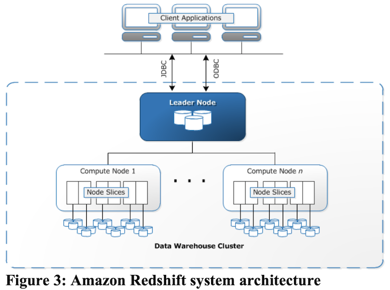

# Amazon Redshift and the Case for Simpler Data Warehouses

SIGMOD 2015 https://www.cs.cmu.edu/~15721-f24/papers/Redshift.pdf

## Abstract

**Amazon Redshift is a fast, fully managed, petabyte-scale data warehouse solution that makes it simple and cost-effective to efficiently analyze large volumes of data using existing business intelligence tools.** Since launching in February 2013, it has been Amazon Web Service’s (AWS) fastest growing service, with many thousands of customers and many petabytes of data under management.

Amazon Redshift’s pace of adoption has been a surprise to many participants in the data warehousing community. While Amazon Redshift was priced disruptively at launch, available for as little as $1000/TB/year, there are many open-source data warehousing technologies and many commercial data warehousing engines that provide free editions for development or under some usage limit. While Amazon Redshift provides a modern MPP, columnar, scale-out architecture, so too do many other data warehousing engines. And, while Amazon Redshift is available in the AWS cloud, one can build data warehouses using EC2 instances and the database engine of one’s choice with either local or network- attached storage.

In this paper, we discuss an oft-overlooked differentiating characteristic of Amazon Redshift – simplicity. Our goal with Amazon Redshift was not to compete with other data warehousing engines, but to compete with non-consumption. We believe the vast majority of data is collected but not analyzed. We believe, while most database vendors target larger enterprises, there is little correlation in today’s economy between data set size and company size. And, we believe the models used to procure and consume analytics technology need to support experimentation and evaluation. Amazon Redshift was designed to bring data warehousing to a mass market by making it easy to buy, easy to tune and easy to manage while also being fast and cost-effective.

## 1. Introduction

### Why RedShift?

Most data is “**dark data**”: data that is collected but not easily analyzed in industry. And overall data landscape is only getting darker, NoSQL and Hadoop becomes only options for analytics on big data.

Also **analysis gap** due to cost (no clear value with up-front expense), complexity (provisioning, maintain, tune with specializd skills in business team), performance (scalability) and rigidity (only structured data).

### What is unique of RedShift?

Common techniques: columnar layout, per-column compression, co-locating compute and data, co-locating joins, compilation to machine code, scale-out MPP processing. 

Design goals:
- Minimize cost of experimentation: $0.25/hour/node
- Minimize time to first report: 15 minutes provision a multi-PB cluster.
- Minimize administration: automate backup, restore, provisioning, patching, failure detection and repair
- Minimize scaling concern: cluster resize
- Minimize tuning: default setting, knobs
- **Cloud Native**: pricing and scale of EC2 + durability and throughput of S3 + security of VPC.
- **software-as-service**

## 2. System Architecture

### Data Plane

Data Plane := [1 leader nodes + multiple compute nodes]

Engine originated from ParAccel. 

**Leader node**: connection for client, SQL parser, generates & compiles query plans to execute, final aggregation.

Query processing begins with query plan generation and compilation to C++ and machine code at the leader node. 

**Compute node**: Data storage and compute is distributed across one or more nodes. Compute node ::= [num of CPU cores slices].

Detailed implementation of node:

One slice for each core of the node's multi-core processor. Each slice is allocated a portion of the node's memory and disk space, where it processes a portion of the workload assigned to the node. The user can specify data distribution strategy (round robin, hashed according to a **distribution key**, or duplicated). Using distribution keys allows join processing on that key to be co-located on individual slices, reducing IO, CPU and network contention and avoiding the redistribution of intermediate results during query execution. Within each slice, data storage is column-oriented. Each column within each slice is encoded in a chain of one or more fixed size data blocks. The linkage between the columns of an individual row is derived by calculating the logical offset within each column chain. This linkage is stored as metadata.

Each data block (2 copies) is synchronously written to both its primary slice as well as to at least one secondary on a separate node. Asynchronously backed up to S3.

Data loading PostgreSQL COPY command. COPY is parallelized across slices, with each slice reading data in parallel, distributing as needed, and sorting locally. bulk load. compression scheme and optimizer statistics are updated with load.

Redshift **foregoes traditional indexes** (or projections in C- Store/Vertica) and instead focuses on sequential scan speed through **compiled code execution** (inspired from academia and Hekaton) and **column-block skipping** (Infobright’s Knowledge Grid and Netezza’s Zone Maps) based on value-ranges stored in memory. 

### Control Plane

Monitoring, logging alarming and initiating maintenance tasks based on telemetry from instance host managers or customer console or API.

## 3. The Case for Simplicity

- Simplifying the Purchase Decision Process.

- Simplifying Database Administration

- Simplifying Database Tuning

Example: a multidimensional index [JAO] using z-curves degrades

## Appendix

### 1. “analysis gap” between data being collected and data available for analysis as due to four major causes.

- Cost – Most commercial database solutions capable of analyzing data at scale require significant up-front expense. This is hard to justify for large datasets with unclear value.

- Complexity – Database provisioning, maintenance, backup, and tuning are complex tasks requiring specialized skills. They require IT involvement and cannot easily be performed by line of business data scientists or analysts.

- Performance – It is difficult to grow a data warehouse without negatively impacting query performance. Once built, IT teams sometimes discourage augmenting data or adding queries as a way of protecting current reporting SLAs.

- Rigidity – Most databases work best on highly structured relational data. But a large and increasing percentage of data consists of machine-generated logs that mutate over time, audio and video, not readily accessible to relational analysis.

### 2. ParAccel history

https://en.wikipedia.org/wiki/ParAccel

https://www.informationweek.com/data-management/amazon-redshift-leaves-on-premises-opening-says-paraccel

In 2013/01, RedShift was announced GA using ParAccel (Actian), so Redshift was cutting into on-premises sales led by HP, IBM, Teradata, and Oracle.

### Reference

Vertica, Ingres VectorWise, Infobright, Kickfire, and many others

[1] Abadi D, Boncz P, Harizopoulos S, Idreos S, Madden S. The Design and Implementation of Modern Column-Oriented Database Systems. Foundations and Trends in Databases. 2013;5(3):197-280.