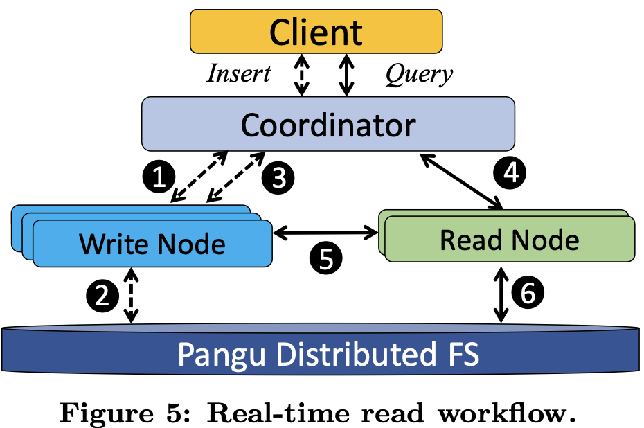
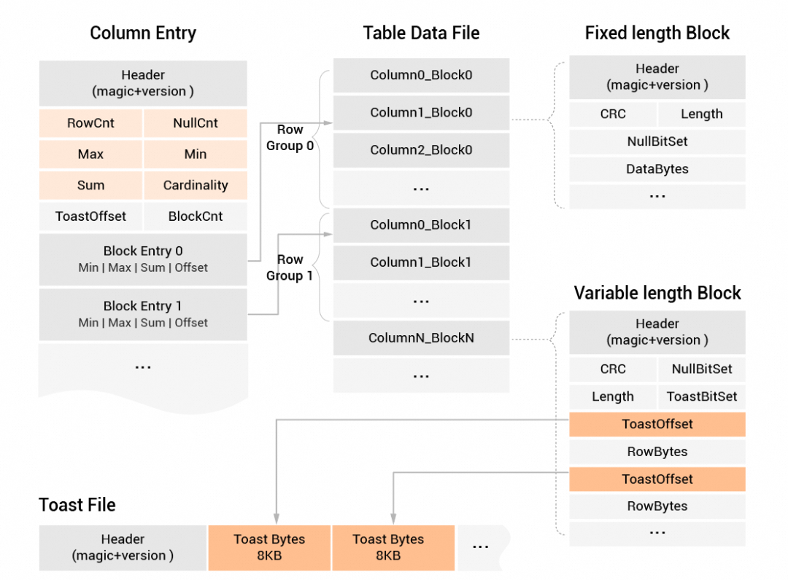
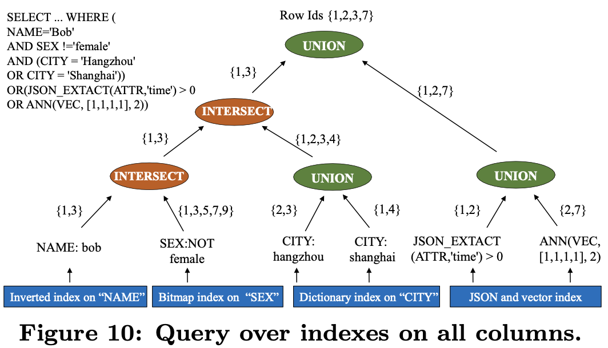

# AnalyticDB: Real-time OLAP Database System at Alibaba Cloud

2019 VLDB https://www.vldb.org/pvldb/vol12/p2059-zhan.pdf

## ABSTRACT

With data explosion in scale and variety, OLAP databases play an increasingly important role in serving real-time analysis with low latency (e.g., hundreds of milliseconds), especially when incoming queries are complex and ad hoc in nature. Moreover, these systems are expected to provide high query concurrency and write throughput, and support queries over structured and complex data types (e.g., JSON,vector and texts). In this paper, we introduce AnalyticDB, a real-time OLAP database system developed at Alibaba. AnalyticDB maintains all-column indexes in an asynchronous manner with acceptable overhead, which provides low latency for complex ad-hoc queries. Its storage engine extends hybrid row-column layout for fast retrieval of both structured data and data of complex types. To handle large-scale data with high query concurrency and write throughput, AnalyticDB decouples read and write access paths. To further reduce query latency, novel storage-aware SQL optimizer and execution engine are developed to fully utilize the advantages of the underlying storage and indexes. AnalyticDB has been successfully deployed on Alibaba Cloud to serve numerous customers (both large and small). It is capable of holding 100 trillion rows of records, i.e., 10PB+ in size. At the same time, it is able to serve 10m+ writes and 100k+ queries per second, while completing complex queries within hundreds of milliseconds.

## Key Contributions

- Efficient Index Management
    - All columns indecies
    - Runtime filter-ratio-based index path selec tion mechanism to avoid performance slow-down from index abuse.
    - Indexes are asynchronously built during off-peak.

- Storage layout for structured data and data of
complex types
    - Hybrid row-column layout for OLAP-style or point-lookup workloads.
    - Support JSON, vector, text.

- Decoupling Read/write
    - Isolated write and read nodes

- Enhanced optimizer and execution engine.
    - Storage-aware SQL optimization mechanism of CBO.

## SYSTEM DESIGN

### Building Blocks

AnalyticDB runs on top of **Apsara**, a large-scale, general-purpose and highly-reliable computing infrastructure developed at Alibaba Cloud since 2009.

- Pangu (a reliable distributed storage system)
- Fuxi (a resource manager and job scheduler, see paper *a
fault-tolerant resource management and job scheduling system
at internet scale. PVLDB, 7(13):1393–1404, 2014.*) 

### Data Model and Query Language

MySQL protocol/ANSI SQL:2003.

### Table Partitioning

Two levels: 

3.0 DDL
```
DISTRIBUTED BY HASH(customer_id)
PARTITION BY VALUE(DATE_FORMAT(login_time, '%Y%m%d')) LIFECYCLE 30
```

2.0 DDL
```
PARTITION BY HASH KEY
SUBPARTITION BY 
```

### Write and Read Path


- Write path
    - Read/Write Decoupling. Write nodes for INSERT, DELETE, UPDATE. 

    - Coordinators distributes write
    requests to corresponding workers based on hash. adjust table partition placement in order to ensure load balance for high workload.

    - in-memory buffer in Write node then periodically flushes them as a log to Pangu.

    - Once the buffer is completely flushed, the node returns a version (i.e., log se- quence number) to coordinators, which then return users a success message for each committed write.

    - MapReduce jobs on Fuxi to compact log files on Pangu to convert log commits into actual data files, i.e., baseline data and indexes.

- Read path

    - Each read node is assigned a number of partitions by coordinators. 

    
    - read nodes are replicated for concurrency and reliability. replication factor (e.g., 2 by default)
    - Each node loads initial partitions from Pangu, and pulls subsequent updates from corresponding write nodes periodically. 
    - applies updates to its local data copies, which are not written back to Pangu.
    - two visibility levels
        - *real-time* read where data can be immediately read after written
        - *bounded-staleness* read where data is visible within a bounded delay.
    

### Storage

Hybrid Row-Column Store with metadata for OLAP and point-lookup queries.

Row-based storage is also used for real-time data ingestion.

 



**Lambda architecture**, **Baseline data** as historical data including both index and row-column data. **Incremental delta** does not contain full-index but a simple sorted index. Incremental data occurs only on read nodes when they pull and replay logs from write nodes. Baseline and incremental data follow the identical data and meta formats above.


Index full column only in Baseline data.

- Query Exception and how to handle MVCC and visibility of data?
    - bit-set to record the row ids of deleted data
    - a bit-set snapshot along with a version number is stored in an in-memory map for serving subsequent queries. 
    - version number based, Qualified row-ids are obtained from full-index (on baseline data) and sorted index given a version number. After that, we filter out deleted rows from referenced delete bit-sets to get the final results.

     

     

     

- How to do compaction?
    - Merge Baseline Data with Incremental Data
    - called *Build*.
    - When the build process starts, we make current in-
cremental data immutable and create another incremental
data instance to handle new arrivals. Before the build pro-
cess finishes, all queries are executed on the baseline data,
stale incremental data and new incremental data. Once the
new version of baseline data is merged, the old baseline data
and stale incremental data can be safely removed. At this
time, the new baseline data, along with new incremental
data, serves subsequent queries.
     
    

- How Index works?
    - BKD-tree for integer
    - dict encoding and inverted index for text by Lucene
    - bitmap index for deletion bits
    - fulltext is possible
    - inverted index of rowids
    - SQL filter on get a set of qualified row ids with index
     
    

## Execution Engine

general-purpose and pipeline-mode execution engine called XUANWU (玄武).

 

## Optimizer

CBO (cost-based optimization) and RBO (rule-based optimization) based.

- Optimization approaches
    - Basic optimization rules (e.g., cropping, pushdown/merge, deduplication, constant folding/predicate derivation)
        - Predicate Push-down
    - probe optimization rules for different Joins (e.g., BroadcastHashJoin, RedistributedHashJoin, NestLoopIndexJoin)
    - Aggregate
    - Join-Reorder
    - Join Push-down
        - avoidance of data redistribution of `SELECT T.tid, count(*) FROM T JOIN S ON T.sid = S.sid GROUP BY T.tid` if T and S are hashed by the same key.
    - Index-based Join and Aggregation
        - avoids generating BushyTree and prefers LeftDeepTree
    - GroupBy pushdown
    - Count pushdown 
        - aggregations like count can be returned directly from indexes
    - Exchange pushdown
    - Sort pushdown
    - advanced optimization rules (e.g., Common Table Expression).

## APPENDIX

### Capablities Highlights

https://help.aliyun.com/zh/analyticdb/analyticdb-for-mysql/product-overview/overall-architecture?spm=a2c4g.11186623.help-menu-92664.d_0_1_8_1_0.6df8c659QL6NPE&scm=20140722.H_206003._.OR_help-T_cn~zh-V_1

- 云原生架构
- 计算存储分离
- 冷热数据分离
- 高吞吐实时写入和数据强一致
- 兼顾高并发查询和大吞吐批处理的混合负载


### ADB 3.0 Architecture

Raft consensus protocol based work group. Data stored in Local SSD by default for acceleration, offload to Object store for cold data.


## 存储层

只需一份全量数据，满足离线和在线场景。

在线分析场景需要数据尽量在高性能存储介质上提高性能，离线场景需要数据尽量在低成本存储介质上降低存储成本。为满足不同场景需求，首先将一份全量数据存储在低成本高吞吐存储介质中，低成本离线处理场景直接读写低成本存储介质中的数据，可降低数据存储和数据IO成本，保证高吞吐。其次将实时数据存储在ESSD云盘上，保证行级的数据实时性，同时对全量数据构建索引，并通过缓存能力对数据进行加速，满足百毫秒级高性能在线分析场景。

提供统一Storage API存储接口层及Arrow数据访问格式。支持使用开源计算引擎（如Spark和Presto）访问内部的数据，同时对湖的生态（Iceberg、Hudi、DeltaLake、Paimon等）提供了完备的支持。

### CREATE TABLE DDL

```
CREATE TABLE [IF NOT EXISTS] table_name
  ({column_name column_type [column_attributes] [ column_constraints ] [COMMENT 'column_comment']
  | table_constraints}
  [, ... ])
  [table_attribute]
  [partition_options]
  [storage_policy]
  [block_size]
  [engine]
  [rt_engine]
  [table_properties]
  [AS query_expr]
  [COMMENT 'table_comment']

column_attributes:
  [DEFAULT {constant | CURRENT_TIMESTAMP}]
  [AUTO_INCREMENT]

column_constraints:
  [{NOT NULL|NULL} ]
  [PRIMARY KEY]

table_constraints:
  [{INDEX|KEY} [index_name] (column_name,...)]
  [{INDEX|KEY} [index_name] (column_name->'$[*]')]
  [FULLTEXT [INDEX|KEY] [index_name] (column_name) [index_option]] [,...]
  [PRIMARY KEY [index_name] (column_name,...)]
  [CLUSTERED KEY [index_name] (column_name,...)]
  [[CONSTRAINT [symbol]] FOREIGN KEY (fk_column_name) REFERENCES pk_table_name (pk_column_name)][,...]
  [ANN INDEX [index_name] (column_name,...) [index_option]] [,...]

table_attribute:
  DISTRIBUTED BY HASH(column_name,...) | DISTRIBUTED BY BROADCAST

partition_options:
  PARTITION BY 
        {VALUE(column_name) | VALUE(DATE_FORMAT(column_name, 'format')) | VALUE(FROM_UNIXTIME(column_name, 'format'))}
  LIFECYCLE N

storage_policy:
  STORAGE_POLICY= {'HOT'|'COLD'|'MIXED' {hot_partition_count=N}}

block_size:
  BLOCK_SIZE= VALUE

engine:
  ENGINE= 'XUANWU|XUANWU_V2'
```

- Deletion working on **PRIMARY KEY** which must be part of HASH KEY and **PARTITION KEY**.

- **CLUSTERED KEY** determines sortness of data file.

- **LIFECYCLE** for data retention.

Example
```
CREATE TABLE customer (
customer_id bigint NOT NULL COMMENT '顾客ID',
customer_name varchar NOT NULL COMMENT '顾客姓名',
phone_num bigint NOT NULL COMMENT '电话',
city_name varchar NOT NULL COMMENT '所属城市',
sex int NOT NULL COMMENT '性别',
id_number varchar NOT NULL COMMENT '身份证号码',
home_address varchar NOT NULL COMMENT '家庭住址',
office_address varchar NOT NULL COMMENT '办公地址',
age int NOT NULL COMMENT '年龄',
login_time timestamp NOT NULL COMMENT '登录时间',
PRIMARY KEY (login_time,customer_id,phone_num)
 )
DISTRIBUTED BY HASH(customer_id)
PARTITION BY VALUE(DATE_FORMAT(login_time, '%Y%m%d')) LIFECYCLE 30
COMMENT '客户信息表'; 
```