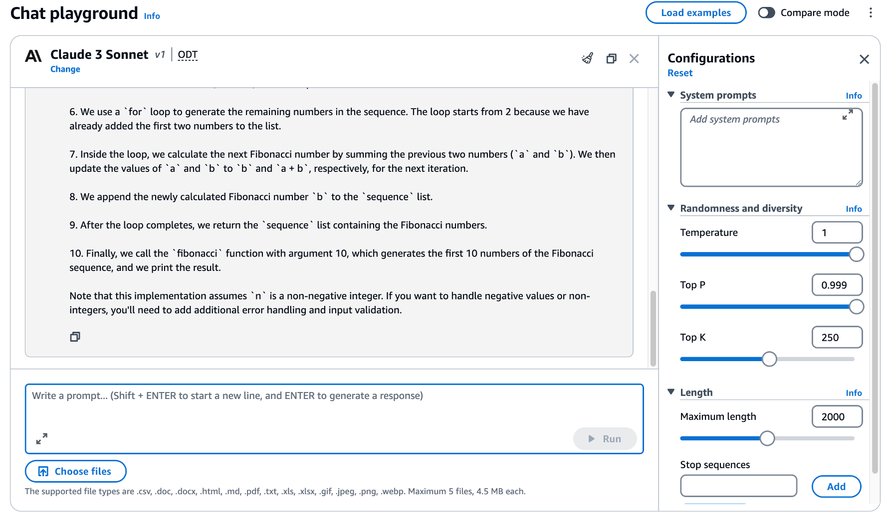

# Attention Is All You Need

Jun 12, 2017 

## Abstract

The dominant sequence transduction models are based on complex recurrent or convolutional neural networks that include an encoder and a decoder. The best performing models also connect the encoder and decoder through an attention mechanism. We propose a new simple network architecture, the Transformer, based solely on attention mechanisms, dispensing with recurrence and convolutions
entirely. Experiments on two machine translation tasks show these models to be superior in quality while being more parallelizable and requiring significantly less time to train. Our model achieves 28.4 BLEU on the WMT 2014 English- to-German translation task, improving over the existing best results, including ensembles, by over 2 BLEU. On the WMT 2014 English-to-French translation task, our model establishes a new single-model state-of-the-art BLEU score of 41.8 after training for 3.5 days on eight GPUs, a small fraction of the training costs of the best models from the literature. We show that the Transformer generalizes well to other tasks by applying it successfully to English constituency parsing both with large and limited training data.

## Intro

Recurrent neural networks (RNN), long short-term memory (LSTM) and gated recurrent neural networks in particular, have been firmly established as state of the art approaches in sequence modeling and transduction problems such as language modeling and machine translation.

- Why not performing?

    Recurrent neural networks precludes parallelization within training examples, constraint of sequential computation remains with LSTM and gated recurrent.

- The way out

    Attention mechanisms, so **Transformer** comes, allowing for more parallelization and can reach a new state of the art in translation quality after being trained for as little as twelve hours on eight P100 GPUs.
    
    Self-attention

## Model Architecture

### Encoder-decoder structure

The encoder maps an input sequence of symbol representations `(x1,...,xn)` to a sequence of continuous representations `z = (z1,...,zn)`. Given z, the decoder then generates an output sequence `(y1,...,ym)` of symbols one element at a time. 


- Encoder

    Two Layers: **Multi-head self-attention** mechanism +  a simple, **position-wise fully connected feed-forward network**.

    We employ a **residual connection** [11] around each of
    the two sub-layers, followed by **layer normalization**.

    dimension = 512.

- Decoder

    The decoder inserts a third sub-layer, which performs multi-head attention over the output of the encoder stack.

### Attention

QKV: mapping a query and a set of key-value pairs to an output, where the query, keys, values, and output are all vectors.


### Scaled Dot-Product Attention

The input consists of queries and keys of dimension dk , and values of dimension dv. We compute the dot products of the query with all keys, divide each by √dk , and apply a softmax function to obtain the weights on the
values.

we compute the attention function on a set of queries **simultaneously**, packed together into a matrix Q.

Below is a single-head attention.


*[Xu: this is why we need kv_cache techniques]*


### Multi-Head Attention


### Position-wise Feed-Forward Networks

Multiple layer perceptron has the most parameters, almost 2/3.


GPT3 has 96 layers.


### Embeddings and Softmax

We use learned embeddings to convert the input
tokens and output tokens to vectors of dimension dmodel.


We also use the usual learned linear transformation and softmax function to convert the decoder output to **predicted next-token probabilities**.


### Positional Encoding

### Auto-regressive

token-by-Token Generation, generate text one token at a time, using previous tokens as input.

## Why Self-Attention

- Given computational complexity, Transformer's computation can be parallelized.

    *[Xu: matmul and multi-headed attention are computed in parallel fashion.]*

- Long context window.

## APPENDIX

### LLM Evolutionary Tree


https://github.com/Mooler0410/LLMsPracticalGuide

### Num of Llama in 2023
 
- 2048 context window
- 32,000 vocab size
- Trained on 1-1.4T tokens
- 2048 A100 GPUs for 21 days training on 65B model costing $5MM

| Parameters  | n dimension | n layers |
| ----------- | ----------- | ----------- |
| 6.7B | 4096 | 32 |
| 13.0B | 5120 | 40 |
| 32.5B | 6656 | 60 |
| 65.2B | 8192 | 80 |

### Num of Llama2

```
int dim; // transformer dimension
int hidden_dim; // for ffn layers
int n_layers; // number of layers
int n_heads; // number of query heads
int n_kv_heads; // number of key/value heads (can be < query heads because of multiquery)
int vocab_size; // vocabulary size, usually 256 (byte-level)
int seq_len; // max sequence length
```

| Model Size | dim  | hidden_dim | n_layers | n_heads | n_kv_heads | vocab_size | seq_len |
|------------|------|------------|----------|---------|------------|------------|---------|
| **7B**     | 4096 | 11008      | 32       | 32      | 32         | 32000      | 4096    |
| **13B**    | 5120 | 13824      | 40       | 40      | 40         | 32000      | 4096    |
| **30B**    | 6656 | 17920      | 60       | 52      | 52         | 32000      | 4096    |
| **65B**    | 8192 | 22016      | 80       | 64      | 8          | 32000      | 4096    |

### Mathematical function used

- matmul


- softmax

    Probability Distribution: Softmax converts raw scores into probabilities between [0, 1.0].
    
    Interpretability: The model can rank token probabilities meaningfully.

    ```
    static void softmax(float[] x, int xOffset, int size) {
        // find max value (for numerical stability)
        float max_val = x[xOffset];
        for (int i = 1; i < size; i++) {
            if (x[xOffset + i] > max_val) {
                max_val = x[xOffset + i];
            }
        }
        // exp and sum
        float sum = 0.0F;
        for (int i = 0; i < size; i++) {
            x[xOffset + i] = (float) Math.exp(x[xOffset + i] - max_val);
            sum += x[xOffset + i];
        }
        // normalize
        for (int i = 0; i < size; i++) {
            x[xOffset + i] /= sum;
        }
    }
    ```

- rmsnorm (Root Mean Square Normalization) and LayerNorm

    primarily for efficiency, stability, and performance in large-scale transformer models.

    ```
    static void rmsnorm(float[] o, float[] x, float[] weight, int size) {
        // calculate sum of squares
        float ss = 0.0F;
        for (int j = 0; j < size; j++) {
            ss += x[j] * x[j];
        }
        ss /= size;
        ss += 1e-5f;
        ss = 1.0f / (float) Math.sqrt(ss);
        // normalize and scale
        for (int j = 0; j < size; j++) {
            o[j] = weight[j] * (ss * x[j]);
        }
    }
    ```

- RoPE relative positional encoding

- classifier into logits

- sigmoid function


### Randomness and diversity




## References

My work: https://github.com/neoremind/llama2.java

https://bbycroft.net/llm

https://tiktokenizer.vercel.app/

[State of GPT by Andrej Karpathy in 2023](https://www.youtube.com/watch?v=bZQun8Y4L2A)

[Transformers (how LLMs work) explained visually | DL5](https://www.youtube.com/watch?v=wjZofJX0v4M)

[Attention in transformers, step-by-step | DL6](https://www.youtube.com/watch?v=eMlx5fFNoYc)

[How might LLMs store facts | DL7](https://www.youtube.com/watch?v=9-Jl0dxWQs8)
