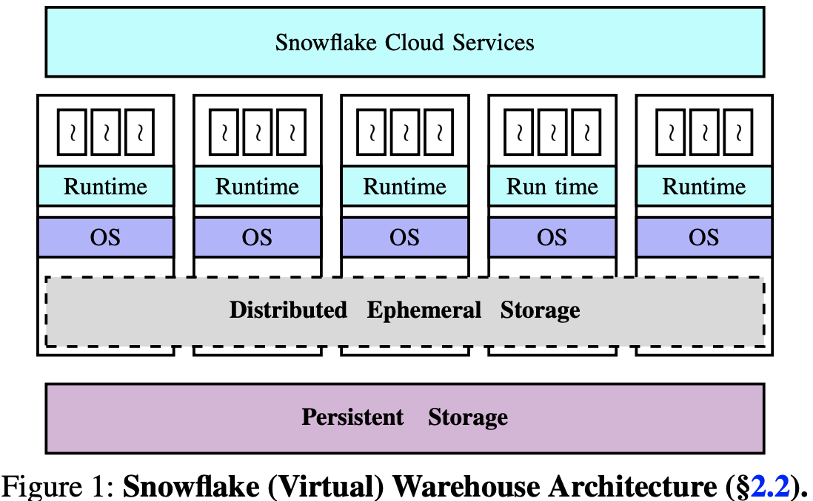
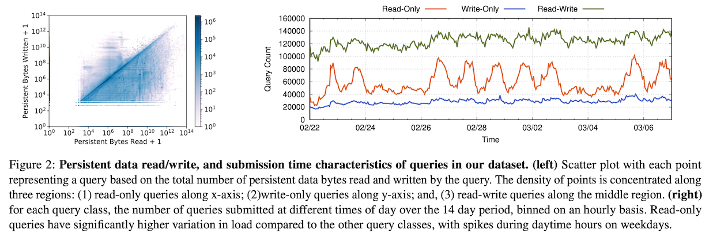
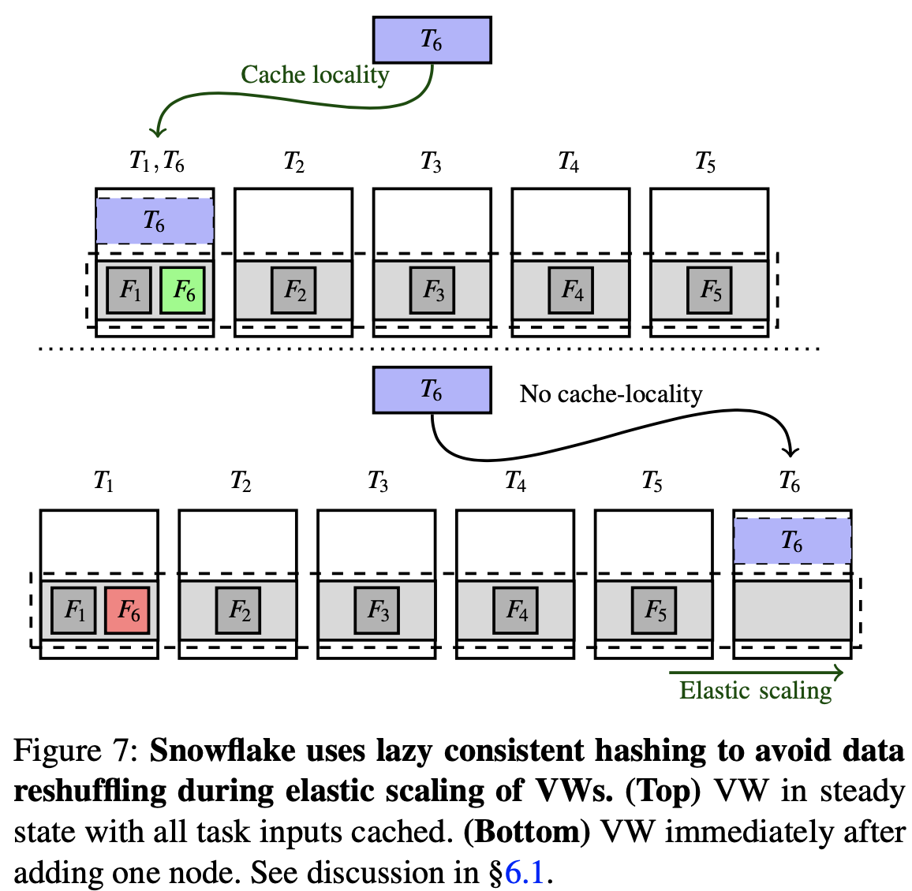

# Building An Elastic Query Engine on Disaggregated Storage

NSDI 20

## Abstract

We present operational experience running Snowflake, a cloud- based data warehousing system with SQL support similar to state-of-the-art databases. Snowflake design is motivated by three goals: (1) compute and storage elasticity; (2) support for multi-tenancy; and, (3) high performance. Over the last few years, Snowflake has grown to serve thousands of customers executing millions of queries on petabytes of data every day.

This paper presents Snowflake design and implementation, along with a discussion on how recent changes in cloud in- frastructure (emerging hardware, fine-grained billing, etc.) have altered the many assumptions that guided the design and optimization of Snowflake system. Using data collected from various components of our system during execution of 70 million queries over a 14 day period, our study both deepens the understanding of existing problems and highlights new research challenges along a multitude of dimensions includ- ing design of storage systems and high-performance query execution engines.

## 1 Introduction

Shared-nothing disadvantages:

- **Hardware-workload mismatch**: Hard to strike a perfect balance between CPU, memory, storage and bandwidth. Bandwidth-intensive compute-light bulk loading vs. compute-extensive bandwidth-light complex queries. Lead to over-provision and under-utilization and higher operational costs.

- **Lack of Elasticity, Inflexibility**: static parallelism and data partitioning lead to 1) constrain adaptation to data skew and time-varying workloads?, 2) reshuffled with performance degradation.

The design principle is to **avoid tight coupling of compute and storage, separate, decouple, disaggregates the two**!. Cloud blob store + a pool of compute nodes, all on-demand.

This paper focuses on below using statistics 70 million queries over a period of 14 contiguous days in February 2018 (dataset on github: https://github.com/resource- disaggregation/snowset).
- ephemeral storage system for intermediate, exachange data in compute nodes
- query scheduling
- elasticity 
- efficiently supporting multi-tenancy

## Design Overview

- Centralized Control via Cloud Services.
- VM: pay for compute-time based on the VW size, support elasticity at fine-grained timescales (e.g., tens of seconds). compute elasticit is achieved using a pre-warmed pool of nodes that can be added/removed to/from VWs on an on-demand basis. 
- **Intermediate data on Elastic Local Ephemeral Storage**: short-lived, low-latency high-throughput access, co-located with compute nodes in VWs. for exchange of intermediate data during on-the-fly quering. Use both memory and local SSDs. spill into S3 in case SSD is exhausted. 
LRU file cache: Snowflake assigns input file sets for the customer to nodes using consistent hashing over persistent data file names. 
- Persistent data: long-lived, strong durability and availability on S3.

## Ephemeral Storage and Local Cache System

- Query types: read-only queries ∼28%, write-only ∼13% and read-write ∼59%.

- Intermediate data sizes can vary over multiple orders of magnitude across queries, GB -> TB. No correlation with data storage size.
- Skewed access distributions and temporal access patterns common in data warehouses enable reasonably high average cache hit rates (60-80% depending on the type of query) for persistent data accesses.

- peak resource utilization high,avg low. Avg CPU 51%, Memory 19%, Network Tx 11% and Network Rx utilizations ∼32%.

## Query (Task) Scheduling

- **Locality-aware task scheduling**. Colocates each task with persistent data files that it operates on using a locality-aware scheduling mechanism.
- **Work stealing**. It is known that consistent hashing can lead to imbalanced partitions, avoid overloading of nodes, read from remote rather than local.

## Resource Elasticity

- **Lazy consistent hashing mechanism**: avoids reshuffling of data upon elastic scaling of nodes, a copy of cached data is stored at remote persistent data store. 

Elasticity demand for ∼20% of the clusters, 1-100x scale.

## Multi-tenancy and Resource Sharing

//TODO

