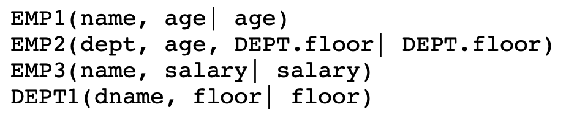
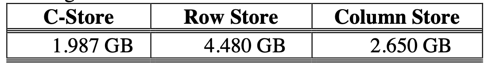
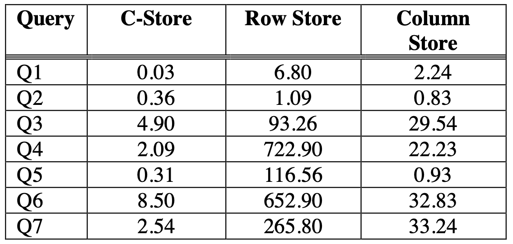

# C-Store: A Column-oriented DBMS

First author: Mike Stonebrake in VLDB'05

## 1. What

C-Store, high performance on OLAP warehouse-style queries, and achieve reasonable speed on OLTP-style transactions. 

**The first paper lays out foundation of column-store in OLAP.**

**row store and write-optimized system**: record-oriented, record (or tuple) are placed contiguously in storage, OLTP.

vs.

**column store and read-optimized system**: values for each single column are stored contiguously, for DW where ad-hoc querying of large amounts.

Why column store now?: Before CPU is slow, so read AS-IS. Now CPUs are getting faster than disk bandwidth, so CPU can do more codec (compact, densepack values avoid space in B+ tree) work to save disk bandwidth. 

**Projections**: C-Store physically stores a collection of columns, each sorted on some attribute(s). Groups of columns sorted on the same attribute are referred to as “projections”; the same column may exist in multiple projections, sorted under attribute(s). (See below, projects | sort key). C-Store projection is anchored on a given logical table to **anchor table** (base table?)




Architecture of C-Store: **WS + RS with Tuple Mover**, Redundant storage (one copy for TP multiple copies for AP), **LSM-tree variant** in WS, read-only queries to be run in historical mode with **timestamp T (snapshot isolation)** *[Xu: HTAP is too ideal to achieve, so this is prevasive design]*


## 2. Data Model

Tuples in a projection are stored column-wise. Tuples in a projection are sorted on one or more attributes as sort key. *[Xu: Like ClickHouse]*

Every projection is horizontally partitioned into 1 or more segments, which are given a segment identifier, Sid, where Sid > 0. *[Xu: Parquet's RowGroup, ORC's Strip]*

How to reconstruct complete rows?: join segments from different projections using **storage keys** and **join indexes**.

- Storage Keys: Storage keys are numbered 1, 2, 3, ... in RS and are not physically stored, but are inferred from a tuple’s physical position in the column. *[Xu: RowId in Lucene]*


- Join Indices: connect the various projections anchored at the same logical table, one-to-one mapping of two projects on the same tuple. join indexes are very expensive to store and maintain with updates.


## 3. RS and WS

Encoding Schemes

- Type 1: Self-order, few distinct values: Example `111122222333333` encoded to `(1, 0, 4), (2, 4, 5), (3, 9, 6)` clustered B-tree indexes.
- Type 2: Foreign-order, few distinct values: `0,0,1,1,2,1,0,2,1` encoded to `(0, 110000100), (1, 001101001)` in bitmap, since bitmap is sparse, apply RLE or bitpacking on top of it.
- Type 3: Self-order, many distinct values: delta encoding `1,4,7,7,8,12` to `1,3,3,0,1,4`.
- Type 4: Foreign-order, many distinct values: unencoded, hard to deal.

Join Indices are column-stored as well.

//TODO WS and Transactions of WS.

## 4. C-Store Query Execution

A C-Store query plan consists of a tree of the **operators** listed above.

1. **Decompress** converts a compressed column to an uncompressed (Type 4) representation.
2. **Select** is equivalent to the selection operator of the relational algebra (σ), but rather than producing a restriction of its input, instead produces a bitstring representation of the result.
3. **Mask** accepts a bitstring B and projection Cs, and restricts Cs by emitting only those values whose corresponding bits in B are 1.
4. **Project** equivalent to the projection operator of the relational algebra (π).
5. **Sort** sorts all columns in a projection by some subset of those columns (the sort columns).
6. **Aggregation** Operators compute SQL-like aggregates over a named column, and for each group identified by the values in a projection.
7. **Concat** combines one or more projections sorted in the same order into a single projection
8. **Permute** permutes a projection according to the ordering defined by a join index.
9. **Join** joins two projections according to a predicate that correlates them.
10. **Bitstring** Operators BAnd produces the bitwise AND of two bitstrings. BOr produces a bitwise OR. BNot produces the complement of a bitstring.

Use **Volcano model** but optimized with **batching block**. Each non-leaf plan node consumes the data produced by its children via a modified version of the standard iterator interface [GRAE93] via calls of “**get_next**.” To reduce communication overhead (i.e., number of calls of “get_next”) between plan nodes, C-Store return 64K blocks from a single column.

//TODO Query Optimization

## 5. Performance Comparison

TPC-H.

Storage space saving.



Queries.

```

Q1. Determine the total number of lineitems shipped for
each day after day D.
    SELECT l_shipdate, COUNT (*)
    FROM lineitem
    WHERE l_shipdate > D
    GROUP BY l_shipdate
Q2. Determine the total number of lineitems shipped for
each supplier on day D.
    SELECT l_suppkey, COUNT (*)
    FROM lineitem
    WHERE l_shipdate = D
    GROUP BY l_suppkey
Q3. Determine the total number of lineitems shipped for
each supplier after day D.
    SELECT l_suppkey, COUNT (*)
    FROM lineitem
    WHERE l_shipdate > D
    GROUP BY l_suppkey
Q4. For every day after D, determine the latest shipdate
of all items ordered on that day.
SELECT o_orderdate, MAX (l_shipdate) FROM lineitem, orders
WHERE l_orderkey = o_orderkey AND
          o_orderdate > D
    GROUP BY o_orderdate
Q5. For each supplier, determine the latest shipdate of an
item from an order that was made on some date, D.
SELECT l_suppkey, MAX (l_shipdate) FROM lineitem, orders
WHERE l_orderkey = o_orderkey AND
          o_orderdate = D
    GROUP BY l_suppkey
Q6. For each supplier, determine the latest shipdate of an
item from an order made after some date, D. SELECT l_suppkey, MAX (l_shipdate)
FROM lineitem, orders
WHERE l_orderkey = o_orderkey AND
           o_orderdate > D
    GROUP BY l_suppkey
Q7. Return a list of identifiers for all nations represented by customers along with their total lost revenue for the parts they have returned. This is a simplified
version of query 10 (Q10) of TPC-H.
SELECT c_nationkey, sum(l_extendedprice) FROM lineitem, orders, customers
WHERE l_orderkey=o_orderkey AND
          o_custkey=c_custkey AND
          l_returnflag='R'
    GROUP BY c_nationkey

```

C-store table schema

```
D1: (l_orderkey, l_partkey, l_suppkey, l_linenumber, l_quantity, l_extendedprice, l_returnflag, l_shipdate | l_shipdate, l_suppkey)
D2: (o_orderdate, l_shipdate, l_suppkey | o_orderdate, l_suppkey)
D3: (o_orderdate, o_custkey, o_orderkey | o_orderdate)
D4: (l_returnflag, l_extendedprice, c_nationkey | l_returnflag)
D5: (c_custkey, c_nationkey | c_custkey)
```




C-Store is much faster because:

- Column representation – avoids reads of unused attributes (same as competing column store).
- Storing overlapping projections, rather than the whole table – allows storage of multiple orderings of a column as appropriate.
- Better compression of data – allows more orderings in the same space.
- Query operators operate on compressed representation – mitigates the storage barrier problem of current processors.


## Note

1. This paper proposes to horizontally partition data across the disks of the various nodes in a **shared nothing architecture**.

2. Multile projects with the same attribute can become **tandem-style highly-available system**.

3. There is an increasing push toward **real-time warehouses**, where the delay to data visibility shrinks toward zero. The ultimate desire is on-line update to data warehouses. *[Xu, Mike proposed the idea  of real-time analytics back in 2005.]*
