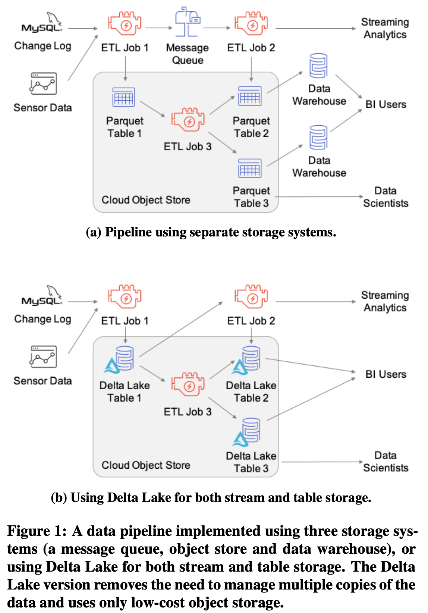

# Delta Lake: High-Performance ACID Table Storage over Cloud Object Stores

VLDB 2020 https://people.eecs.berkeley.edu/~matei/papers/2020/vldb_delta_lake.pdf

## ABSTRACT
Cloud object stores such as Amazon S3 are some of the largest
and most cost-effective storage systems on the planet, making them
an attractive target to store large data warehouses and data lakes.
Unfortunately, their implementation as key-value stores makes it difficult to achieve ACID transactions and high performance: metadata
operations such as listing objects are expensive, and consistency
guarantees are limited. In this paper, we present Delta Lake, an open
source ACID table storage layer over cloud object stores initially
developed at Databricks. Delta Lake uses a transaction log that is
compacted into Apache Parquet format to provide ACID properties,
time travel, and significantly faster metadata operations for large
tabular datasets (e.g., the ability to quickly search billions of table
partitions for those relevant to a query). It also leverages this design to provide high-level features such as automatic data layout
optimization, upserts, caching, and audit logs. Delta Lake tables
can be accessed from Apache Spark, Hive, Presto, Redshift and
other systems. Delta Lake is deployed at thousands of Databricks
customers that process exabytes of data per day, with the largest
instances managing exabyte-scale datasets and billions of objects.

## 1. Intro

**Delta Lake, an ACID transactional table storage layer over cloud object stores where OTF Parquet resides, to offer *manageability* (dataset that consists of multiple objects with version/time travel/schema evolution/upsert/deletion/merge of records) and better *performance* of working with data in cloud object stores.**

Cloud object store is low-cost and enable scaling computing and storage resources separately. So, DW and data lake now use. e.g., Spark/Hive/Presto writes to S3 with Parquet/ORC, Athena/BigQuery/Redshift Spectrum access object store.

But, not easy to achieve DW capablity because S3 is just key-value stores with no cross-key consistency guarantees and differs in performance.

**Pain points**

- Correctness/Consistency
    - Multi-object updates/writes are not atomic, there is no isolation between queries.
        - .e.g, See partial updates. Rolling back writes (undo) is also difficult, if an update query crashes, the table is in a corrupted state. Hard to repair incorrect data, incorporate late records

- Performance challenges
    - millions of small objects, metadata operations are
expensive

**Main idea**

- Maintain information about which objects
are part of a Delta table in an ACID manner, using a write-ahead log, transactions are achieved using
optimistic concurrency protocols 
that is itself stored in the cloud object store. 
- min/max statistics vs. simple "files in object store" 

**Features**

- Time travel: query point-in-time snapshots.
- UPSERT, DELETE and MERGE operations. (e.g., for GDPR)
- Efficient streaming I/O: write small
objects into the table at low latency.
- Caching on local SSD.
- Data layout optimization, Z-
order, sorted, min/max.
- Schema evolution: reading old
Parquet files.
- audit logs with trans log.



## 2. MOTIVATION: CHARACTERISTICS AND CHALLENGES OF OBJECT STORES

### Object Store APIs

S3, Azure Blob Storage, Google Cloud Storage

key-value store interfaxce, buckets, 

```
key= warehouse/table1/part1
value=immutable parquet binary blob (some appendable) 
```

- Limitations:
    - LIST API given a start key so pagination only return up to 1000 files; 
    - latent xxx ms; 5–10 ms of base latency
    - eventual consistency, LIST/GET-after-PUT.
    - large sequential I/Os is required and parallelism for LIST
    - mutate, point updates is impossible.

- Implications for table storage:
    - Keep frequently accessed data close-by sequentially.
    - Make objects large, but not too large.
    - Avoid LIST operations.

### Approaches for Table Storage

1. Directories of Files

    Like Hive on  HDFS, a collection of objects, “partitioned” into directories.

    ```
    mytable/date=2020-01-01/obj1
    mytable/date=2020-01-01/obj2
    ```

    No atomicity, Poor performance due to having to LIST every objects, No management like versioning.

2. Custom Storage Engines

    - like Snowflake, a highly available metadata service 

3. Metadata in Object Stores. (RECOMMENDED)

    - store transaction log and metadata directly in object store.
    - Delta lake, Hudi, Iceberg.

## 3. DELTA LAKE STORAGE FORMAT AND ACCESS PROTOCOLS

**A Delta Lake table is a directory on a cloud object store or file system that holds data objects with the table contents and a log of transaction operations (with occasional checkpoints)**.

### 3.1 Storage Format (Table Format)


**Log** (e.g., 000003.json) contains an array of actions to apply to the previous version of the table in order to generate the next one. 

- Action types:

    - Change Metadata.
    - Add or Remove Files.

        *Physical deletion of the data object can
happen lazily after a user-specified retention time threshold.*

    - Protocol Evolution
    - ...

**Log Checkpoints**, compress the log periodically
into checkpoints. By default, our clients write checkpoints every 10 transactions.

### 3.2 Access Protocols

Start from “root” `xxx.json`.

- Read-only transactions
    1. Read the _last_checkpoint 
    2. LIST files to read
    3. Use subsequent log records dentified in the previous step to reconstruct the state of the table
    4. Use the statistic to identify the set of data relevant
    for the read query.
    5. GET.

- Write Transactions
    - Identify a recent log record ID
    - Read data at table version r
    - Write any new data object, add to
    the table into new files in the correct data directories.
    - write the transaction’s log record into the r + 1.json log object

### 3.3 Available Isolation Levels

serializable for write.

snapshot isolation for read.

## 4. HIGHER-LEVEL FEATURES IN DELTA

- Time Travel and Rollbacks
    - MVCC, undo
    - SQL AS OF timestamp and VERSION AS
OF commit_id 
    ```
    MERGE INTO mytable target
    USING mytable TIMESTAMP AS OF <old_date> source
    ON source.userId = target.userId 
    WHEN MATCHED THEN UPDATE SET *
    ```
- UPSERT, DELETE and MERGE

    - With Delta Lake, all of these operations can be executed transactionally, replacing any updated objects through new add and remove records in the Delta log. Delta Lake supports standard SQL UPSERT, DELETE and MERGE syntax.
    - **When new records are inserted (via INSERT INTO or MERGE operations), Delta Lake does not modify existing Parquet files. Instead, it: Creates new Parquet data files containing the new records. Writes an entry in the transaction log (_delta_log/), referencing the new files as "add" actions.**
    ```
        INSERT INTO my_table VALUES (1, 'Alice'), (2, 'Bob');

        [
            {
                "add": {
                "path": "part-0001-abc.snappy.parquet",
                "size": 2048,
                "modificationTime": 1708193148000,
                "dataChange": true
                }
            }
        ]
    ```

    ```
    MERGE INTO my_table AS target
    USING (SELECT 1 AS id, 'Alice' AS name) AS source
    ON target.id = source.id
    WHEN MATCHED THEN UPDATE SET target.name = source.name
    WHEN NOT MATCHED THEN INSERT (id, name) VALUES (source.id, source.name);
    ```

- Streaming Ingest and Consumption
    - Write Compaction?
    - Exactly-Once Streaming Writes
    - Efficient Log Tailing.

- Data Layout Optimization
    - compact data objects OPTIMIZE/VACCUM
    - auxiliary data structures such as data statistics and indexes such as Z-Ordering by Multiple Attributes.

- Caching
- Audit Logging
- Schema Evolution and Enforcement
- Connectors to Query and ETL Engines
    - Open-Source & Fully Compatible with Apache Spark, Presto, and Trino

## APPENDIX

### UPDATE steps

1. Identifies affected Parquet files

    Delta Lake scans the table for rows where ID = 1.

    The Parquet files containing those rows are marked for removal in the _delta_log/.

2. Writes new Parquet files

    A new Parquet file is created with the updated rows (ID=1, name='Bob').

    Unchanged rows from the old file are also copied over (to maintain completeness).

3. Logs the changes in _delta_log/

    The old Parquet file is marked as "remove".

    The new Parquet file is added with "add".


### OPTIMIZE and VACUUM for Performance
After frequent updates/inserts, compact small Parquet files with:

```
OPTIMIZE my_table;

VACUUM my_table RETAIN 7 HOURS;
```