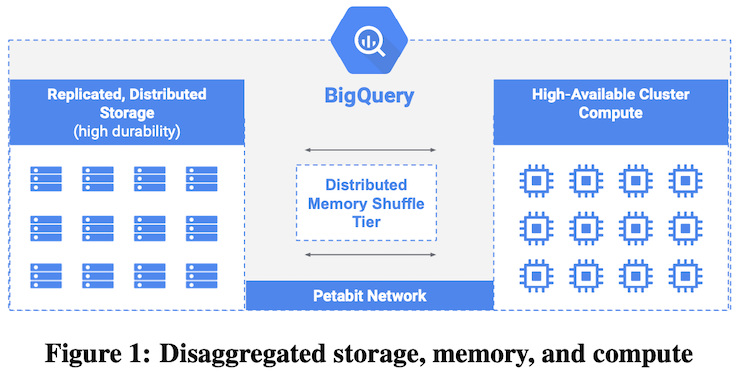
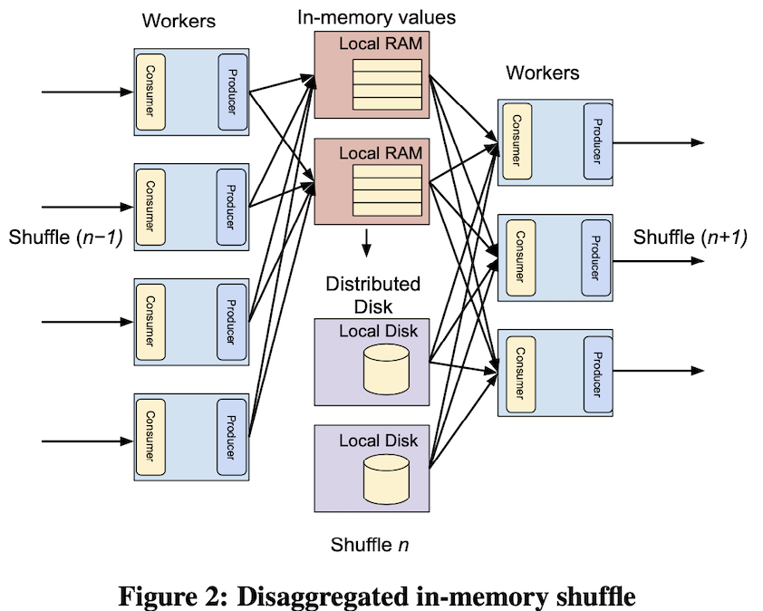
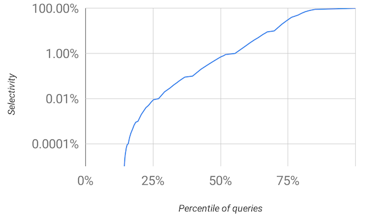
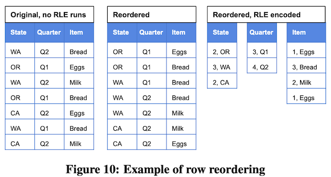

# Dremel: A Decade of Interactive SQL Analysis at Web Scale

VLDB 2021

## ABSTRACT

Google’s Dremel was one of the first systems that combined a set of architectural principles that have become a common practice in today’s cloud-native analytics tools, including disaggregated storage and compute, in situ analysis, and columnar storage for semistruc- tured data. In this paper, we discuss how these ideas evolved in the past decade and became the foundation for Google BigQuery.

*"We feel the Dremel paper has been an important contribution to cloud analytical db industry. We are pleased that it has stood the test of time and influence many others."*

## 1. INTRODUCTION

2010 Dremel -> BigQuery (a fully-managed, serverless cloud DW that enables scalable analytics) in GCP.

This paper focuses on Dremel’s key ideas and architectural principles.

Some of these principles turned into industry trends and best practices. Stated in terms of the technology trends highlighted in the recently published Seattle Report on "The Seattle Report on Database Research. ACM SIGMOD Record, 48(4), 2020.":

- SQL
- Disaggregated compute and storage: elasticity
- In situ analysis and data lake analysis: MapReduce and other data processing systems at Google to interoperate seamlessly with SQL-based analysis.
- Serverless computing: provisioned vs. on-demand (no upfront provision)
- Columnar storage

## 2. EMBRACING SQL

- How Google transition from NO SQL to back-to-SQL?

GFS, MR, Sawzall (enable C++ on MR), BigTable.. “SQL doesn’t scale”? Dremel reintroduce SQLs for Big Data analysis. 

The ability to interactively and declaratively analyze huge datasets, ad hoc, in dashboards, and in other tools, unlocked the insights buried inside huge datasets, which was a key enabler for many successful products over the next decade.

Hierarchical schemas (nested data structure) in Protocol Buffers are supported in Dremel.

Dremel initially avoided query-time joins. Denormalizing related data into one nested record was common in Google’s datasets. Now, distributed joins across large datasets remain an active area of research. Dremel introduced a new shuffle join architecture that leverages the latest research.

F1 and F1 Lightning, federating. Spanner (Cloud Spanner), Cloud DataFlow, PowerDrill, Procella, and Tenzing, all SQL based.

Similar in industry: Hadoop -> HiveSQL, SparkSQL and Presto.

- How to unify SQL across systems?

Shared and open-source dialect implementation: GoogleSQL.

## 3. DISAGGREGATION

### Disaggregated storage

2006, share nothing architecture, each server kept a disjoint subset of the data on local disks.

2009, mirgat **compute move to Borg** (an unified container-management system Borg (open source K8S)).

But local data is still "locked up" leading to resizing with re-shuffle, sharding and replication-aware. So, **storage move to GFS**.

//todo
How Google address the latency and performance degradation moving from share-nothing to share-storage?

section 7?

Eventually, Dremel on disaggregated storage outperformed the local-disk based system both in terms of latency and throughput for typical workloads.

### Disaggregated memory

To support join, Dremel’s shuffle utilized local RAM and disk to store sorted intermediate results, like MR with colocation. The bottlenecks are scalability, the coupling inherently led to resource fragmentation and stranding and provides poor isolation.

2012, Dremel built a new disaggregated shuffle infrastructure using Colossus, **in-memory shuffle implementation is managed separately in a distributed transient storage system**, not part of Dremel compute resources, enabling performance, large shuffle and cost.

## 4. IN SITU DATA ANALYSIS

2006's Dremel was share-nothing, traditional DW with proprietary format.

In situ data processing = accessing data in its original place.

Dremel “open-sourced” columnar and self-describing storage format within Google via a shared internal library. The paradigms of MapReduce and parallel DBMSs turned out to be friends, not foes.

Go beyond: 1) support record-based formats such as Avro, CSV, and JSON. 2) analysis through federation, for example, a lookup join which uses the row key in BigTable can be executed much more efficiently.

## 5. SERVERLESS COMPUTING

Elastic, multi-tenant, and on-demand service in Dremel, now widely referred to in the industry as serverless vs. deploy on dedicated servers, allow analyze data in cloud storage “on-demand” following data lake architecture.

How?

- **Disaggregation**: The disaggregation of compute, storage, and memory.
- **Fault Tolerance and Restartability**: assumption that the underlying compute resources slow or unavailable, each subtask within a query had to be deterministic and repeatable, ispatcher had to support dispatching multiple copies of the same task to alleviate unresponsive workers.
- **Virtual Scheduling Units**: Dremel scheduling logic was de- signed to work with abstract units of compute and memory called slots. Like Virtual Warehouse in Snowflake.

Some key points in the dynamic utilization of compute resources in Dremel/BigQuery:

- Centralized scheduling: more fine-grained, better isolation and utilization of resources.
- New Shuffle Persistence Layer: decoupled schedule and execution of different stages of each query; at each checkpoint of a query, the scheduler can dynamically preempt workers.
- Flexbile Execution DAG evolution: BigQuery implements a more flexible execution plan than that described in the original 2010 paper.
- Dynamic execution plan: for queries on data where the cardinality estimates are wrong, Dremel/BigQuery allows the query plan to dynamically change during runtime, managed by the central query coordinator, and checkpointed by the shuffle persistence layer.

## 6. COLUMNAR STORAGE FOR NESTED DATA

Repetition and definition levels. Parquet, ORC, and Apache Arrow inspired by Dremel, all support nested data.

In 2014, Dremel began migration of the storage to an improved columnar format, Capacitor (see https://cloud.google.com/blog/products/bigquery/inside-capacitor-bigquerys-next-generation-columnar-storage-format). To make filtering as efficient as possible, Capacitor data access library allows filter more efficient, used in Dremel but also F1, Procella, Flume, MapReduce, and BigQuery’s Storage API.

Capacitor techniques:

- **Partition and predicate pruning**: `EXTRACT(YEAR FROM date) = 2020` is first rewritten as date `BETWEEN ‘2020-01- 01’ AND ‘2020-12-31’`
- **Vectorization**: columnar block-oriented vectorized processing.
- **Skip-indexes**: following figure shows 15% of queries return no data (have selec- tivity 0), about 25% of queries return less than 0.01% of the data, and about 50% of queries return less than 1% of the data. **High selectivity** requires a fast skipping to jump over the false records. The column header contains an index with offsets pointing to the beginning of each segment. When the filter is very selective, Capacitor uses this index to skip segments that have no hits, avoiding their decompression.? BKD index with sort?

- **Predicate reordering**: heuristics to make filter reordering decisions, which take into account dictionary usage, unique value cardinality, NULL density, and expression complexity. Example, filter p(x) AND q(y), where x has no dictionary encoding and many unique values, while y has a dictionary and only few unique values. In this case, it is better to evaluate predicate q(y) fol- lowed by p(x), even if q(y) is a more complex expression than p(x), since q(y) will only be evaluated over a small number of dictionary values.
- **Encoding of Capacitor**: dictionary and run-length encodings (RLE), finding the optimal solution is an NP-complete problem, sampling and heuristics

## 7. INTERACTIVE QUERY LATENCY OVER BIG DATA

Counterproductive for DW. 
- colocating processing with data reduces data access latency vs. disaggregation.
- Optimizing storage layout vs. in situ processing. 
- Dedicated machines vs. shared serverless machine resources.

Dremel's latency-reducing techniques.

- Stand-by server pool
- Speculative execution: small tasks with long tail latency, straggler.
- Multi-level execution trees
- Column-oriented schema representation: self-describing
- Balancing CPU and IO with lightweight compression
- Approximate results
- Query latency tiers: dispatcher, schedule resources fairly for long-running and small jobs. preempt.
- Reuse of file operations: reuse metadata.
- Guaranteed capacity: reservations
- Adaptive query scaling

## References

https://warrenqi.github.io/2021/06/14/dremel-decade-later.html
