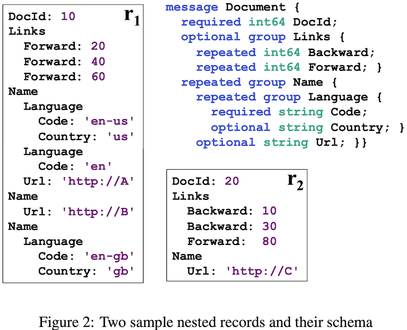
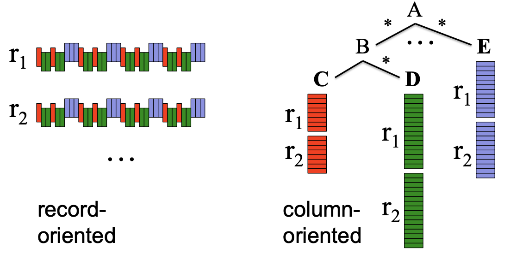
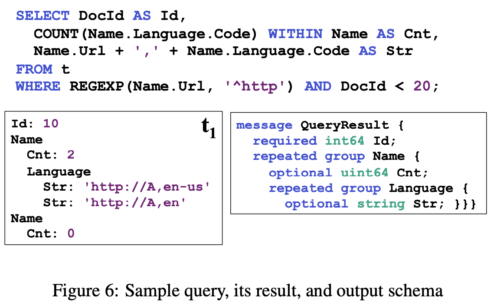

# Dremel: Interactive Analysis of Web-Scale Datasets

VLDB 2010

## ABSTRACT

Dremel is a scalable, interactive ad-hoc query system for analy- sis of read-only nested data. By combining multi-level execution trees and columnar data layout, it is capable of running aggrega- tion queries over trillion-row tables in seconds. The system scales to thousands of CPUs and petabytes of data, and has thousands of users at Google. In this paper, we describe the architecture and implementation of Dremel, and explain how it complements MapReduce-based computing. We present a novel columnar stor- age representation for nested records and discuss experiments on few-thousand node instances of the system.

## What is Dremel?

Dremel is a query system in Google since 2006 taht supports interactive analysis of very large datasets over shared clusters of commodity machines. Unlike traditional databases, it is capable of operating on in situ nested data. In situ refers to the ability to access data ‘in place’, e.g., in a distributed file system (like GFS) or another storage layer (e.g., Bigtable). 

vs. MR: not a replacement for MR but used in conjunction with MR to analyze outputs of MR pipelines with SQL, it complements the MR.

Dremel uses a column-striped storage representation for nested data models, which is first in analytical db industry.

## DATA MODEL



The nested data model backs a **platform-neutral, extensible mechanism for serializing structured data at Google**. Code generation tools produce **bindings** for programming languages such as C++ or Java. Cross-language interoperability is achieved using a standard **binary on-the-wire representation of records**, in which field values are laid out sequentially as they occur in the record. This way, a MR program written in Java can consume records from a data source exposed via a C++ library. Thus, if records are stored in a columnar representation, assembling them fast is important for interoperation with MR and other data processing tools.

## NESTED COLUMNAR STORAGE

Goal: our goal is to store all values of a given field consecutively to improve retrieval efficiency. 



How to losslessly represent the nested record structure in a columnar format using repetition and definition levels.

Repetition levels indicate at which repeated field in the path the value has repeated. Definition levels specify how many optional/repeated fields in the path are actually defined.

Present an efficient algorithm to split the nested records into column stripes with the required repetition and definition level annotations.

A finite state machine based algorithm to efficiently reassemble the original records from the columnar data for a given subset of fields. The state transitions are determined by the repetition levels.

See paper appendix for detailed algorithm.

## QUERY LANGUAGE

Based on SQL and is designed to be efficiently implementable on columnar nested storage desribed above.

The language supports nested subqueries, inter and intra-record aggregation, top-k, joins, user-defined functions, etc.



## QUERY EXECUTION

- **Tree architecture**

Dremel uses a multi-level serving tree to execute queries. A root server receives incoming queries, reads metadata from the tables, and routes the queries to the next level in the serving tree. The leaf servers communicate with the storage layer.

For example, 
```
SELECT A, COUNT(B) FROM T GROUP BY A
```

Root server receives the above query, determines all tablets, i.e., horizontal partitions of the table, that comprise T and rewrites the query as follows:

```
SELECT A, SUM(c) FROM (R1 UNION ALL ... Rn1 ) GROUP BY A
```

Tables R1,...,Rn1 are the results of queries sent to the nodes
1,...,n at level 1 of the serving tree. Ti1 is a disjoint partition of tablets in T processed by server i at level 1. 

```
Ri1 = SELECT A, COUNT(B) AS c FROM Ti1 GROUP BY A
```

- **Query dispatcher**

Schedules queries based on their priorities and balances the load,  fault tolerance when one server becomes much slower than others or a tablet replica becomes unreachable. **processing units = slots**

**Read-ahead cache** typically achieves hit rates of 95%. Tablets are usually **three-way replicated**. 


## Parquet

https://www.dremio.com/resources/guides/intro-apache-parquet/

In 2013, Twitter and Cloudera announced the Parquet, an open source file format that stores data in columnar format. We created Parquet to make the advantages of compressed, efficient columnar data representation.

Parquet is built from the ground up with complex nested data structures in mind, and uses the **record shredding and assembly algorithm** described in the Dremel paper.

File format: https://parquet.apache.org/docs/file-format/

```
    4-byte magic number "PAR1"
    <Column 1 Chunk 1 + Column Metadata>
    <Column 2 Chunk 1 + Column Metadata>
    ...
    <Column N Chunk 1 + Column Metadata>
    <Column 1 Chunk 2 + Column Metadata>
    <Column 2 Chunk 2 + Column Metadata>
    ...
    <Column N Chunk 2 + Column Metadata>
    ...
    <Column 1 Chunk M + Column Metadata>
    <Column 2 Chunk M + Column Metadata>
    ...
    <Column N Chunk M + Column Metadata>
    File Metadata
    4-byte length in bytes of file metadata (little endian)
    4-byte magic number "PAR1"
```


## References

https://github.com/julienledem/redelm/wiki/The-striping-and-assembly-algorithms-from-the-Dremel-paper

Another Google paoper published in 2014, [Storing and Querying Tree-Structured Records in Dremel](https://research.google/pubs/storing-and-querying-tree-structured-records-in-dremel/) presents how queries are processed in column-stored in a way that results in query processing time that is linear on the size of the relevant data.