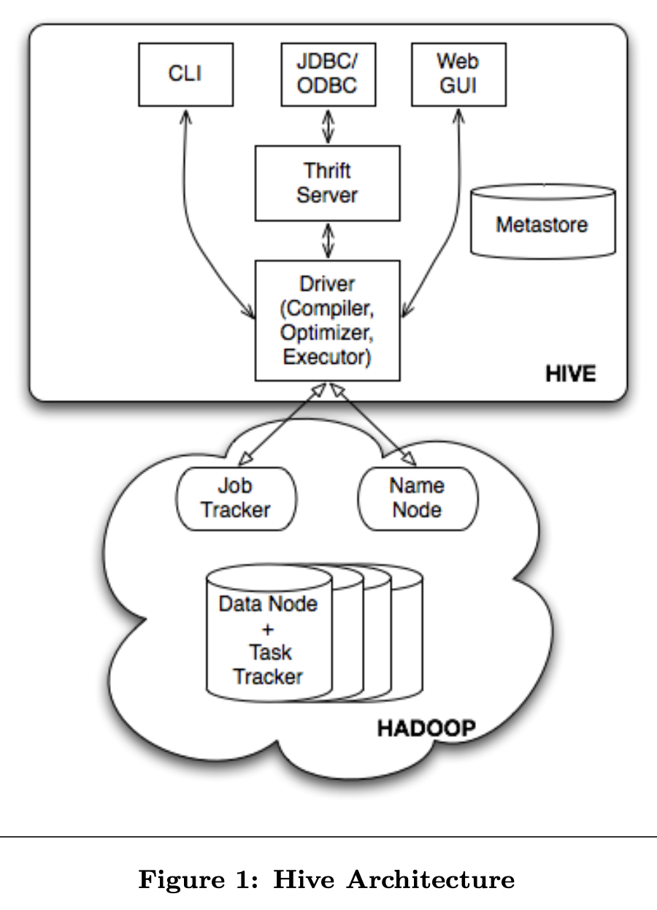
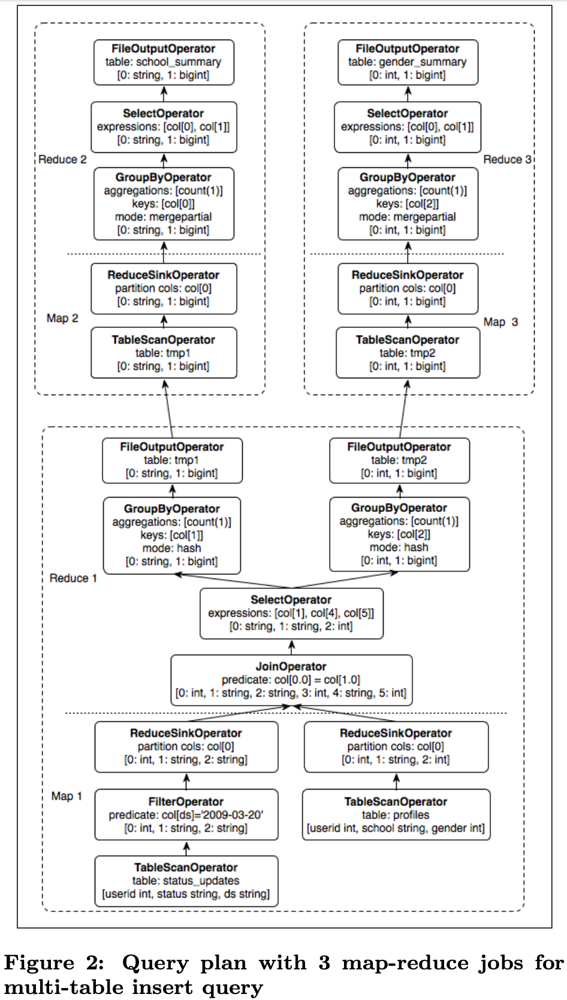

# Hive - A Warehousing Solution Over a Map-Reduce Framework

VLDB 2009 https://www.vldb.org/pvldb/vol2/vldb09-938.pdf

## INTRODUCTION

The size of data sets being collected and analyzed in the industry for business intelligence is growing rapidly, making traditional warehousing solutions prohibitively expensive. Hadoop [3] is a popular open-source map-reduce implementation which is being used as an alternative to store and process extremely large data sets on commodity hardware. However, the map-reduce programming model is very low level and requires developers to write custom programs which are hard to maintain and reuse.

In this paper, we present Hive, an open-source data warehousing solution built on top of Hadoop. Hive supports queries expressed in a SQL-like declarative language - HiveQL, which are compiled into map-reduce jobs executed on Hadoop. In addition, HiveQL supports custom map-reduce scripts to be plugged into queries. The language includes a type system with support for tables containing primitive types, collections like arrays and maps, and nested compositions of the same. The underlying IO libraries can be extended to query data in custom formats. Hive also includes a system catalog, Hive-Metastore, containing schemas and statistics, which is useful in data exploration and query optimization. In Facebook, the Hive warehouse contains several thousand tables with over 700 terabytes of data and is being used ex- tensively for both reporting and ad-hoc analyses by more than 100 users.

## HIVE DATABASE

### Data Model

- Table: Each table has a HDFS directory which stores files with serialization format (SerDe).
- Partitions: determine the distribution of data within sub-directories of the table directory. e.g., `/wh/T/ds=20090101/country=U`.
- Buckets.

Types can be primitive column types (integers, floating point numbers, strings, dates and booleans) and nestable types — array and map. 

### Query Language

SQL-like HiveQL supporting 
- DDL: Create table.
- DML-Query: select, project, join, aggregate, union all and sub-queries in the from clause.
- DML-load and insert.

Extensibility: UDF and UDAF, embed custom map-reduce scripts.

Examples: Status- Meme

```
# Two tables

status_updates(userid int,status string,ds string)

profiles(userid int,school string,gender int)

# Load data

LOAD DATA LOCAL INPATH ‘/logs/status_updates’
INTO TABLE status_updates PARTITION (ds=’2009-03-20’)

# compute daily statistics on the frequency of status updates based on gender and school

FROM (SELECT a.status, b.school, b.gender
      FROM status_updates a JOIN profiles b
           ON (a.userid = b.userid and
               a.ds=’2009-03-20’ )
      ) subq1
INSERT OVERWRITE TABLE gender_summary
                       PARTITION(ds=’2009-03-20’)
SELECT subq1.gender, COUNT(1) GROUP BY subq1.gender
INSERT OVERWRITE TABLE school_summary
                       PARTITION(ds=’2009-03-20’)
SELECT subq1.school, COUNT(1) GROUP BY subq1.school
```

## HIVE ARCHITECTURE



### Metastore

Metastore contains Database, Tables (column names, types, owner, storage and SerDe information, location, paritioning, bucketing). Uses relational database (like MySQL, Oracle) not HDFS. 


### Compiler

Compiler is invoked by the driver upon receiving a HiveQL statement. The compiler translates this statement into a plan which consists of a DAG of map-reduce jobs. 

1. The **Parser** transforms a query string to a parse tree representation.

2. The **Semantic Analyzer** transforms the parse tree to a block-based internal query representation, verifies column names, expands select * and does type-checking.

3. The **Logical Plan Generator** converts the internal query representation to a logical plan, which consists of a tree of logical operators.

4. The na ̈ıve **Rule-based Optimizer** approach:

- **Co-located join**. Combines multiple joins which share the join key into a single multi-way join, and hence a single map-reduce job.
- **Adds repartition operators** (also known as ReduceSinkOperator) for join, group-by and custom map-reduce operators. These repartition opera- tors mark the boundary between the map phase and a reduce phase during physical plan generation.
- **Prunes columns** early and **pushes predicates** closer to the table scan operators in order to minimize the amount of data transfered between operators.
- In case of partitioned tables, **prunes partitions**
that are not needed by the query

5. The **Physical Plan Generator** converts to physical plan, consisting of a DAG of map-reduce jobs. It creates a new map-reduce job for each of the marker operators – repartition and union all – in the logical plan. It then assigns portions of the logical plan enclosed between the markers to mappers and reducers of the map-reduce jobs.



The driver submits the individual map-reduce jobs from
the DAG to the Execution Engine in a topological order. Hive currently uses **Hadoop as its execution engine**.