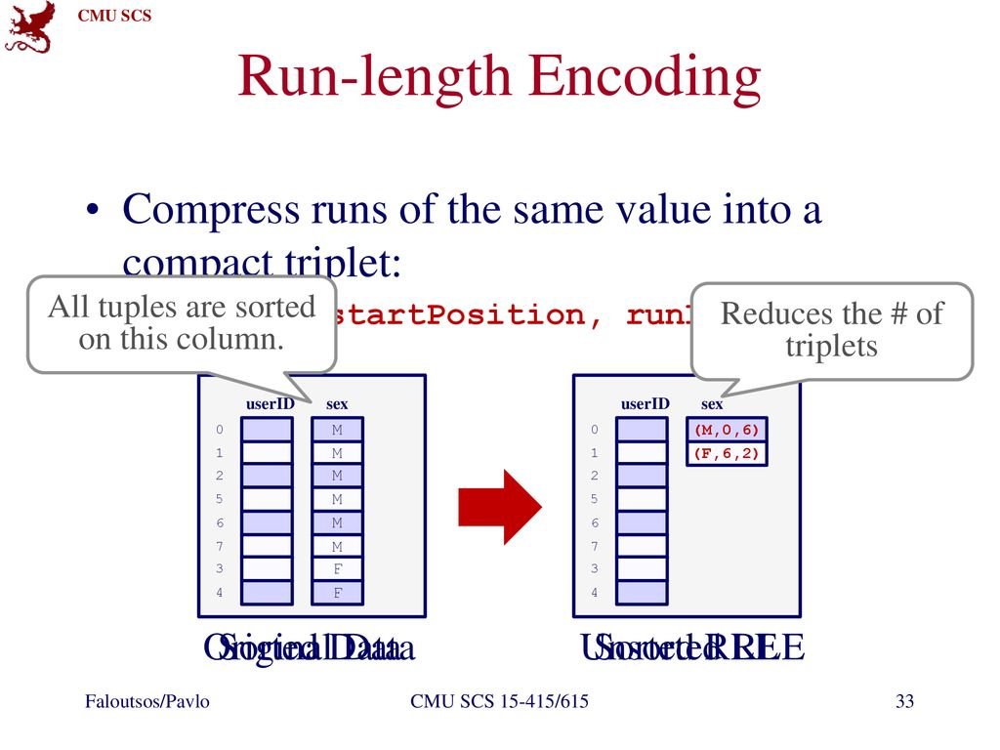
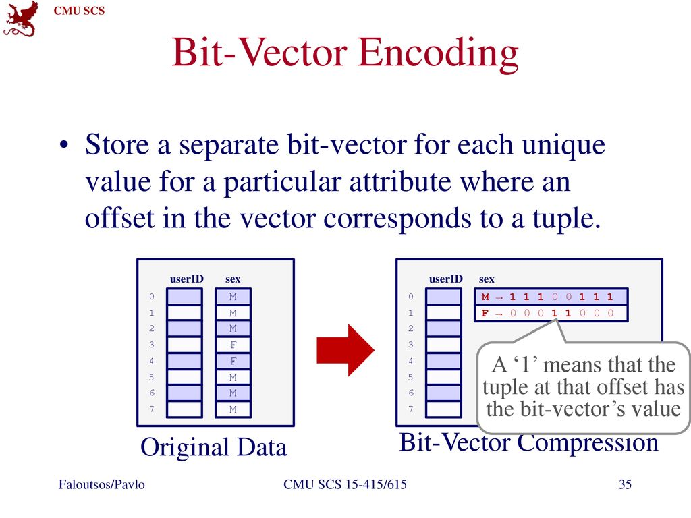
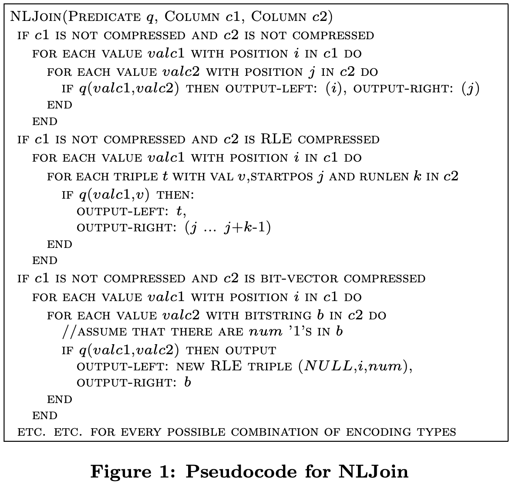

# Integrating Compression and Execution in Column-Oriented Database Systems

SIGMOD 2006

## ABSTRACT

Column-oriented database system architectures invite a re-evaluation of how and when data in databases is compressed. Storing data in a column-oriented fashion greatly increases the **similarity of adjacent records** on disk and thus opportunities for compression. The ability to compress many adjacent tuples at once lowers the **per-tuple cost of compression**, both in terms of CPU and space overheads.

In this paper, we discuss how we extended C-Store (a column-oriented DBMS) with a compression sub-system. We show how compression schemes not traditionally used in row-riented DBMSs can be applied to column-oriented systems. We then evaluate a set of compression schemes and show that the best scheme depends not only on the properties of the data but also on the nature of the query workload.

## 1. INTRODUCTION

Compression -> improve performance significantly in db.
- reduceing the size of the data from disk
- less I/O seek times
- higher buffer hit rate. 

Compression only makes sense for queries that are I/O limited, the **CPU overhead is often compensated for by the I/O improvements** as improvements in CPU speed outpaces memory and disk access.

Column-oriented -> vs. Row-oriented, **Columnar store + Compression is good combination!**, because 
1. Better compression ratio consecutive entries in a column are often quite **similar to each other** and sorted data is usually quite compressible., whereas **adjacent attributes in a tuple are not**. 
2. CPU overhead of iterating through a page of column values less than iterating through a page of tuples, allowing using vectorized code that takes advantage of the super-scalar and pipelining of modern CPUs
3. Operator on columnar data, e.g., no-eager/lazy decompressed, RLE 42 appears 1000 times, then SUM can be 42000.

## 2. C-STORE ARCHITECTURE

Experiment and extend on C-STORE where each column is compressed using one of the methods described in this paper, a recap.

Each table is physically represented as a collection of **projections**.

Each projection consists of a set of columns, each stored column-wise, along with a common sort order for those columns.

```
a set of columns + sort order
(shipdate, quantity, retflag, suppkey | shipdate, quantity, retflag)
```

Every column of each table is represented in at least one projection, and columns are allowed to be stored in multiple projections, allows the query optimizer to choose from.

join indices.

## 3. COMPRESSION SCHEMES

### 3.1 Null Suppression

consecutive zeros or blanks -> {numb of nulls}. ?

### 3.2 Dictionary Encoding

replace frequent patterns with smaller codes for them.

Keep data byte-aligned rather than bit-shifting because worth **byte-aligning dictionary entries** to obtain even modest CPU savings.

Algorithm: first calculates the num- ber of bits, X, needed to encode a single attribute of the column, calculates how many of these X-bit encoded values can fit in 1, 2, 3, or 4 bytes. For example, if an attribute has 32 values, it can be encoded in 5 bits, so 1 of these values can fit in 1 byte, 3 in 2 bytes,4 in 3 bytes,or 6 in 4bytes. 

For example, if the value 1 is encoded by the 5 bits: 00000; the value 25 is encoded by the 5 bits: 00001; and the value 31 is encoded by the 5 bits 00010; then the dictionary would have the entry (read entries right-to-left)
```
X000000000100010 -> 31 25 1
```

**Lesson Learned: Column stores are so I/O efficient that even a small amount of compression is enough to make queries on that column become CPU-limited**.

**CPU Cache-Conscious Optimization**, The size of the dictionary fits into L2 cache of CPU.

**Parsing Into Single Values for query operator**. Instead of decoding a 16-bit entry in the above example into the 3 original values, one could instead apply 3 masks (and corresponding bit-shifts) to get the three single attribute dictionary values. For example:
```
(X000000000100010 & 0000000000011111) >> 0 = 00010 
(X000000000100010 & 0000001111100000) >> 5 = 00001 
(X000000000100010 & 0111110000000000) >> 10 = 00000
```

### 3.3 Run-length Encoding

Run-length encoding compresses **runs of the same value** in a column to a compact **singular representation**. 

```
(value, start position, run length)
```


*from https://slideplayer.com/slide/14768807/*

The C-Store architecture results in a high percentage of columns being sorted (or secondarily sorted) and thus provides many opportunities for RLE-type encoding.

### 3.4 Bit-Vector Encoding

Suit when cardinality is low, such as marketplace id, country code.



further compressing these bit-maps.

## 4. COMPRESSED QUERY EXECUTION

Introduce **compression block** in C-STORE qurery executor. 

How to read columns?

- First is through repeated use of the `getNext()` method which will progress through the compressed buffer, transiently decompressing the next value and returning that value along with the position (a position is the ordinal offset of a value in a column) that the value was located at in the original column. 
- Second is through the `asArray()` method which decompresses the entire buffer and returns a pointer to an array of data in the uncompressed column type.

**Compression-Aware Optimizations**

NLJ (nested loops join) operator.



//TODO

## References

https://slideplayer.com/slide/14768807/