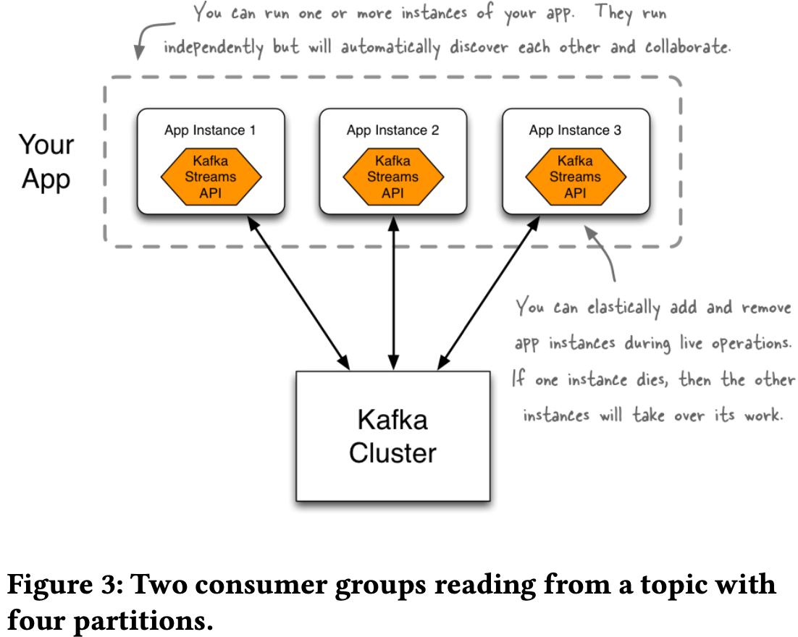
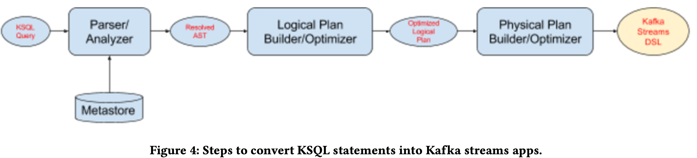

# KSQL: Streaming SQL Engine for Apache Kafka

2019

## ABSTRACT

Demand for real-time stream processing has been increasing and
Apache Kafka has become the de-facto streaming data platform in
many organizations. Kafka Streams API along with several other
open source stream processing systems can be used to process
the streaming data in Kafka, however, these systems have very
high barrier of entry and require programming in languages such
as Java or Scala.
In this paper, we present KSQL, a streaming SQL engine for
Apache Kafka. KSQL provides a simple and completely interactive
SQL interface for stream processing on Apache Kafka; no need
to write code in a programming language such as Java or Python.
KSQL is open-source, distributed, scalable, reliable, and real-time.
It supports a wide range of powerful stream processing opera-
tions including aggregations, joins, windowing, sessionization,
and much more. It is extensible using User Defined Functions
(UDFs) and User Defined Aggregate Functions (UDAFs). KSQL
is implemented on Kafka Streams API which means it provides
exactly once delivery guarantee, linear scalability, fault tolerance
and can run as a library without requiring a separate cluster.

## Intro

What is KSQL? A streaming SQL engine for Apache Kafka that offers an easy way to express stream processing transformations.

KSQL is implemented on top of the [Kafka Streams API](https://kafka.apache.org/39/documentation/streams/).

- Kafka streams 
    - runs in application, simple, not like Flink running on a cluster. Scale out? just start more applications.
    - uses intermediate Kafka topics to perform shuffle for operations such as aggregation and join that need to colocate data based on a key. **repartitions**. 
    - state stores in RocksDB.



## KSQL

Message := key + value + offset, no schema

so, has to have schema on value. BOOLEAN, INTEGER, BIGINT, DOUBLE, VARCHAR, and complex types of ARRAY, MAP and STRUCT

- Stream 
    - independent and unbounded sequence of structured values
- Table
    - state-full entity, change log with a state store that represent the latest state.
    - a new message either updates the previous message in the set with the same key, or adds a new message when there is no message with the same key.
- Windowed
    - Tumbling window
    - Hopping window 
    - Session window

```
CREATE STREAM pageviews (
    viewtime BIGINT,
    userid VARCHAR, 
    pageid VARCHAR
) WITH(
    KAFKA_TOPIC='pageviews_topic',
    VALUE_FORMAT='JSON');

CREATE TABLE users (
    registertime BIGINT,
    gender VARCHAR,
    regionid VARCHAR,
    userid VARCHAR,
    address STRUCT<street VARCHAR, zip INTEGER>
) WITH (
    KAFKA_TOPIC='user_topic',
    VALUE_FORMAT='JSON',
    KEY='userid');
```

- CSAS(CREATE STREAM AS SELECT)
- CTAS(CREATE TABLE AS SELECT)
- INSERT INTO

```
CREATE STREAM enrichedpageviews AS
SELECT * FROM pageviews LEFT JOIN
users ON pageviews.userid = users.userid
WHERE regionid ='region 10';
```

```
CREATE TABLE userviewcount AS
SELECT userid, count(*)
FROM pageviews
WINDOW TUMBLING (SIZE 1 HOUR)
GROUP BY useid;
```

**KSQL engine** is to compile the KSQL statements into Kafka streams apps that can continuously run and process data streams in Kafka topics.

System catalog to table schemas.



UDFS AND UDAFS

EXECUTION MODES

### Appendix

KSQL is deprecated; use **ksqlDB** for new applications, **ksqlDB** is the successor to KSQL, merging stream processing + database capabilities. Introduced materialized views: Persistent tables that can be queried in real time.
Added connectors: Reads/writes directly to external databases (PostgreSQL, MySQL, etc.).

```
SELECT user_id, COUNT(*) 
FROM clickstream 
GROUP BY user_id 
EMIT CHANGES;
```

If you only need basic stream transformations, Kafka Streams API might be enough.
