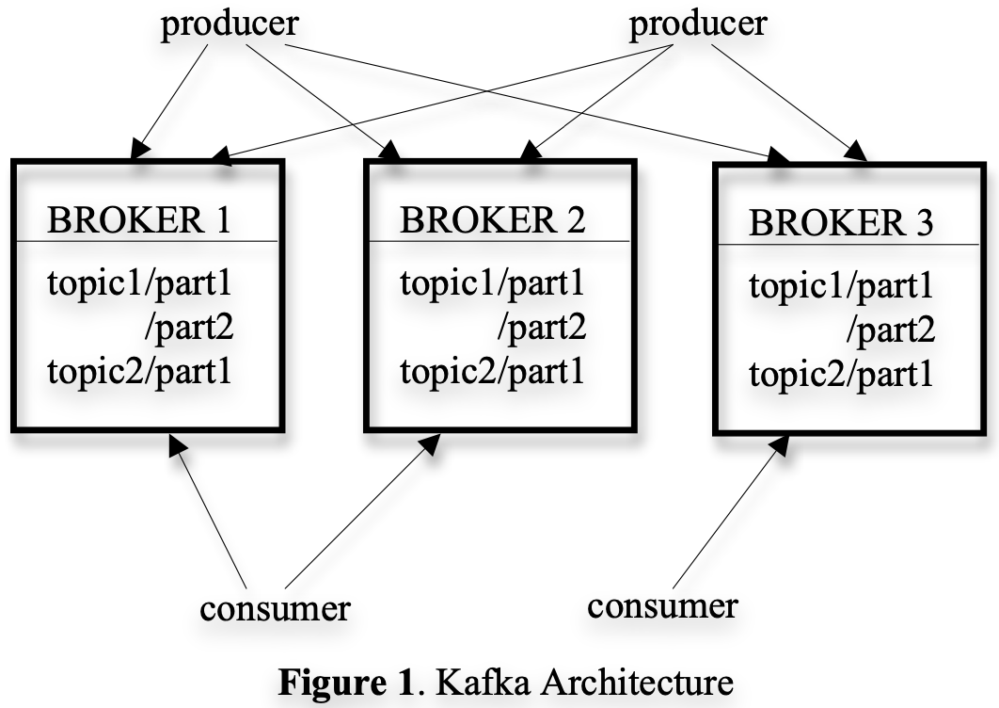
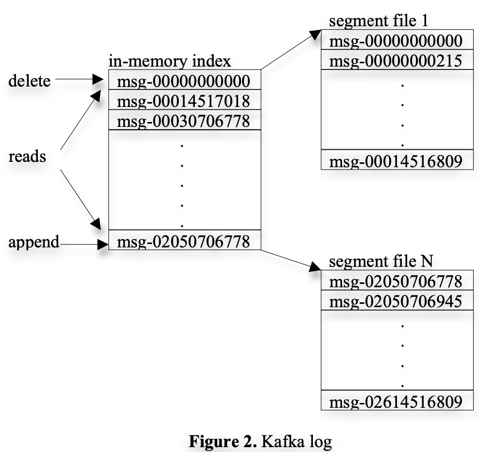

# Kafka: a Distributed Messaging System for Log Processing

NetDB'11, Jun. 12, 2011

## ABSTRACT

Log processing has become a critical component of the data pipeline for consumer internet companies. We introduce Kafka, a distributed messaging system that we developed for collecting and delivering high volumes of log data with low latency. Our system incorporates ideas from existing log aggregators and messaging systems, and is suitable for both offline and online message consumption. We made quite a few unconventional yet practical design choices in Kafka to make our system efficient and scalable.

Our experimental results show that Kafka has superior
performance when compared to two popular messaging systems.
We have been using Kafka in production for some time and it is
processing hundreds of gigabytes of new data each day.

## Intro

Kafka, a distributed messaging system, complementary of traditional real-time log aggregators predecessors: Facebook’s Scribe [6], Yahoo’s Data Highway [4], and Cloudera’s Flume  (collecting and loading, pushing the log into data warehouse or Hadoop).

## Kafka Architecture and Design Principles

### Roles

- Topic: A stream of messages of a particular type.
- Partition: A topic is divided into
multiple partitions.
- Broker: Stateless, each broker stores one or more 
partitions.
- Producer
    ```
    producer = new Producer(…);
    message = new Message(“test message str”.getBytes());
    set = new MessageSet(message);
    producer.send(“topic1”, set);
    ```
- Consumser: subscribed messages by pulling data
from the brokers.
    ```
    streams[] = Consumer.createMessageStreams(“topic1”, 1)
    for (message : streams[0]) {
        bytes = message.payload();
        // do something with the bytes
    }
    ```



### Log

- A set of Segment files of approximate 1GB.
- Broker simply append to last Segment.
- Async flush to disk
- In-memory sparse index of Segment file first offest, binary search to locate one offset.



### Message
- No identifier, just logical offset in the log.
- Avoids the overhead of maintaining auxiliary, seek-intensive random-access index structures that map the message ids to the actual message locations.
- "Note that our message ids are increasing but not
consecutive. " [Xu: during failover?]

wire format
```
length: varint
attributes: int8
    bit 0~7: unused
timestampDelta: varlong
offsetDelta: varint
keyLength: varint
key: byte[]
valueLen: varint
value: byte[]
Headers => [Header]
```

### Consumer
- asynchronous pull
- ack offset

### Efficient transfer

- Rely on file system page cache for sequential access
    [Xu: Redpanda avoids OS dependent cache vs. direct I/O?]
- Zero-copy: 4 data copying and 2 system calls -> Bypass user space I/O, `transferFrom/SendTo` [sendfile](https://man7.org/linux/man-pages/man2/sendfile.2.html) syscalls.
- Read-ahead (Prefetch)
- Write-behind (group commit, group smaller logical writes into large physical writes). 

### Distributed Coordination

- Routing by Partitioning key
- Independent consumer groups
- Decentralized subscribe by Zookeeper
- Zookeeper for
    - membership change: detecting the addition and the removal of brokers and consumers
    - triggering a rebalance process in each consumer when the above events happen
    - maintaining the consumption relationship and keeping track of the consumed offset of each partition.

### Delivery Guarantees

- at-least-once delivery
- single partition in order, no global FIFO.

## Appendix

https://kafka.apache.org/documentation/#design


### High Performance Techniques

- Producer
    - Batch, message set
    - Async + callback
- Binary message format
    - Compression
- Zero-copy sendfile syscall avoiding byte copying
- Divide and Conquer, Load balancing on producer and consumer, Sharded partition for throughput
- Sequential access
- No force fsync? OS Page Cache then later flush

### Zero copy process

1. The operating system reads data from the disk into pagecache in kernel space
2. The application reads the data from kernel space into a user-space buffer
3. The application writes the data back into kernel space into a socket buffer
4. The operating system copies the data from the socket buffer to the NIC buffer where it is sent over the network

### Similar alternatives

- Apache Pulsar 
- Redpanda
- NATS JetStream
- Azure Event Hubs
- Message Queues
    - RabbitMQ
    - Amazon SQS