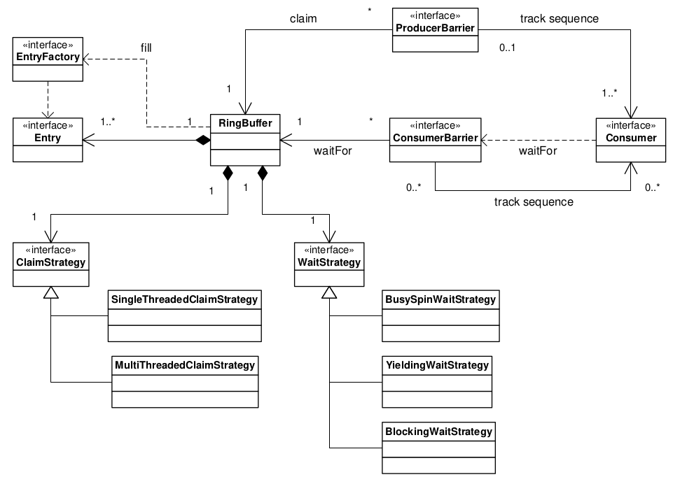

# LMAX Disruptor: High performance alternative to bounded queues for exchanging data between concurrent threads

https://lmax-exchange.github.io/disruptor/disruptor.html

## Abstract

LMAX was established to create a very high performance financial exchange. As part of our work to accomplish this goal we have evaluated several approaches to the design of such a system, but as we began to measure these we ran into some fundamental limits with conventional approaches.

Many applications depend on queues to exchange data between processing stages. Our performance testing showed that the latency costs, when using queues in this way, were in the same order of magnitude as the cost of IO operations to disk (RAID or SSD based disk system) – dramatically slow. If there are multiple queues in an end-to-end operation, this will add hundreds of microseconds to the overall latency. There is clearly room for optimisation.

Further investigation and a focus on the computer science made us realise that the conflation of concerns inherent in conventional approaches, (e.g. queues and processing nodes) leads to contention in multi-threaded implementations, suggesting that there may be a better approach.

Thinking about how modern CPUs work, something we like to call “**mechanical sympathy**”, using good design practices with a strong focus on teasing apart the concerns, we came up with a data structure and a pattern of use that we have called the Disruptor.

Testing has shown that the mean latency using the Disruptor for a three-stage pipeline is 3 orders of magnitude lower than an equivalent queue-based approach. In addition, the Disruptor handles approximately 8 times more throughput for the same configuration.

These performance improvements represent a step change in the thinking around concurrent programming. This new pattern is an ideal foundation for any asynchronous event processing architecture where high-throughput and low-latency is required.

At LMAX we have built an order matching engine, real-time risk management, and a highly available in-memory transaction processing system all on this pattern to great success. Each of these systems has set new performance standards that, as far as we can tell, are unsurpassed.

However this is not a specialist solution that is only of relevance in the Finance industry. The Disruptor is a general-purpose mechanism that solves a complex problem in concurrent programming in a way that maximizes performance, and that is simple to implement. Although some of the concepts may seem unusual it has been our experience that systems built to this pattern are significantly simpler to implement than comparable mechanisms.

The Disruptor has significantly **less write contention, a lower concurrency overhead and is more cache friendly** than comparable approaches, all of which results in greater throughput with less jitter at lower latency. On processors at moderate clock rates we have seen over 25 million messages per second and latencies lower than 50 nanoseconds. This performance is a significant improvement compared to any other implementation that we have seen. This is very close to the theoretical limit of a modern processor to exchange data between cores.

## 1. Overview

The Disruptor: a general-purpose, high performance concurrent structure

## 2. The Complexities of Concurrency

- Concurrency: not only that two or more **tasks happen in parallel** (Xu: slice in CPU times), but also that they **contend on access to resources**.

- Important to tackle: **mutual exclusion** (mostly writes) and **visibility of change**

### 2.1. The Cost of Locks

Expensive because context switch to the operating system kernel happens, which will suspend threads waiting on a lock until it is released by lock owner/holder.

| Method | Time (ms) |
|--------|-----------|
| Single thread | 300 |
| Single thread with lock | 10,000 |
| Two threads with lock | 224,000 |
| Single thread with CAS | 5,700 |
| Two threads with CAS | 30,000 |
| Single thread with volatile write | 4,700 |

### 2.2. The Costs of “CAS”

CAS (Compare And Swap) operations, e.g. “lock cmpxchg” on x86, is a special machine-code instruction that allows a word in memory to be conditionally set as an atomic operation. (e.g. fetch_add in C++ atomic, incrementAndAdd in Java AtomicInteger). No context swtich.

CAS is not free. The processor must lock its instruction pipeline to ensure atomicity and employ a memory barrier to make the changes visible to other threads. 

### 2.3. Memory Barriers

Modern processors perform out-of-order execution of instructions and out-of-order loads and stores of data between memory and execution units for performance reasons. 

The processors need only guarantee that **program logic produces the same results regardless of execution order**.

Memory barriers are used by processors to indicate sections of code where the ordering of memory updates is important. They are the means by which hardware ordering and visibility of change is achieved between threads. 

CPU Register, Cache, CPU Store buffer and Invalidate queue has cache coherency protocols (MESI (Modified, Exclusive, Shared, and Invalid) on Intel x86-64), Main memory, when you write, it can reside in any of these places. The timely generation of these messages (Xu: or visiability) can be controlled by memory barriers.

https://www.intel.com/content/www/us/en/developer/articles/technical/fast-core-to-core-communications.html //TODO

- A write barrier (**sfence**) orders store instructions on the CPU that executes it by marking a point in the store buffer, thus flushing writes out via its cache. This barrier gives an ordered view to the world of what store operations happen before the write barrier.

- A read memory barrier (**lfence**) orders load instructions on the CPU that executes it by marking a point in the invalidate queue for changes coming into its cache. This gives it a consistent view of the world for write operations ordered before the read barrier.

- A full memory barrier (**mfence**) orders both loads and stores but only on the CPU that executes it.

### 2.4. Cache Lines

64 bytes unit

**False Sharing**: different threads modify distinct data that happens to reside on the same CPU cache line, causing unnecessary cache invalidations and slow-downs, even though the threads aren't logically sharing the same data.

When iterating over the contents of an array the stride is predictable and so memory will be **pre-fetched** in cache lines, maximizing the efficiency of the access. E.g., linked lists and trees are not cache-line friendly.

### 2.5. The Problems of Queues

linked-lists or arrays

have write contention on the head, tail, and size variables

Head and tail mechanisms often share the same cache line despite separation

Queues typically operate at extremes (nearly full or nearly empty), maximizing contention

Java-Specific Issues: GC -> Objects allocated and placed in queue, Node objects for linked-list backing

## 3. Design of the LMAX Disruptor

The LMAX disruptor is designed to address all of the issues outlined above in an attempt to maximize the **efficiency of memory allocation**, and operate in a **cache-friendly manner** so that it will perform optimally on **modern hardware**.

Disruptor: **A pre-allocated bounded data structure in the form of a ring-buffer**. Data is added to the ring buffer through one or more producers and processed by one or more consumers. (Xu: multi-producer and multi-consumer).

### 3.1. Memory Allocation

Ringbuffer: an array of pointers to entries or an array of structures representing the entries that will be re-used and live for the duration of the Disruptor instance.

(Xu: Project Valhalla addresses this)

Laid out contiguously in main memory and so support cache striding

### 3.2. Teasing Apart the Concerns

Concerns:

- Storage of items being exchanged
- Coordination of producers claiming the next sequence for exchange
- Coordination of consumers being notified that a new item is available

On creation of the ring buffer the Disruptor utilises the abstract factory pattern to pre-allocate the entries. (Xu: `EventFactory`)

Ring size a power of 2

No contention at the head and tail of the queue, just ring buffer walk through.

- Single-producer: no contention
- Multi-producer: Contention on claiming the next available entry can be managed with a simple CAS operation on the sequence number for that slot.

Once a producer has copied the relevant data to the claimed entry it can make it public to consumers by committing the sequence. (Xu: API of Disruptor next() -> publish())

Consumers wait for a sequence to become available in the ring buffer before they read the entry. Various strategies can be employed while waiting. (Xu: busy spin, lock block, timeout wait, thread yield )

### 3.3. Sequencing

Producers claim the next slot in sequence when claiming an entry in the ring. Always incremental.

Consumers wait for a given sequence to become available by using a memory barrier to read the cursor. Once the cursor has been updated the memory barriers ensure the changes to the entries in the ring buffer are visible to the consumers who have waited on the cursor advancing.

Consumers each contain their own sequence which they update as they process entries from the ring buffer. 
These consumer sequences allow the producers to track consumers to prevent the ring from wrapping. 

### 3.4. Batching Effect

### 3.5. Dependency Graphs

### 3.6. Disruptor Class Diagram


### 3.7. Code Example

(Xu: Now API is differnent from original paper.)

```
// Callback handler which can be implemented by consumers
final BatchHandler<ValueEntry> batchHandler = new BatchHandler<ValueEntry>()
{
public void onAvailable(final ValueEntry entry) throws Exception
{
// process a new entry as it becomes available.
}

    public void onEndOfBatch() throws Exception
    {
        // useful for flushing results to an IO device if necessary.
    }

    public void onCompletion()
    {
        // do any necessary clean up before shutdown
    }
};

RingBuffer<ValueEntry> ringBuffer =
    new RingBuffer<ValueEntry>(ValueEntry.ENTRY_FACTORY, SIZE,
                               ClaimStrategy.Option.SINGLE_THREADED,
                               WaitStrategy.Option.YIELDING);
ConsumerBarrier<ValueEntry> consumerBarrier = ringBuffer.createConsumerBarrier();
BatchConsumer<ValueEntry> batchConsumer =
    new BatchConsumer<ValueEntry>(consumerBarrier, batchHandler);
ProducerBarrier<ValueEntry> producerBarrier = ringBuffer.createProducerBarrier(batchConsumer);

// Each consumer can run on a separate thread
EXECUTOR.submit(batchConsumer);

// Producers claim entries in sequence
ValueEntry entry = producerBarrier.nextEntry();

// copy data into the entry container

// make the entry available to consumers
producerBarrier.commit(entry);
```


