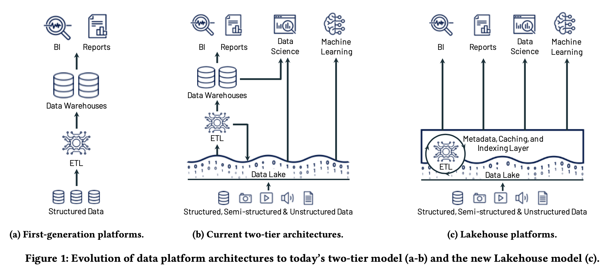
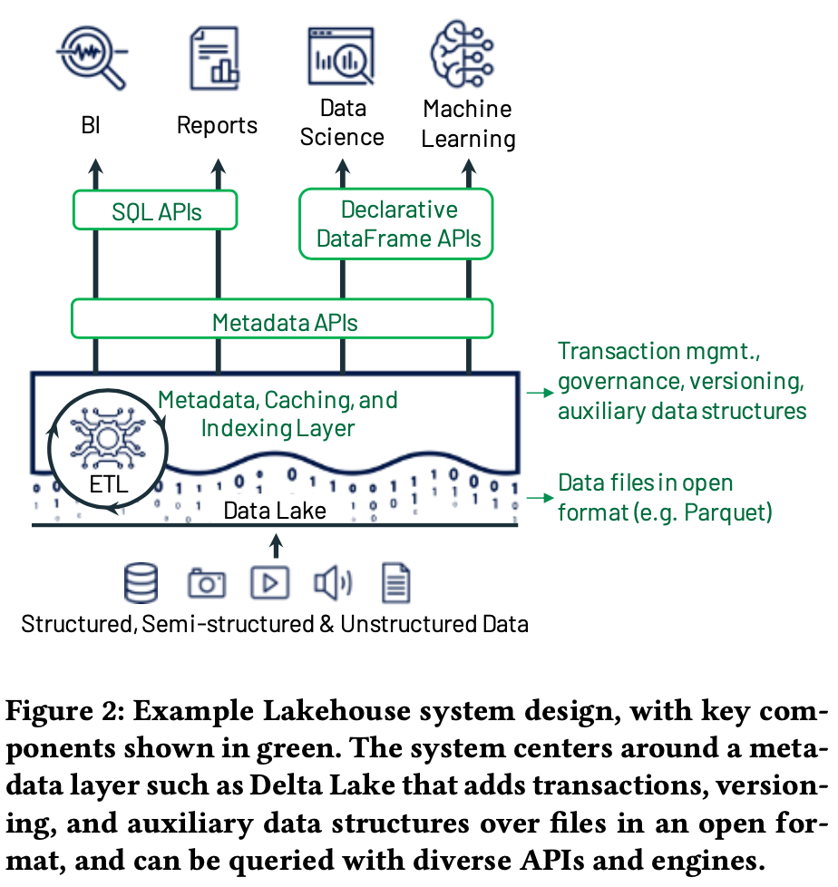

# Lakehouse: A New Generation of Open Platforms that Unify Data Warehousing and Advanced Analytics

https://www.cidrdb.org/cidr2021/papers/cidr2021_paper17.pdf

Lakehouse characterized:

- open direct-access data formats, such as Apache Parquet and ORC.

- first-class support for machine learning and data science workloads 

- state-of-the-art performance

Definition:

A data management system based on low-cost and directly-accessible storage that also provides traditional analytical DBMS management and performance features such as ACID transactions, data versioning, auditing, indexing, caching, and query optimization. 

We believe that the industry is likely to **converge** towards Lakehouse designs given the vast amounts of data already in data lakes and the opportunity to greatly simplify enterprise data architectures.

## Intro

Two-tier data lake + warehouse architecture is now dominant in the industry 

- DW: collect trx operational data to centrailized DW, support BI, schema-on-write, high performance since proprietary formats. Problems: 1. coupled storage and compute on-premise, provision and pay for peak workload, costly. 2. Only structured.
- Data lakes: offload data to lake with low-cost storage and open sourced format (Parquet, ORC), e.g. HDFS, schema-on-read, a subset be ETLed to DW.

What is the problem of the status-quo?

|                                        | Two-tier data lake + warehouse architecture                  | Lakehouse                                                    |
| -------------------------------------- | ------------------------------------------------------------ | ------------------------------------------------------------ |
| Reliability/Data quality               | consistent between DW/data lake two systems.  incorrect data due to complex data pipelines with increased number of ETL/ELT jobs. | fewer ETL/ELT, direct access.  ACID support trx, rollback, table version, 0-copy cloning, time travel, DeltaLake, Iceberg, Hudi. |
| Data staleness                         | staging data, periodic ETL/ELT jobs.                         |                                                              |
| Limited support for advanced analytics | unstructured NOT support.  ML: TensorFlow, PyTorch and XGBoost NOT on DW. non-SQL code, export leading to longer lag. |                                                              |
| Total cost of ownership                | high cost                                                    | low cost. S3/GCS/ADLS  decouple compute/storage. pay separately. |

Existing steps towards Lakehouses:

- major data warehouses support for EXTERNAL TABLE in RCFile, Parquet and ORC format on S3,...
  - Azure Synapse: Create external file format. https://learn.microsoft.com/en-us/sql/t-sql/statements/create-external-file-format-transact-sql?view=sql-server-ver16&tabs=delimited.
  - BigQuery: Creating a table definition file for an external data source. https://cloud.google.com/bigquery/external-table-definition, 2020.
  - Redshift CREATE EXTERNAL TABLE. https://docs.aws.amazon.com/redshift/latest/dg/r_CREATE_EXTERNAL_TABLE.html, 2020.
  -  Snowflake CREATE EXTERNAL TABLE. https://docs.snowflake.com/en/sql-reference/sql/create-external-table.html, 2020.
- SQL engines that run directly against data lake storage
  - Spark SQL, Presto, Hive, and AWS Athena 

## The Lakehouse Architecture

### Implementing a Lakehouse System

- store immutable data in a low-cost object store, S3
- transactional metadata layer, rollback, table version, 0-copy cloning, time travel, Delta lake, Iceberg
- open format, Parquet

- Performance: DW vs. Lakehouse
  - DW: 
    - storing hot data on fast devices such as SSDs, e.g. Redshift, RA3/DC2
    - maintaining statistics. Optimizer
    - building efficient access methods such as indexes, z-index, ADB full index.
    - co-optimizing the data format and compute engine. vectorized, sorted data, colocated join...
  - Lakehouse:
    - caching
      - on SSD, RAM, transcoded format. e.g. Databricks store decompressed Parquet files.
    - auxiliary data structures such as indexes and statistics
      - min-max statistic 
      - data skipping if base data is clustered.
      - bloom filter index.
    - data layout optimizations.
      - record ordering.  zonemap. individual dimensions or space-filling curves such as Z-order and Hilbert curves to provide locality across multiple dimensions.  minimize IO volume.

