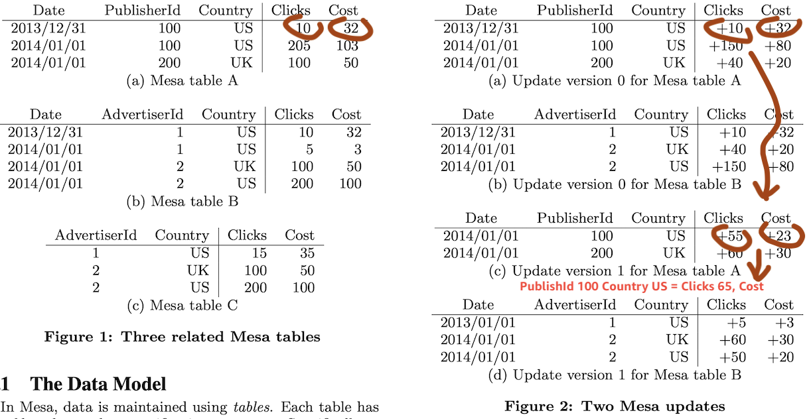
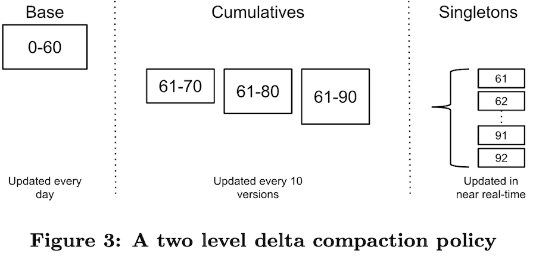
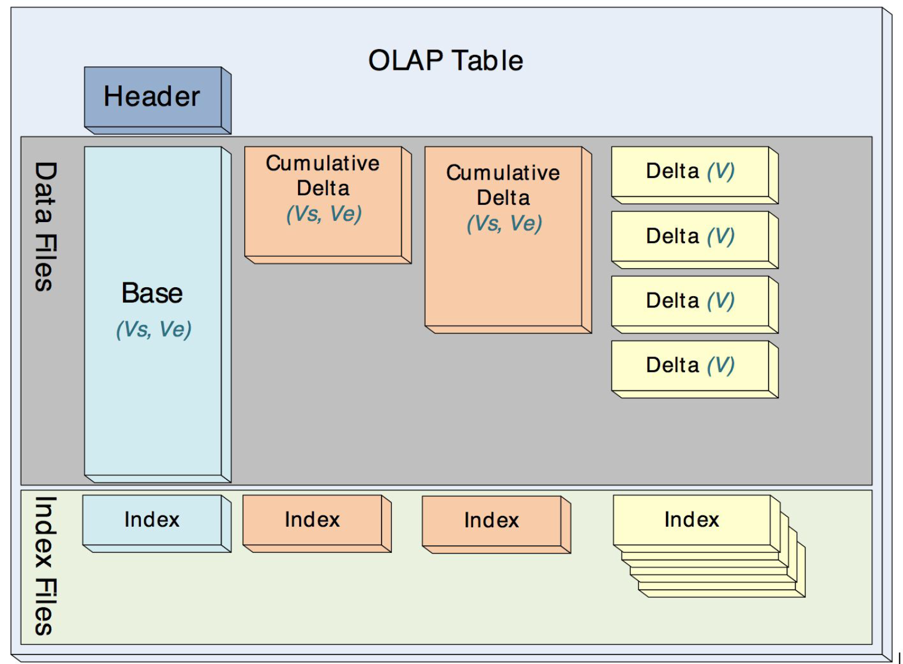
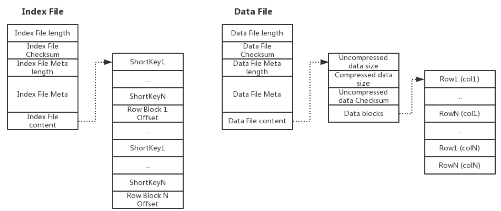
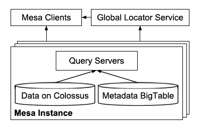
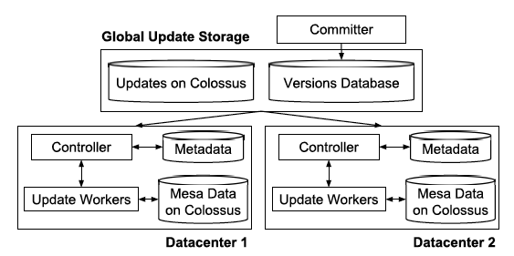

# Mesa: Geo-Replicated, Near Real-Time, Scalable Data Warehousing

VLDB 2014

## ABSTRACT

Mesa is a highly scalable analytic data warehousing system that stores critical measurement data related to Google’s Internet advertising business. Mesa is designed to satisfy a complex and challenging set of user and systems requirements, including near real-time data ingestion and queryability, as well as high availability, reliability, fault tolerance, and scalability for large data and query volumes. Specifically, Mesa handles petabytes of data, processes millions of row updates per second, and serves billions of queries that fetch trillions of rows per day. Mesa is geo-replicated across multiple datacenters and provides consistent and repeatable query answers at low latency, even when an entire datacen- ter fails. This paper presents the Mesa system and reports the performance and scale that it achieves.

## 1. INTRODUCTION

### Data needs 

For Google Ads system.

- Atomic Updates
- Consistency and Correctness: strong consistency and repeatable query results.
- **Availability**: for online production data serving. No SPOF and downtime in planned or unplanned maintenance or failures, outages in DC.
- **Near Real-Time Update Throughput**: stringent data staleness and freshness.
- **Query Performance**: latency-sensitive users serving live customer reports with very low latency (p99 hundreds of ms), and ETL for high throughput.
- **Scalability**: trillions of rows and petabytes of data.
- Online Data and Metadata Transformation

### What is Mesa?

Mesa is a distributed, replicated, and highly available data processing, storage, and query system for structured data. Mesa ingests data generated by upstream services, aggregates and persists the data internally, and serves the data via user queries.

### Mesa technology in a nutshell

Levergage Google infrastructure: Colossus, BigTable, MapReduce.

Data is horizontally partitioned and replicated.

Updates may be applied at the granularity of a single table or across many tables (materialized view).

Multi-versioned.

Updates are batched, assigned a new version number, and periodically (e.g., every few minutes) incorporated into storage.

Cross DC consistency, distributed synchronization protocol based on Paxos.

## 2. MESA STORAGE SUBSYSTEM

### Data model of Mesa

Table schema (facts) ::= two types of attributes:
- dimensional attributes (which we call keys) 
- measure attributes (which we call values).

Types are int32、int64、string, etc.

Aggregation function on measure attributes: `SUM`,`MIN`,`MAX`,`COUNT`.

**A single fact may be aggregated in multiple materialized views based on these dimensional hierarchies to enable data analysis using drill-downs and roll-ups. Parent table - Children tables.** 

*(Xu: this is MOLAP (Multi-dimensional OLAP))*



For example, table C corresponds to a materialized view of the following query over table B.

```
SELECT SUM(Clicks), SUM(Cost) GROUP BY AdvertiserId, Country. 
```

### Updates and Queries

To achieve high update throughput, Mesa **applies updates in mini-batches**. The update batches themselves are produced by an upstream system outside of Mesa, typically at a frequency of **every few minutes**. An update to Mesa specifies a **version number** n (sequentially assigned from 0).

**Strict ordering, MVCC**, always incorporating an update entirely before moving on to the next update sequentailly.

### Versioned Data Management and Compaction

Given storing each version independently AND going over all the versions and aggregating them at query time is very expensive. Mesa **pre-aggregates** certain versioned data and stores it using deltas, each of which consists of a set of rows (with no repeated keys) and a version,  represented by [V1,V2].

A delta [V1, V2] and another delta [V2 + 1, V3] can be aggregated to produce the delta [V1,V3].

A delta are **immutable file** that **sorted by key**. Merge two delta uses  **O(N) merg sorted array**.

Similar to append-only log-structured storage systems such as LevelDB and BigTable. Mesa uses two level compaction policy: **base compaction** runs daily and **cumulative deltas** frequently (10 singleton deltas to 1). **Delta compaction policy** is a balance of query latency (too much small I/O) vs. storage cost (duplicate data).

举个例子，下图的中Base是24小时之前的文件，天粒度聚合而成。存在61-92这些个singleton delta，它们都是每个mini-batch导入的预聚合好的数据，如果不存在cumulative delta，那么假如查询条件的版本指定到91，那么就需要base，外加61-91这32次的随机I/O，这种延迟明显太大了，那么如果有了cumulative就可以按照最短路径的算法，做一次查询只需要base，加61-90这个cumulative，加91这一个delta，一共3次随机I/O就可以查询出来结果。




### Physical Data and Index Formats

Must support fast seeking to a specific key, so data is sorted and with index files.

**Data file**: row blocks columnar store, each of which is individually **transposed and compressed**. 

**Index file**: An index entry contains the short key for the row block, which is a fixed size prefix of the first key in the row block, and the offset of the compressed row block in the data file. A na ̈ıve algorithm for querying a specific key is to perform a binary search on the index file to find the range of row blocks that may contain a short key matching the query key, followed by a binary search on the compressed row blocks in the data files to find the desired key.





## 3. MESA SYSTEM ARCHITECTURE

### Single Datacenter Instance



- **Update/Maintenance Subsystem**

The update and maintenance subsystem runs various background operations such as loading updates, performing table compaction, applying schema changes, and running table checksums.

- **Query Subsystem**

Query servers: look up table metadata, determine the set of files storing the required data, perform on-the-fly aggregation of this data. Only SELECT *, no rich SQL functionality. Multiple sets with labeling for different workload.

### Multi-Datacenter Deployment




