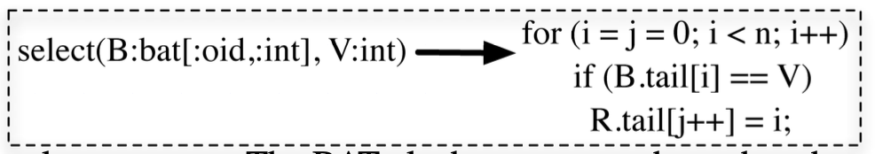

# MonetDB: Two Decades of Research in Column-oriented Database Architectures

2012

## Abstract

MonetDB is a state-of-the-art open-source column-store database management system targeting ap- plications in need for analytics over large collections of data. MonetDB is actively used nowadays in health care, in telecommunications as well as in scientific databases and in data management research, accumulating on average more than 10,000 downloads on a monthly basis. This paper gives a brief overview of the MonetDB technology as it developed over the past two decades and the main research highlights which drive the current MonetDB design and form the basis for its future evolution.

## What 

MonetDB1 is an open-source database management system (DBMS) for high-performance applications in analytical workload (data mining, BI, OLAP, scientific databases, XML Query, text and multimedia retrieval), that is being developed at the CWI database architectures research group since 1993.

## Uniqueness

Pioneer: MonetDB achieves significant speed up compared to more traditional designs by innovations at all layers of a DBMS.

-  storage model based on vertical fragmentation (column-store)
- a modern CPU-tuned query execution architecture
- adaptive indexing
- run-time query optimization
- a modular software architecture

## MonetDB Design

SQL:2003 standard, client interfaces such as ODBC and JDBC.

For read-dominated, but support for transactions.

### Physical Data Model

1. First to exploit column-store + new design for an execution engine on column-store.

Vertical fragmentation (column-store), by storing each column in a separate `(surrogate,value)` table, called a **BAT (Binary Association Table)**. surrogate is OID (object-identifier) or row Id. All attribute values of a single tuple are assigned the same OID. **The OID columns are not materialized, but rather implicitly given by the position.**

For each relational tuple t of R, all attributes of t are stored in the **same position** in their respective column representations. The position is determined by the **insertion order of the tuples**. This tuple-order alignment across all base columns allows the column-oriented system to perform tuple **reconstructions** efficiently in the presence of tuple order-preserving operators.

*Xu: like ADB.*

Design cache-conscious data structures and algorithms that make optimal use of hierarchical memory systems

2. Encoding

- fixed-width data types (e.g., integer, decimal and floating point numbers)
- variable-width data types (e.g., strings) with dict encoding with BLOB.

3. Memory mapped files support to load data

4. Late tuple reconstruction (Late Materialization?)

Only just before sending the final result to the client, N-ary tuples are constructed. This approach allows the query engine to **exploit CPU- and cache-optimized vector-like operator implementations throughout the whole query evaluation relying on a bulk processing model as opposed to the typical Volcano approach**, allowing to minimize function calls, type casting, various metadata handling costs, etc. Intermediate results need to be materialized, but those can be reused 

### Execution Model

MonetDB Assembly Language (MAL). 

The BAT algebra operators have the advantage that tight for-loops without function calls create high instruction locality which eliminates the instruction cache miss problem. Such simple loops are amenable to compiler optimization (loop pipelining, blocking, strength reduction), and CPU out-of-order speculation.

Example of code, same as the example in paper MonetDB/X100.

### System Architecture. 

- Front-end: Map the user-space data model to MonetDB’s BATs and to translate and optimize (**pushing down selections** and exploiting **join indexes**) to MAL.
- Back-end: MAL optimizers framework, execution engine?
- Kernel: Operator level, `select` exploit **sorted-ness** of a BAT by deploying binary search, or **merge-join** if the join attributes happen to be sorted, and fall-back to **hash-join** otherwise.

## Research

Some advanced direction that MonetDB team explores.

- Hardware-conscious Database Technology

memory wall?

- Vectorized Execution and Light-weight Compression. 

compromise between classical tuple-at-a-time pipelining and operator-at-a-time bulk processing [4]. The idea of vectorized execution is to operate on chunks (vectors) of data that are large enough to amortize function call overheads, but small enough to fit in CPU caches and to avoid materialization of large intermediates into main memory. Combined with just-in-time light-weight compression, it lowers the memory wall significantly [21]. The X100 project has been commercialized into the Actian/VectorWise company.

Others:

- Reusing Intermediate Results with Recycler.

- Adaptive Indexing and Database Cracking? //TODO

- DataCyclotron. 

...

future efforts are mainly towards distributed and highly parallel processing as well as towards **adaptive and exploratory** processing where database systems may interpret queries by their intent, **rather than as a contract carved in stone** for complete and correct answers

