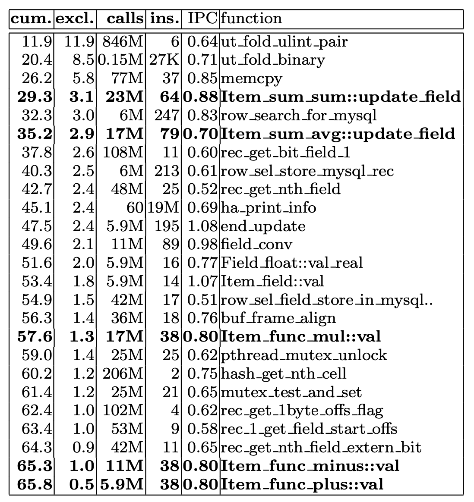
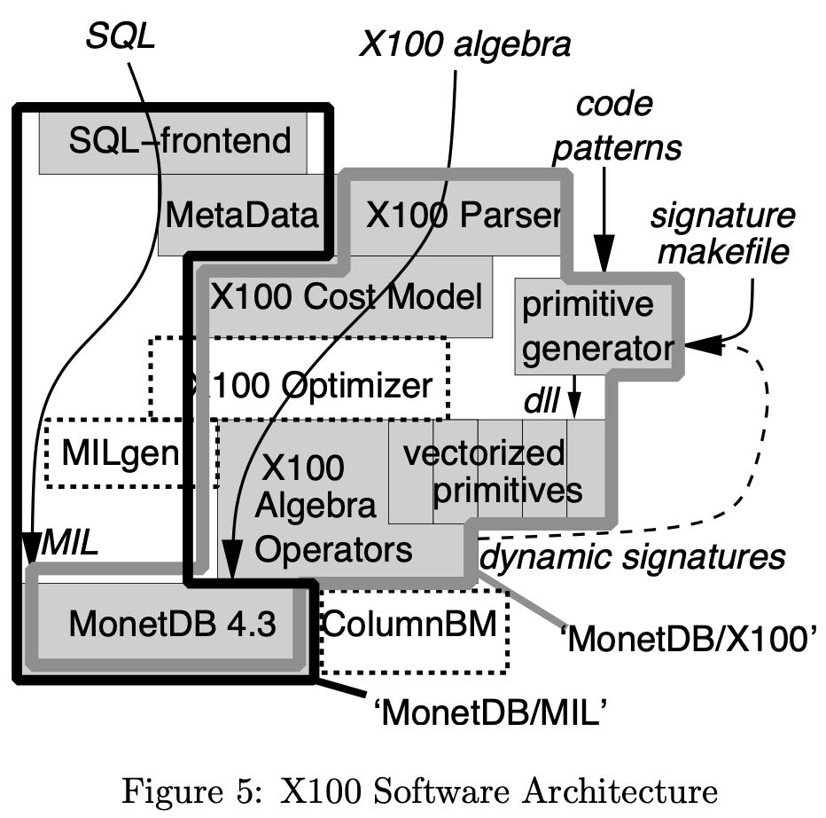
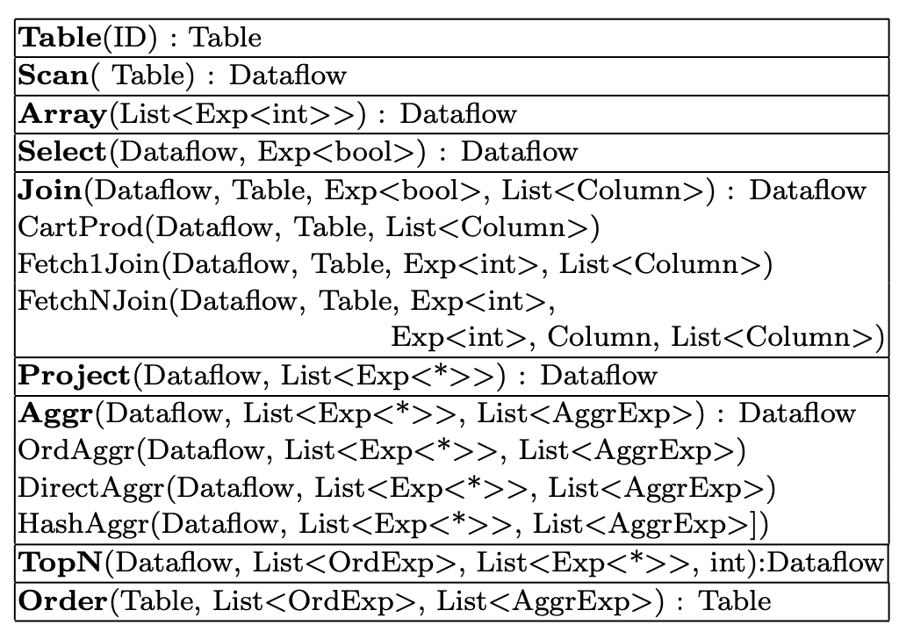
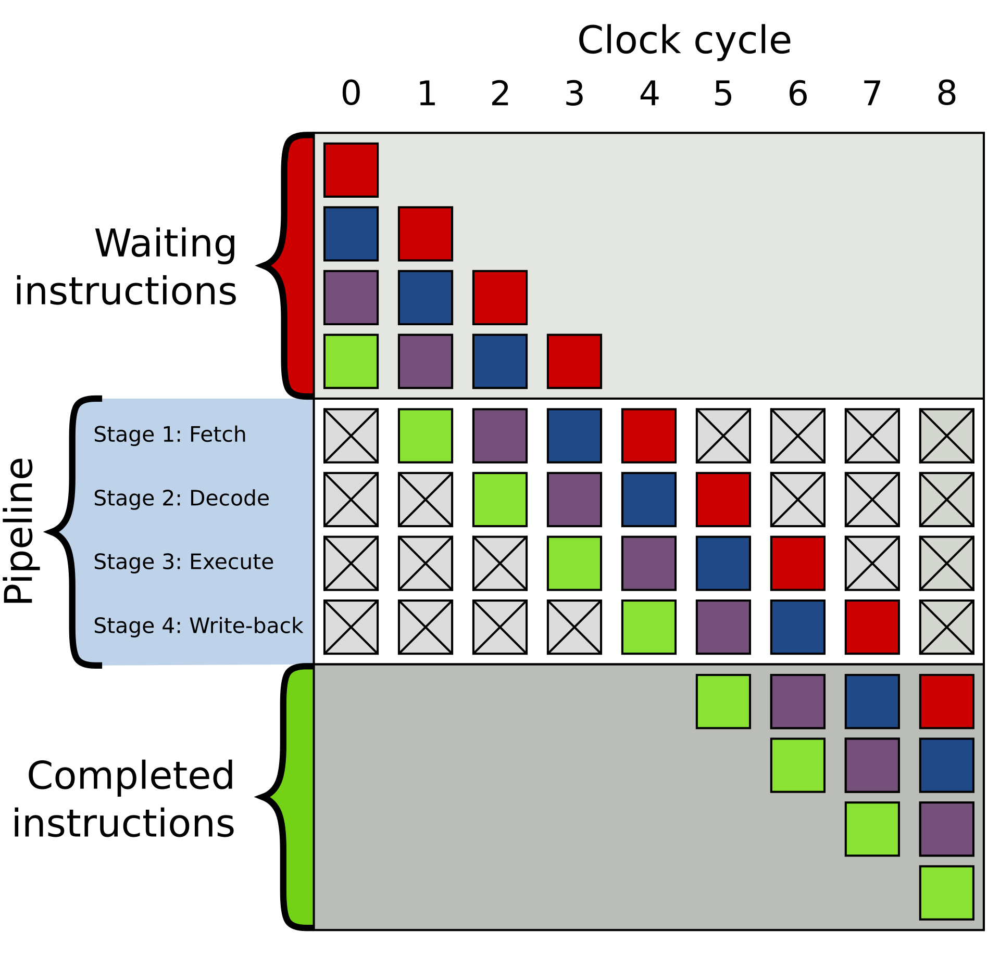
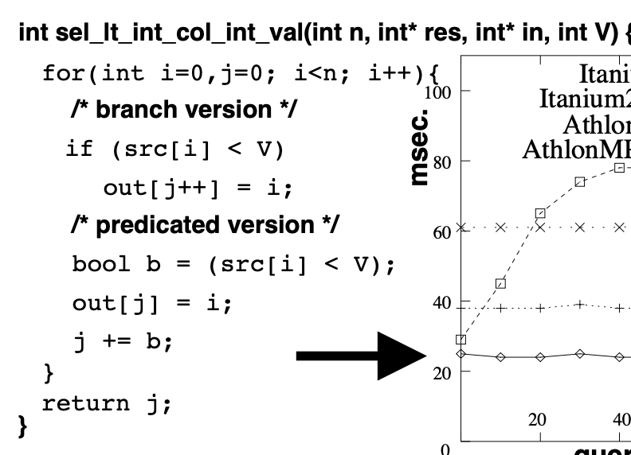
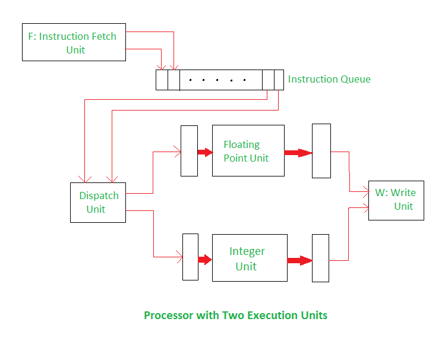

# MonetDB/X100: Hyper-Pipelining Query Execution

## Abstract
Database systems tend to achieve only low IPC (instructions-per-cycle) efficiency on modern CPUs in compute-intensive application areas like decision support, OLAP and multimedia retrieval. 

This paper starts with an in-depth investigation to the reason why this happens, focusing on the TPC-H benchmark. Our analysis of various relational systems and MonetDB leads us to a new set of guidelines for designing a query processor.

The second part of the paper describes the architecture of our new X100 query engine for the MonetDB system that follows these guidelines. 

On the surface, it resembles a classical Volcano-style engine, but the crucial difference to base all execution on the concept of vector processing makes it highly CPU efficient. We evaluate the power of MonetDB/X100 on the 100GB version of TPC-H, showing its raw execution power to be between one and two orders of magnitude higher than previous technology.

## Problem Statements

### Why
Modern CPUs can perform enormous amounts of calculations per second, but only if they can find enough **independent work** to exploit their **parallel execution** capabilities.

But **low IPC (instructions-per-cycle) for analytical workload in OLAP** because most DBMSs inhibits compilers from using their most performance-critical optimization techniques resulting in only IPC of 0.7.

For example, in OLAP,

* Example 1: **Volcano iterator model** for pipelined processing, leads to **tuple-at-a-time execution**, which causes both **1) high interpretation overhead**, and **2) hides opportunities for CPU parallelism from the compiler**. 
 * Example 2: **MonetDB1 with MIL query language** uses a **column-at-a-time execution model**, it can solve tuple-at-a-time interpretation, however, full column materialization causes it to generate large data streams during query execution, constrained by memory bandwidth, causing its CPU efficiency to drop sharply.

### How 
Combining the column-wise execution of MonetDB with the incremental materialization offered by Volcano-style pipelining. Create **MonetDB/X100**: a new prototype query engine with a **vectorized (1000 batch)** query processing model, achieving high CPU efficiency.

## Microbenchmark: TPC-H Query 1

Xu: The below proves that tuple-at-a-time execution like MySQL and columne-wise but full column materialization during execution like MonetDB/MIL all result to inablity to do exploit CPU pipelining causing low IPC.

Choose CPU-bound, simple, no fancy join query in TPC-H.

```
select
	l_returnflag,
	l_linestatus,
	sum(l_quantity) as sum_qty,
	sum(l_extendedprice) as sum_base_price,
	sum(l_extendedprice * (1 - l_discount)) as sum_disc_price,
	sum(l_extendedprice * (1 - l_discount) * (1 + l_tax)) as sum_charge,
	avg(l_quantity) as avg_qty,
	avg(l_extendedprice) as avg_price,
	avg(l_discount) as avg_disc,
	count(*) as count_order
from
	lineitem
where
	l_shipdate <= date '1998-12-01' - interval ':1' day
group by
	l_returnflag,
	l_linestatus
order by
	l_returnflag,
	l_linestatus
LIMIT 1;
```
*see https://github.com/dragansah/tpch-dbgen/blob/master/tpch-queries/1.sql*

On Relational Database System, MySQL uses Volcano + tuple-at-a-time execution model, below figure shows the real  “work” (displayed in bold) takes only **10%** of total execution time. One explanation for this high cost is the **absence of loop pipelining**. The addition (+) consists of four dependent instructions that have to wait for each other. 


*gprof trace of MySQL*

On MonetDB/MIL, vertical fragmentation of dataset (column-wise layout), each column stored in a Binary Association Table (BAT).But all MIL operators are memory-bound instead of CPU-bound! With SF=0.001, such that all used columns of the lineitem table as well as all intermediate results fit inside the CPU cache, eliminating any memory traffic. MonetDB/MIL then becomes almost twice as fast.

## X100: A Vectorized Query Processor

Goal: execute high-volume queries at high CPU efficiency.

Approach:
* Vertically fragmented data layout, column-wise store.
* Compressed disk data layout is used in RAM to save space and bandwidth.
* Vector-at-a-time + Volcano execution model: **Volcano-like execution pipeline based on a vectorized processing model. Small (e.g. 1000 values) vertical chunks of cache-resident data items, called “vectors” are the unit of operation for X100 execution primitives.  The CPU cache is the only place where bandwidth does not matter, and therefore (de)compression happens on the boundary between RAM and cache. The X100 query processing operators should be cache- conscious and fragment huge datasets efficiently into cache-chunks and perform random data access only there.** The C compiler sees that the X100 vectorized primitives operate on restricted (independent) arrays of fixed shape. This allows it to apply aggressive loop pipelining.

The paper focuses on storage engine, the query engine was still being built unmature. The experiments, X100 uses MonetDB as its storage manager (as shown in below figure), where it operates on in-memory BATs.



X100 Algebra



Data Storage

* To handle updates, deletion list + delta columns.
* Lightweight compression, encoding, store a column as a single-byte or two-byte integer.
* “summary” indices, MinMax indices on all columns.

## Appendix 1. How CPUs Work

### CPU Pipelining

A CPU technique for implementing instruction-level parallelism within a single processor. Pipelining attempts to keep every part of the processor busy with some instruction by dividing incoming instructions into a series of sequential steps (the eponymous "pipeline") performed by different processor units with different parts of instructions processed in parallel.



*Figure 1: Example of 4-stage pipeline. The colored boxes represent instructions independent of each other. from https://en.wikipedia.org/wiki/Branch_predictor*

### Branch predictor

The purpose of the branch predictor is to improve the flow in the instruction pipeline. Branch predictors play a critical role in achieving high performance in many modern pipelined microprocessor architectures.

If mispredicted the branch, and then must flush the pipeline.The deeper pipeline goes, the branch mispredictio/performance penalty goes high as processor has to flush the pipeline and fill it up with new instructions.

Example in the paper, transform the branch into a boolean calculation (the “predicated” variant) can do better.



### Super-scalar CPUs 

A super-scalar CPU can get to an IPC (Instructions Per Cycle) of > 1. 

Scalar architectures (execute one instruction per clock cycle) vs. Superscalar architectures (execute multiple instructions simultaneously).

Example: In the below diagram, there is a processor with two execution units; one for integer and one for floating point operations. The instruction fetch unit is capable of reading the instructions at a time and storing them in the instruction queue. In each cycle, scheduler and the dispatch unit retrieves and decodes up to two instructions from the front of the queue. If there is one integer, one floating point instruction and no hazards, both the instructions are dispatched in the same clock cycle. 



*from https://www.geeksforgeeks.org/superscalar-architecture/*

### Out-of-Order Execution

in-order execution vs. out-of-order execution.


### Compiler optimizations - loop pipelining

loop pipelining, an operation consisting of multiple dependent operations F(), G() on all n independent elements of an array A is transformed from:
```
F(A[0]),G(A[0]), F(A[1]),G(A[1]),.. F(A[n]),G(A[n])
```
into:
```
F(A[0]),F(A[1]),F(A[2]), G(A[0]),G(A[1]),G(A[2]), F(A[3]),..
```

### Cache-conscious

50-100ns to main memory, memory stall (wait 180 wait cycles for a 3.6GHz CPU), cache misses (cache hit-ratio of the memory loads and stores is where performance degration comes), we need cache-conscious data structures. 

Cache-aligned B-trees [16, 7] or column-wise data layouts such as PAX [2] and DSM [8] (as in MonetDB). 

* DSM（Decomposition Storage Model）

* PAX (Partition Attributes Cross)

## Reference

 *G. Graefe. Volcano - an extensible and parallel query evaluation system. IEEE Trans. Knowl. Data Eng., 6(1):120–135, 1994.*
