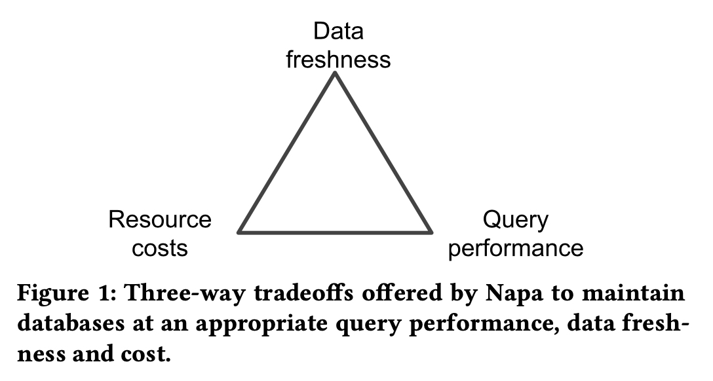
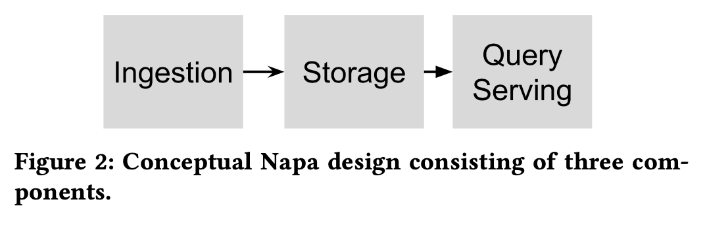
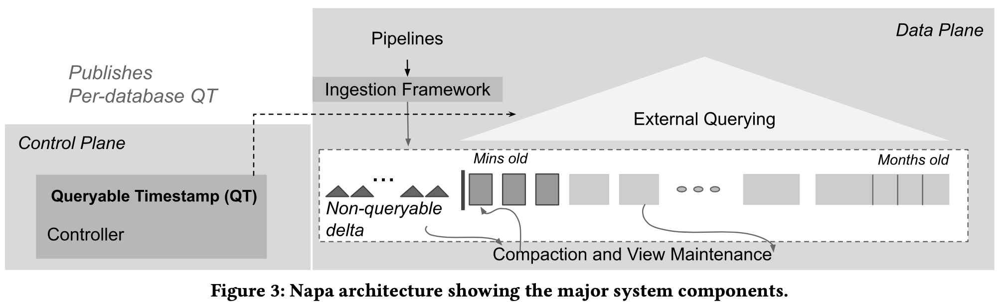
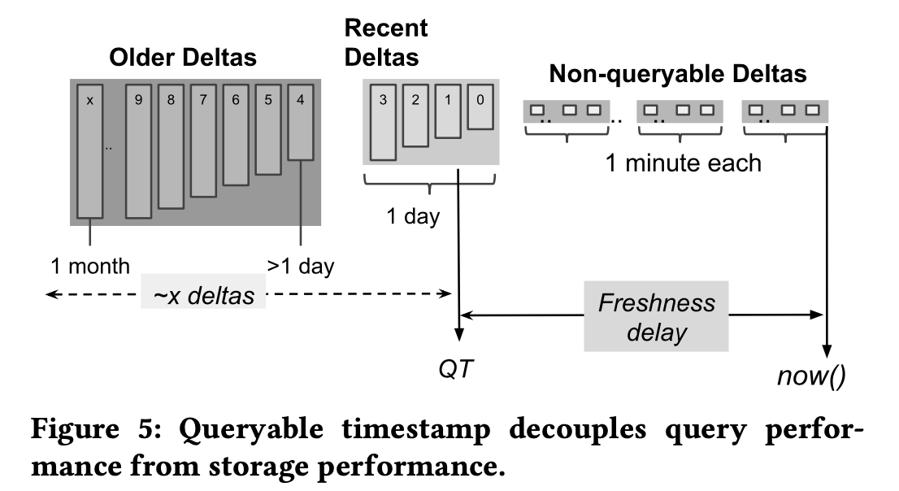
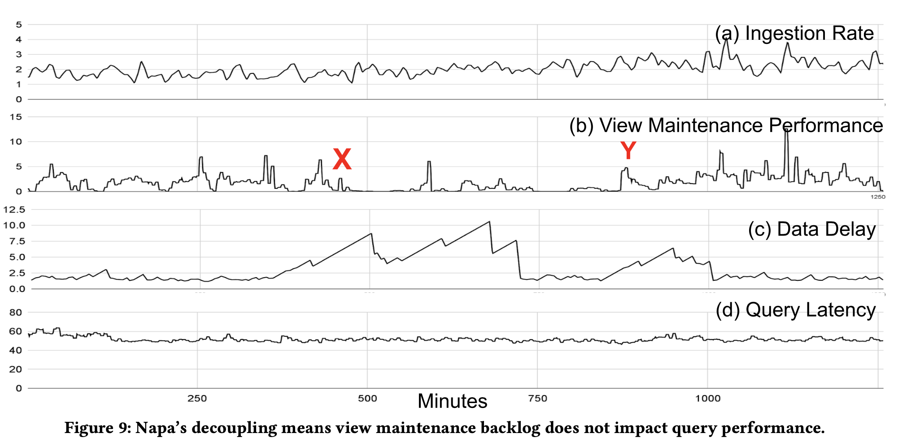
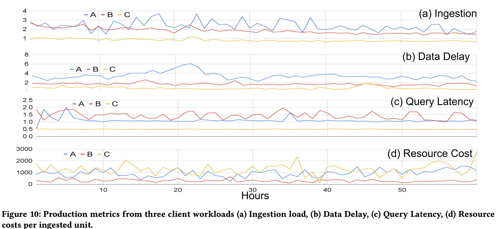

# Napa: Powering Scalable Data Warehousing with Robust Query Performance at Google

## ABSTRACT
Google services continuously generate vast amounts of application data. This data provides valuable insights to business users. We need to store and serve these planet-scale data sets under the extremely demanding requirements of scalability, sub-second query response times, availability, and strong consistency; all this while ingesting a massive stream of updates from applications used around the globe. We have developed and deployed in production an analytical data management system, Napa, to meet these requirements. Napa is the backend for numerous clients in Google. These clients have a strong expectation of variance-free, robust query performance. At its core, Napa's principal technologies for robust query performance include the aggressive use of materialized views, which are maintained consistently as new data is ingested across multiple data centers. Our clients also demand flexibility in being able to adjust their query performance, data freshness, and costs to suit their unique needs. Robust query processing and flexible configuration of client databases are the hallmark of Napa design.

Keyword: precomputed materialized views, Robust query capability to balance of query performance, data freshness and cost, a fully indexed storage system that is optimized for key lookups, range scans, and efficient incremental maintenance of indexes on tables and views. 

## 1 INTRODUCTION

Napa is an analytical data **storage** system, F1 Query as query engine. Napa was built to replace Mesa.

Bedrock principles of its design:

* **Robust Query Performance**: Consistent and predictable query performance, low variance in latency. As low as sub-second latency. Achieved by aggressive use of precomputed materialized views vs. efficient scans of base data.

* **Flexibility**: clients choose data freshness, performance, and cost dynamic requirements/tradeoffs. Do NOT want clients to choose between Always sacrifice freshness OR query performance or consistency.

* **High-throughput Data Ingestion**

## 2 DESIGN CONSTRAINTS

Clients Need Flexibility knobs. A three-way tradeoff.

For example, 1) less aggressive compactions for cost but result in reduced performance (higher merging effort at query execution time). assume view maintenance leads to higher costs usually. 2) cost-conscious client uses fewer materialized views, or reduced freshness to get good performance, 3) higher effort for all.

## 3 DESIGN CHOICES MADE BY NAPA

Napa has to be highly scalable to process a stream of updates while simultaneously serving millions of queries with good performance. A key design choice in Napa is to rely on materialized views for predictable and high query performance.

All decoupled, decouples ingestion from view maintenance, and view maintenance from query processing.

1. **Ingestion framework**: committing updates / deltas into the tables.
2. **Storage framework**: tables and views are LSM-tree based. Deltas are constantly consolidated to form larger deltas like Mesa, or so called **compaction**. Also, periodically compacting tables and views. =N-way merge sorting
3. **Query serving**: merging of necessary deltas of the table (or view) at query time. The fewer deltas the faster. F1 Query as query engine.

Knobs for client: number of views, quota limits on processing tasks, maximum number of deltas that can be opened, etc.

**Queryable Timestamp (QT)**: [Now() - QT] indicates data delay. All data up to the QT timestamp can be queried by the client. 

**Data Availability**: The underlying paradigm to provide this level of fault-tolerance is to replicate client databases at multiple data centers and ensure that the database replicas are mutually consistent. 

The queryable timestamp indicates a state at which all tables and views in a database are globally consistent across all data centers. Even though compaction and view maintenance are carried out asynchronously at each replica, the system moves from one consistent state to another.

## 4 SYSTEM ARCHITECTURE

**DATA PLANE** + **CONTROL PLANE** in multi-DCs.

* Data plane consists of ingestion, storage, and query serving. 

* Control plane / controller responsible for synchronizing and coordinating metadata transactions across multi-DCs.

Building blocks in Google are:
* Table = a collection of files in Colossus
* Metadata uses Spanner.
* F1 Query as query engine.

Client ETL pipeline.

[Xu: Very much like Alibaba AnalyticDB's design]

Napa excels at serving workloads where clients issue aggregation queries with complex flters, e.g., those powering dashboards. As a result, **the storage and view maintenance framework is a key component** of Napa to maintain these aggregations. The storage framework is responsible for compacting tables and incrementally updating views. Compaction requires merging deltas, typically with a high fan-in, to create larger deltas, which reduces merge operations during online querying. This is similar to the post-processing in LSM-trees, where I/O spent by an online process shifts work away from online querying.

Materialized views are **sorted, indexed (indexed key lookups), and range-partitioned by their (multi-part) primary keys**. Similar to ADB. This may be a surprising design choice given the recent trends in the database community favoring scan-based query processing. Napa’s choice is largely motivated by the strict latency and resource requirements of its workloads, making it necessary to leverage indexed key lookups. Most Napa queries can effectively be answered by range-partitioned indexed tables. Note that range partitioning comes with its set of issues, such as hotspotting and load balancing due to temporal keys. For such cases, other partitioning schemes are also being investigated, but these are beyond the scope of this paper. The consequence of LSM and large-scale indexing means that Napa heavily relies on merging and sorting performance for efficiency. Hence, considerable effort was spent on speeding up sorting, merging, and group-by operators. Views vs. traditional columnar storage, parallelism, and compression.

The Napa controller schedules compaction and view update tasks to keep the count of deltas for a table to a configurable value.

## 5 INGESTING TRILLIONS OF ROWS

Make durable without considering the pace of subsequent view maintenance, produces write-optimized deltas, deltas are unqueryable. The value of QT will advance from X to Y once the data ingested in (Y-X) range has been optimized to meet the query performance requirements. All ingested rows are assigned a metadata timestamp for ordering, and then marked as committed after num of replication is met. Ingestion framework provides knobs to limit the peak machine costs.

## 6 QUERYABLE TIMESTAMP

Each delta is **sorted by its keys**, **range partitioned**, and has a **row-stores local B-tree like index**. **Column store PAX.**

Lantency contraints: maximum number of deltas opened and merged during query execution. An automated module **dynamically adjusts** this limit based on the query workload, query time merging is quite expensive.

QT is dependent on compactions and incremental view maintenance.

Global QT and Local replica QT like a quarum majority water mark.

--

[Xu: Section 7 and 8 are too abstract, they cover traditional techniques but put in practice for Google-scale processing]

## 7 MAINTAINING VIEWS AT SCALE

Query optimizations challenges in View Maintenance: the skew in view maintenance from base to view, use of F1 Query optimizer as a “data pump" to issue view update queries, replanning to avoid data skews.

Not destroy beneficial data properties such as sortedness and partitioning, which are hard to recreate. (cardinality, sparseness, correlations). 
* The cheapest views: base table keys (A, B, C), while the view is on (A, B).
* partial prefix: base table keys (A, B, C, D) while the view is on (A, B, D).
* do not share any prefix: base table keys (A, B, C, D) while the view is (D, C, A). most expensive require both re-partitioning and re-sorting.

Some views have high aggregation reduction (even 100-1000x), preserving the sort order is not paramount. For have-to, Napa develops a state-of- the-art sort library, from the ingestion servers to the sort operators in F1 Query.

Sort lib techniques: 
* normalized keys for efficient comparisons
* poor man’s normalized keys [15] for cache efficiency
* tree-of-losers priority queues [23] for a minimal comparison count
* offset-value coding [22] for caching partial comparisons. 

## 8 ROBUST QUERY SERVING PERFORMANCE

1. **Reducing Data in the Critical Path**: Whenever possible, Napa uses views to answer a query. Filters and partial aggregations pushed down, F1 Query workers and Napa storage collocated. Parallelism.

2. **Minimizing Number of Sequential I/Os**:  affinity-based distributed metadata or data caching? by pass file I/O.

3. **Combining Small I/Os**: fine grained units and then parallelizing I/O calls across deltas and across queried columns. Lazy merging across deltas. Size-based disk layout

4. **Tolerating Tails and Failures**: hedging

## 9 PRODUCTION METRICS INSIGHTS

## 10 RELATED WORK

Compare with Cloud Offerings: Amazon Aurora, Redshift, Snowflake.

Data analytics within Google: Tenzing, Dremel, Procella, Mesa.

LSM-based Indexing Systems: Napa uses a variant of B+-trees, RocksDB, LevelDB, PebblesDB.

