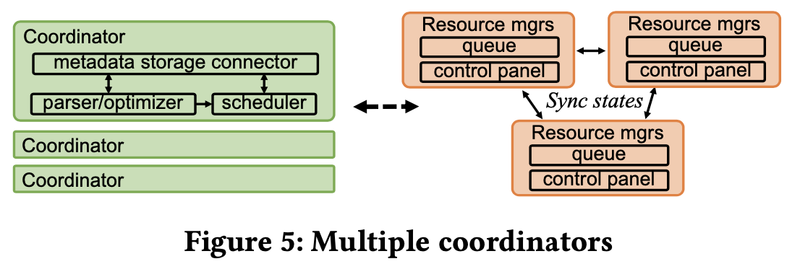

# Presto: A Decade of SQL Analytics at Meta

## ABSTRACT

Presto is an open-source distributed SQL query engine that supports analytics workloads involving multiple exabyte-scale data sources. Presto is used for low-latency interactive use cases as well as long-running ETL jobs at Meta. It was originally launched at Meta in 2013 and donated to the Linux Foundation in 2019. Over the last ten years, upholding query latency and scalability with the hyper growth of data volume at Meta as well as new SQL analytics requirements have raised impressive challenges for Presto. A top priority has been ensuring query reliability does not regress with the shift towards smaller, more elastic container allocation, which requires queries to run with substantially smaller memory headroom and can be preempted at any time. Additionally, new demands from machine learning, privacy, and graph analytics have driven Presto maintainers to think beyond traditional data analytics. In this paper, we discuss several successful evolutions in recent years that have improved Presto latency as well as scalability by several orders of magnitude in production at Meta. Some of the notable ones are hierarchical caching, native vectorized execution engines, materialized views, and Presto on Spark. With these new capabilities, we have deprecated or are in the process of deprecating various legacy query engines so that **Presto becomes the single piece to serve interactive, ad-hoc, ETL, and graph processing workloads for the entire data warehouse at Meta**.

## 1. Problem Statements

- **Latency and efficiency**: data increases -> the scan cost of the same query increases -> longer wait time -> reach limit of cluster since RPC connections have limitation. Use case: low-latency dashboard.
- **Scalability and reliability**: in-memory processing with no fault tolerance, memory is limited, so only a few seconds to minutes running job, for suitable for ad-hoc queries -> scale the workload elastically to handle arbitrarily large memory consumption and arbitrarily long runtime with an unstable underlying infrastructure (ephemeral containers with less memory). Use case: Big ETL with PB-size scans or hours of runtime.
- **Requirements going beyond data analytics**: data lake. Use case: machine learning feature engineering.

## 2. Original vs. Current Architecture


## 3. LATENCY IMPROVEMENTS

### Caching

With data lake, disaggregated storage with scalable independent computation adds IO bound. How to solve? Caches at various levels.

- Raw Data Cache: Caches remote data in its original form (compressed and possibly encrypted) on local flash upon read. LRU.
- Fragment Result Cache: Prevent duplicated computation upon multiple queries. Cache the plan fragment results on leaf stages with one level of scan, filter, projection, and/or aggregation. 
- Metadata Cache and Catalog Servers: file indexes (“footers” or “headers”).
- Cache locality

### Native Vectorized Execution

Why?

1. Control precise memory management.
2. Leverage vectorized CPU execution SIMD.

What?

Velox [41] is a project originally incubated from Presto at Meta to support C++ vectorized execution.

### Adaptive filtering

- Subfield Pruning: Like Dremel to handle nested data in complex type like maps, arrays.
- Filter reordering: more selective filters are evaluated.
- Filter-based lazy materialization?
- **Dynamic join filtering**: For an inner join, the build side can provide a “digest” in the format of bloom filters, ranges, or distinct values to serve as a filter for the probe side. The digest can be pushed down through the above framework as an extra filter during the scan, so that the probe side reader will not materialize the data that is not matching the join key. 

### Materialized views and near real-time data

Presto can read in-flight data (delta) ingested into the warehouse to provide near real-time analytics.

When a materialized view is created by Presto, an automatic job will be created to materialize the data for the view. The automatic job will run the view query to materialize the view data. The continuous incoming near real-time data will not be materialized for the view until it becomes immutable.

For client side, use UNION ALL query to combine the materialized data as well as the non-materialized fresh data from the base table. 

Materialized views can benefit subquery optimization.

## 4. EFFICIENCY IMPROVEMENTS

Cost-Based Optimizer highlights **join type selection** including broadcast join and redistributed join and **join reordering** to minimize the overall memory usage. Statistics based, which is stored in metadata store, like column histogram, total value count, distinct value count, null count, minima, maxima, etc.

Also mention about History-Based Optimizer.

## 5. SCALABILITY IMPROVEMENTS

### Multiple coordinators

Avoid single point of failure. Separate queueing and resource utilization monitoring of a cluster to **resource managers**. The queued queries and cluster control panel information are replicated across resource managers using Raft.



### Recoverable grouped execution

A query can be executed in a “grouped” fashion if the first aggregation, join, or window function key after the table scan is a superset of the data partition key. Downside is the overhead of intermediate data materialization.

Below example will NOT "scan will read all 3 partitions in parallel and shuffle them based on the aggregation key col1", but scan one partition at a time from Partition 1 to 2 then 3. Since intermediate data materialized, so it allows smaller run-time memory footprint and support failure recovery.

```
SELECT COUNT() from table1 GROUP BY col1
```


### Presto on Spark

Recovery at shuffle point is too coarse, we need finer granularity. Presot runs on top of the Spark RDD interface to provide scalability and reliability.

### Spilling

interactive and ad-hoc work- loads spill data to local flash for latency, and ETL workload spill data to remote storage for scalability.


## 6. ENABLING RICHER ANALYTICS

Data lake and Lake house trend support, Delta Lake, Iceberg, and Hudi. Presto integrates with all these table formats.

User-defined types, Graph extensions...


## Appendix

#### Appendix 1. Original architecture


Figure 1 illustrates the original architecture of a Presto clus- ter [44]. It consists of a single coordinator and a number of workers that can scale to thousands. The coordinator is responsible for queueing and parsing a query string, then turning it into a plan. Optimizations will be applied to the plan and later fragmented into plan fragments or simply fragments based on shuffle boundaries. These fragments will be scheduled to workers in parallel. Work- ers are responsible for query processing with all data in memory and data shuffling through streamed RPCs over the network. Each worker will launch tasks to process the data based on the fragments received. The processed data will be shuffled into different buffers in memory waiting for the different downstream tasks to fetch. A cluster can run multiple queries and their tasks concurrently with full multi-tenancy sharing memory, IO, network, and CPU. Presto also supports storage connectors to allow scanning heterogeneous data sources for the same query.

#### Appendix 2. Collocated-storage compute engines for the original architecture

As dashboards became slower with larger scans, users started to leverage **in-memory or collocated-storage compute engines** [40, 44] for better performance.

Paper: Cubrick: Indexing Millions of Records per Second for Interactive Analytics.

Caching enables deprecatio collocated storage connectors like Raptor [44] and in-memory database like Cubrick [40] at Meta.

#### Related works

Interactive and ad-hoc analytical engines are offered widely by cloud providers. Representative ones include **BigQuery** powered by **Dremel** [33, 34], **Snowflake** [18], and **Redshift** [7]. Various internal ones are **Procella** [13] and **F1** [43]. Similar techniques like disaggregate storage and caching are also used in these systems.

Regarding analytical SQL batch engines, **SparkSQL** [6] is a popular open-source engine supporting long-running ETL jobs. SparkSQL, as a SQL evaluation engine, is built on top of Spark [57] which is the general-purpose compute engine. Presto in this paper started directly with a SQL evaluation engine and gradually evolved with fault-tolerance support on top of Spark. **F1** [43] is another example of leveraging the interactive engine as a library and running on MapReduce framework [20] to support fault tolerance.

Vectorized engines are an industry trend to boost query perfor- mance. Notable ones are **DuckDB** [42], **Photon** [10], **ClickHouse** [16], and Alibaba’s **Hologres** [30].

Mutability, versioning, and time traveling are supported in vari- ous open-source solutions including **Delta Lake** [5], **Iceberg** [28], and **Hudi** [27]. Presto has integration with all these table formats yet still only relies on Meta’s solution called “delta” to support more flexible data mutation.

