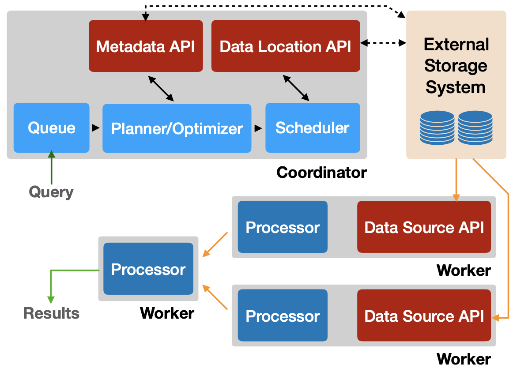
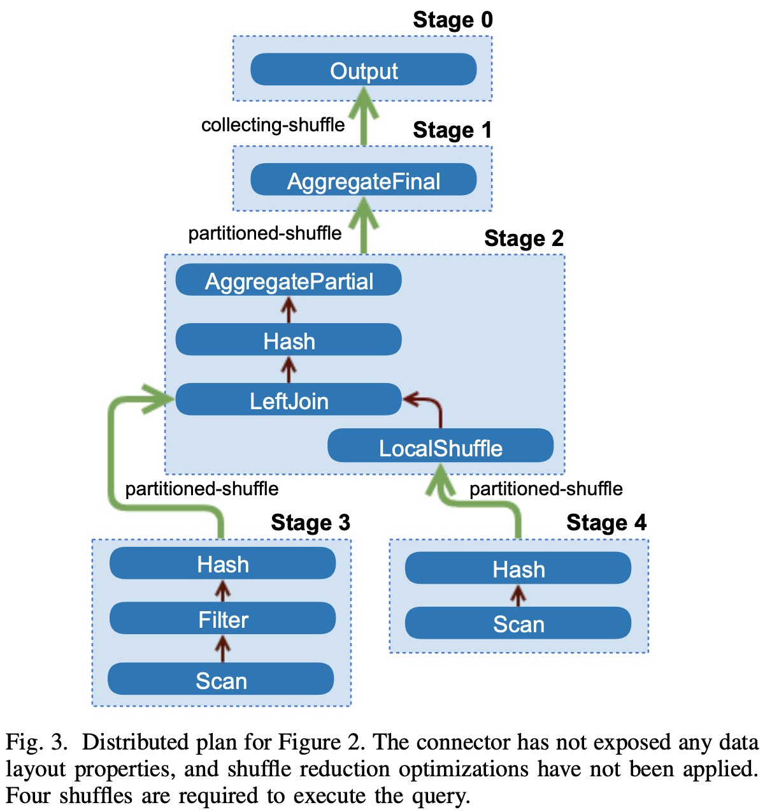
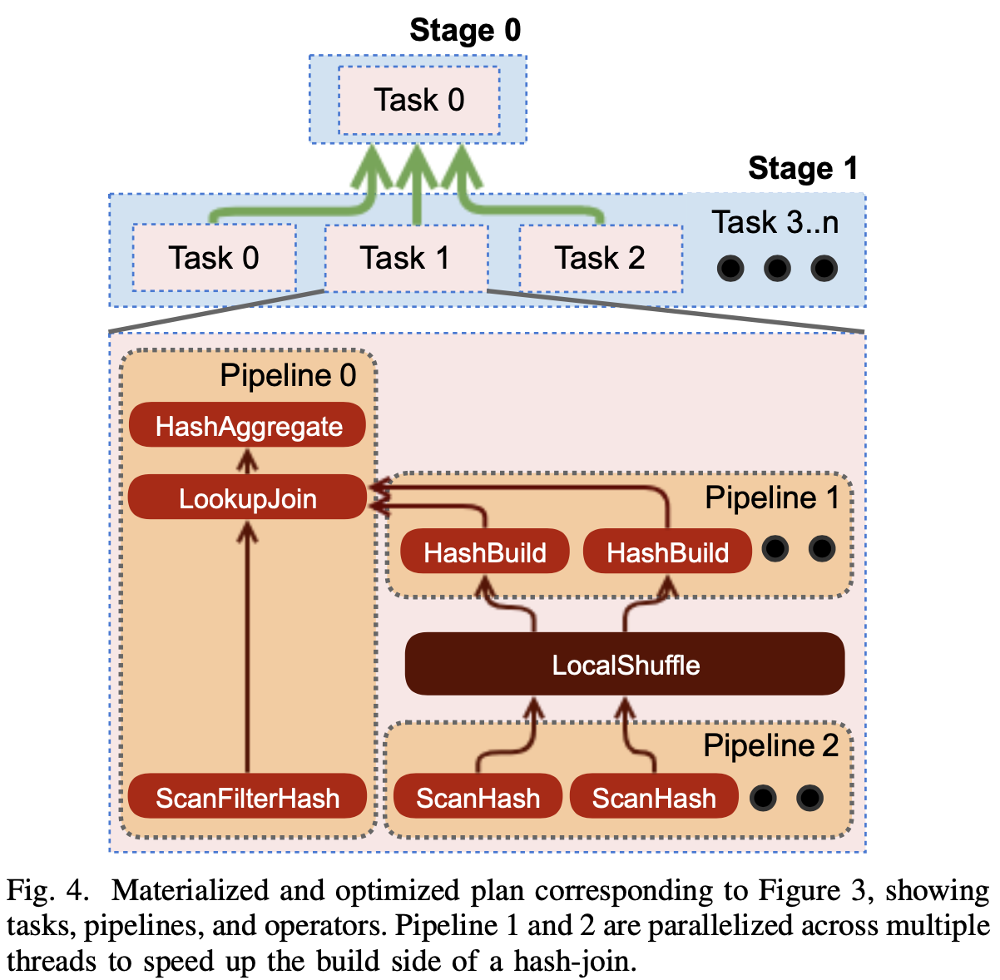

# Presto: SQL on Everything

## Abstract

Presto is an open source distributed query engine that supports much of the SQL analytics workload at Facebook. Presto is designed to be adaptive, flexible, and extensible. It supports a wide variety of use cases with diverse characteristics. These range from user-facing reporting applications with sub- second latency requirements to multi-hour ETL jobs that aggre- gate or join terabytes of data. Presto’s Connector API allows plugins to provide a high performance I/O interface to dozens of data sources, including Hadoop data warehouses, RDBMSs, NoSQL systems, and stream processing systems. In this paper, we outline a selection of use cases that Presto supports at Facebook. We then describe its architecture and implementation, and call out features and performance optimizations that enable it to support these use cases. Finally, we present performance results that demonstrate the impact of our main design decisions.

## 1. What

Presto is an open-source distributed SQL query engine. Its architecture and design have found a niche within the crowded SQL-on-Big-Data space in the early 2010s.

Characteristics:
- **Adaptive**: smart scheduling, multi-tenant system capable of concurrently running hundreds of memory, I/O, and CPU-intensive queries, and scaling to thousands of worker nodes while efficiently utilizing cluster resources. automatically tune parallelism.
- **Flexible**: multiple use cases, 1) interactive/BI queries, 2) long-running batch ETL jobs with aggregations or joins, 3) end-user facing analytics tools (low latency ∼50ms-5s, 99.999% availability in Advertiser Analytics), 4) visualizations and dashboards, 5) A/B testing. 
- **Extensible**: HTTP API, JDBC; federated design connector to various data sources, see https://trino.io/docs/current/connector.html.
- **High performance**: code-gen, low repsonse time

## 2. ARCHITECTURE

Concept:

- **Coordinator**: “brain”, parse SQL, create and optimize distributed execution plan, query orchestration. 

- **Worker**: query processing. Worker nodes fetch data from connectors and exchange intermediate data with each other. 

- **Stage**: breaking up the execution into a hierarchy of stages, it is  conceptual and logical in plan.

- **Task**: physical in exectuion plan. a stage is implemented as a series of tasks distributed over workers. tasks are same in term of executing the same computation on different sets of input data.

- **Split**: addressable chunk of data in an external storage system. tasks operate on splits. Stages at the lowest level of a distributed query plan retrieve data via splits from connectors, and intermediate stages at a higher level of a distributed query plan retrieve data from other stages.

- **Driver**: Tasks contain one or more parallel drivers. It is the lowest level of parallelism .

- **Pipeline**: a chain of operators. A task performing a hash-join must contain at least two pipelines; one to build the hash table (build pipeline), and one to stream data from the probe side and perform the join (probe pipeline)

- **Operator**: An operator consumes, transforms and produces data. e.g., a table scan.

- **Exchange**: Exchanges transfer data between nodes between different tasks. buffered in-memory data transfers (shuffles).

coordinator把plan stages分发给worker，stage只是抽象的概念，worker内实际运行的被称作task，这是最小的执行单元。task有输入和输出，靠shuffle把上下游的task连接起来。比如在实际调试页面里面有0.x，1.x，0表示stage 0，x表示stage内task的并行度。

一个task可以包含1到多个pipeline，pipeline包含一系列operators，例如hash-join算子包括至少两个pipeline，build table pipeline，另外一个是流式的probe pipeline。优化器如果发现一个pipeline可以支持并行优化，那么就会把一个pipeline拆开，例如build pipeline可以拆成scan data和build partitions两个pipeline，节点内并行度可以不同。pipeline直接用local shuffle串联起来。driver在Query Execution中来介绍。



## 3. SYSTEM DESIGN

3.1 SQL Dialect

3.2 Client Interfaces, Parsing, and Planning

3.3 Query Optimization

3.4 Scheduling

3.5 Query Execution

3.6 Resource Management 

3.7 Fault Tolerance

### 3.2 Client Interfaces, Parsing, and Planning

Parsing: ANTLR-based parser to convert SQL into a syntax tree. Logical planner produces plan nodes.

Logical Planning: The planner produces nodes that are purely logical, i.e. they do not contain any information about *how* the plan should be executed.

### 3.3 Query Optimization

To physical plan.

**Rule based (RBO)**: predicate and limit pushdown, column pruning, and decorrelation.

**Cost based (CBO)**: Cascades framework, join strategy selection (hash join, nest-loop join, index join) and join re-ordering.

Optimizer takes advantage of the following techniques:

- **Data Layouts**: Connectors report locations and other data properties such as partitioning, sorting, grouping, and indices to Query Optimizer. They will help Query Optimizer do locality aware table scan, partition pruning, sort pushdown, index join.

- **Predicate Pushdown**: range and equality predicates down through the connector (e.g., Parquet supports push down). Efficient index based filtering for highly selective filters conditions. partition pruning.

- **Inter-node Parallelism**: Tasks. Every arc in below diagram is a Exchange operator.



How to **reduce shuffle**?

1. If two tables are partitioned on the same column, do co-located join.

2. If tables has index, do index nested loop join vs. hash joins.

-  **Intra-node Parallelism**: multiple threads parallelism on a single node. Below example shows, pipeline 1 and 2 are parallelized to speed up **build side** of a hash-join, left is **probe side**.



### 3.4 Scheduling

Stage Scheduling:

- all-at-once: minimizes wall clock time by scheduling all stages of execution concurrently, consume resources for latency-sensitive use cases.

- phased: lazy

Task Scheduling:

Leaf Stages vs. Intermediate Stages

For Leaf Stages:

- shared nothing mode: workers are co-located with storage nodes. The scheduler uses the Connector Data Layout API to decide task placement under these circumstances. Raptor is a storage engine optimized for Presto with a shared-nothing architecture that stores ORC files on flash disks and metadata in MySQL.

- shared-storage mode: majority of CPU time is spent on table scan decompressing, decoding, filtering and applying transformations to data read from connectors. divided up into enough splits, a leaf stage task is scheduled on every worker node in the cluster. 

Every task in a leaf stage must be assigned one or more splits. Tasks in intermediate stages are always eligible to run.

### 3.5 Query Execution

The **driver loop**: more complex than the popular Volcano (pull) model of recursive iterators. No thread yielding. driver can move data between operators. 有点类似于时间片，线程不用靠os切换. Driver loop操作的最小数据单元是一个列存的page.

Shuffles: uses in-memory buffered shuffles over HTTP to exchange intermediate results. 对于shuffle的并发度，有一种tunning的机制，比如output buffer太满，执行stall并且消耗内存，input buffer太空，处理效率又不足，因此通过监控buffer的使用率，可以调控shuffle并行度，进而避免上述的极端现象，网络资源可以在多个请求间平衡下。

### 3.6 Resource Management

Goal: do fair cooperative multi-tasking with arbitrary workloads. scheduler must be adaptive 

Any given split is only allowed to run on a thread for a **maximum quanta** of one second, like CPU slicing for multi-queries run concurrently.

Presto uses Memory Pools do shuffles, joins. Presto supports spilling for hash joins and aggregations, but in production no spill, so **no fault tolerance** which is unlike Hive and Spark.

### 3.7 Fault Tolerance

Simple strategy: Coordinator failures cause the cluster to become unavailable, and a worker node crash failure causes all queries running on that node to fail. Presto relies on clients to automatically retry failed queries.

## 4. QUERY PROCESSING OPTIMIZATIONS

### Working with the JVM
- JIT compiler (method inlining, loop unrolling, and intrinsics)
- experiment GraalVM. G1 GC. Avoid ‘humongous’ object. uses segmented arrays.

### Code Generation

- Expression Evaluation: Presto generates bytecode to natively deal with constants, function calls, references to variables, and lazy or short-circuiting operations. 
- Targeting JIT Optimizer Heuristics:  produce bytecode that is more amenable to JIT optimization. For example, generate unrolled loops over columns. call sites are monomorphic, allowing it to inline virtual methods. auto-vectorize. CPU branch prediction.

### File Format Features

Scan operators invoke Connector API with leaf split and get columnar data Pages. A page consists of a list of Blocks (Column values), using **flat memory data structures**. Pointer chasing, unboxing, and virtual method calls add significant overhead to tight loops.

**Skip data sections** by using statistics in file headers/footers (e.g., min-max range headers and Bloom filters). 

**Encoding**: Page with compressed encoding schemes for each column. Dictionary-encoded blocks are very effective at compressing low-cardinality sections of data and run-length encoded (RLE) blocks compress repeated data. Several pages may share a dictionary, which greatly improves memory efficiency. A column in an ORC file can use a single dictionary for an entire ‘stripe’ (up to millions of rows).

**Lazy materialization**.


## FAQ

### What’s the difference between PrestoDB and PrestoSQL?

```
           PrestoSQL - Trino
          /       
   Presto 
(Facebook) \
            PrestoDB -> rename back to Presto
```

PrestoDB is the former name of the original version of Presto. It was developed by Eric Hwang, Dain Sundstrom, David Phillips, and Martin Traverso at Facebook. In 2018, they left Facebook and founded the Presto Software Foundation to ensure that the project would remain collaborative and independent. They named their new fork PrestoSQL, which was later renamed to Trino at the end of 2020. PrestoDB was renamed to Presto shortly after, so PrestoDB is now simply called Presto, and PrestoSQL is now Trino.

see https://trino.io/blog/2020/12/27/announcing-trino.html

