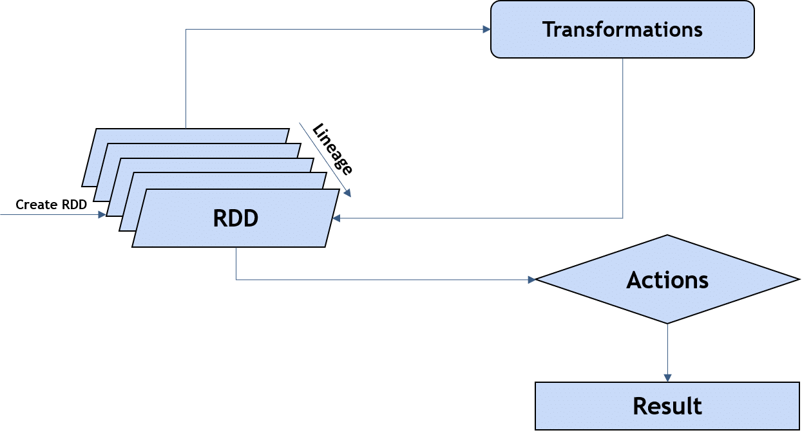
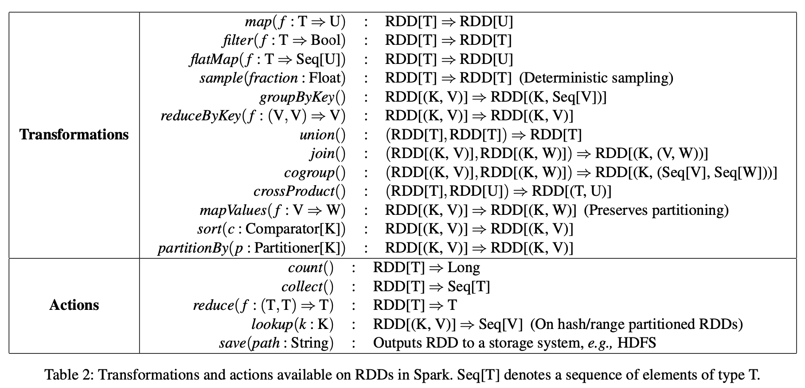
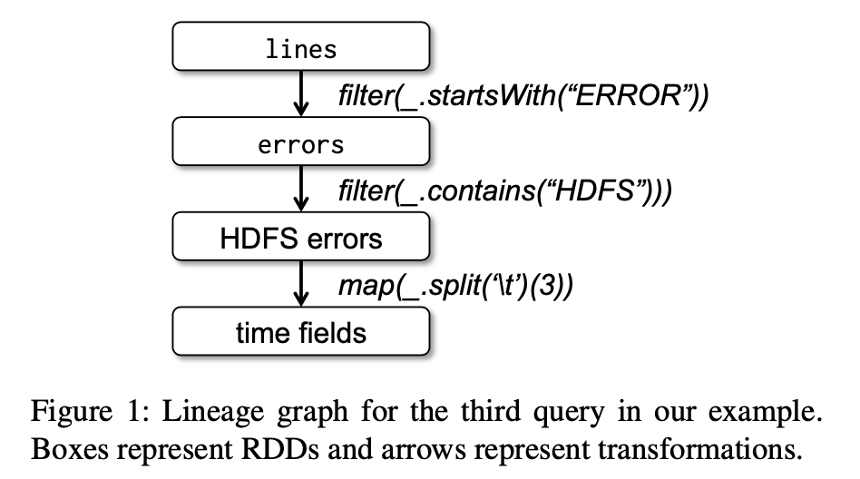
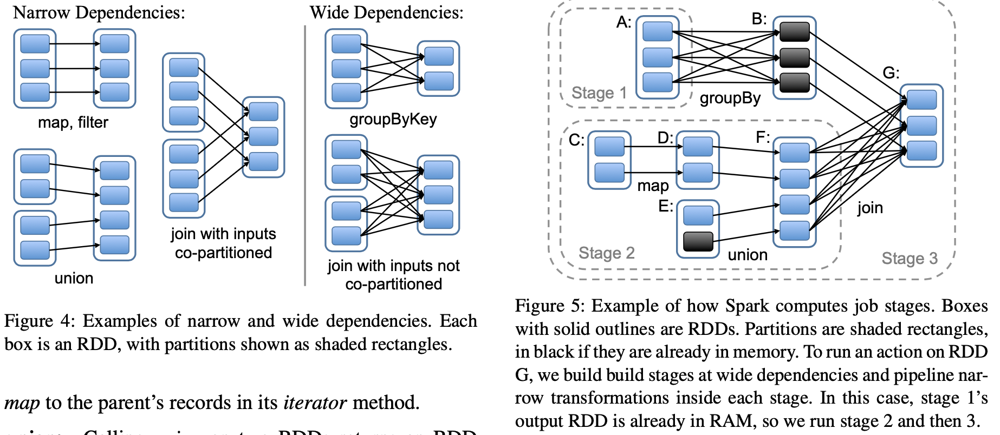
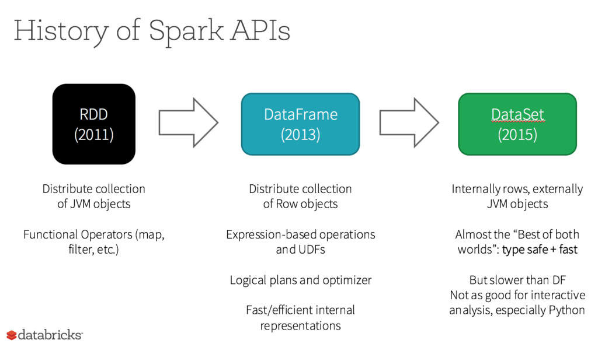

# Resilient Distributed Datasets: A Fault-Tolerant Abstraction for In-Memory Cluster Computing

NSDI2012 https://www.usenix.org/system/files/conference/nsdi12/nsdi12-final138.pdf

## Abstract
We present Resilient Distributed Datasets (RDDs), a distributed memory abstraction that lets programmers perform in-memory computations on large clusters in a fault-tolerant manner. RDDs are motivated by two types of applications that current computing frameworks handle inefficiently: iterative algorithms and interactive data mining tools. In both cases, keeping data in memory can improve performance by an order of magnitude. To achieve fault tolerance efficiently, RDDs provide a restricted form of shared memory, based on coarsegrained transformations rather than fine-grained updates to shared state. However, we show that RDDs are expressive enough to capture a wide class of computations, including recent specialized programming models for iterative jobs, such as Pregel, and new applications that these models do not capture. We have implemented RDDs in a system called Spark, which we evaluate through a variety of user applications and benchmarks.


## 1. What is the drive of RDD?

Frameworks like MapReduce provide high-level operators for engineers to accessing a cluster’s computational resources and distributed dataset, without having to worry about work distribution and fault tolerance. **They lack abstractions for leveraging distributed memory** because many iterative machine learning and graph algorithms, including PageRank, K-means clustering, and logistic regression may reuse intermediate data, and interactive data mining, and faster data processing.

## 2. What is RDD?

Apache Spark's core innovation.

**R**esilient **D**istributed **D**atasets are fault-tolerant, parallel data structures that let users explicitly persist intermediate results in memory, control their partitioning to optimize data placement, and manipulate them using a rich set of operators.

[Xu] RDD = abtraction of immutable and distributed in-memory or fault-tolerant dataset (collection of data) that are partitioned across machines in a cluster, specifalized for distributed parralel computation.

## 3. How to use the "data structure" specialized for distributed computation?

### RDD interface

RDDs provide high-level APIs (programming models and interfaces) based on 
- a rich set of coarse-grained **transformations** lazy evaluation (e.g., map, filter and join) that apply the same operation to many data items, let users compose them in arbitrary ways.
- trigger computation to produce result through **actions** (e.g., collect, count).



*https://blog.nashtechglobal.com/things-to-know-about-spark-rdd/*

Basic compute unit/atomic piece in Spark is a split or partition of dataset in the form of RDD. An RDD representing an HDFS file has a partition for each block of the file.

### RDD operations


Example:


```
lines = spark.textFile("hdfs://...")
errors = lines.filter(_.startsWith("ERROR"))
errors.persist()

// use the RDD in actions 
errors.count()

// perform further transformations on the RDD and use their results
// Count errors mentioning MySQL:
errors.filter(_.contains("MySQL")).count()

// Return the time fields of errors mentioning
// HDFS as an array (assuming time is field
// number 3 in a tab-separated format):
errors.filter(_.contains("HDFS"))
      .map(_.split(’\t’)(3))
      .collect()
```

### Representing RDDs

graph-based representation.

- **Narrow dependencies**: where each partition of the parent RDD is used by at most one partition of the child RDD. allow for **pipelined execution** or **chained execution of multiple operators into one stage**.
- **Wide dependencies**: where multiple child partitions may depend on it. **shuffle and exchange** is required.

For example, `map` leads to a narrow dependency, while `join` leads to to wide dependencies (unless the parents are hash-partitioned).



lineage: recompute just that partition, recoverable, thus fault-tolerant.

## 4. How RDD is implemented?

Spark ~14,000 lines of Scala, runs over the Mesos.

- Job Scheduling: the scheduler examines that RDD’s lineage graph to build a DAG of stages to execute. pipelined transformations with narrow dependencies. The boundaries of the stages are the shuffle operations required for wide dependencies.(Figure 5.)
- Interpreter Integration: code gen, compiling a class, loading it into the JVM, and invoking a function on it.
- Memory Management: in-memory storage as deserialized Java objects, in-memory storage as serialized data, and on-disk storage. 
- Support for Checkpointing

### Appendix 1. Spark API evolution



*https://www.databricks.com/glossary/what-is-rdd*