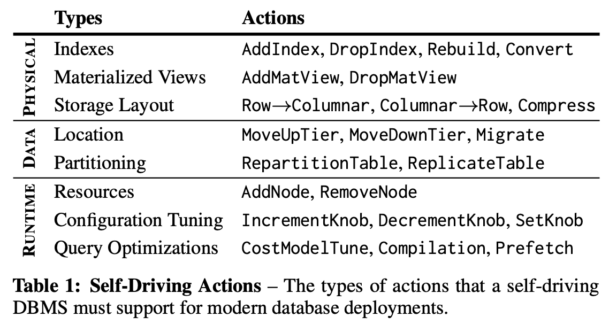
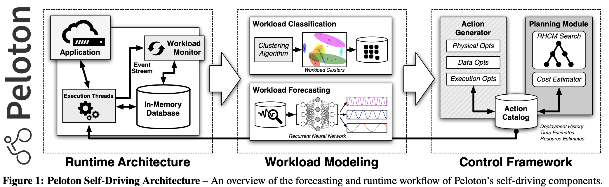

# Self-Driving Database Management Systems

Conference on Innovative Data Systems Research (CIDR) 2017

## ABSTRACT

In the last two decades, both researchers and vendors have built
advisory tools to assist database administrators (DBAs) in various
aspects of system tuning and physical design. Most of this previous
work, however, is incomplete because they still require humans to
make the final decisions about any changes to the database and are
reactionary measures that fix problems after they occur.

What is needed for a truly “self-driving” database management
system (DBMS) is a new architecture that is designed for autonomous
operation. This is different than earlier attempts because all aspects
of the system are controlled by an integrated planning component
that not only optimizes the system for the current workload, but also
predicts future workload trends so that the system can prepare itself
accordingly. With this, the DBMS can support all of the previous
tuning techniques without requiring a human to determine the right
way and proper time to deploy them. It also enables new optimiza-
tions that are important for modern high-performance DBMSs, but
which are not possible today because the complexity of managing
these systems has surpassed the abilities of human experts.

This paper presents the architecture of Peloton, the first self-
driving DBMS. Peloton’s autonomic capabilities are now possible
due to algorithmic advancements in deep learning, as well as im-
provements in hardware and adaptive database architectures.

## PROBLEM OVERVIEW

Previous self-tuning systems is focused on standalone tools that target only a single aspect of the database.

Samples aspects.

1. **Data logical or physical design** of a database (indexes, materialized views)
2. **Data organization**, layout (dist, partition, sort, interleaved sort key..) and placement on cold/hot/cache.
3. **Runtime parameters**, DBA provides a sample database and workload trace, tool returns an optimal configuration. 

All of these are insufficient
 - (1) external to the DBMS
 - (2) reactionary
 - (3) not able to take a holistic view that considers more than one problem at a time. 

understand workload, access pattern, OLTP vs. OLAP vs. HTAP.

forecast resource utilization trends.

## SELF-DRIVING ARCHITECTURE

Goal: Peloton to efficiently operate without any human-provided guidance information. The system automatically learns how to improve the latency of the application’s queries and transactions. 

- Peloton Workflow: 

    Peloton contains an embedded monitor that follows the system’s internal event stream of the executed queries. Each query entry is annotated with its resource utilization. The stream is also periodically punctuated with (1) DBMS/OS telemetry data [20] and (2) the begin/end events for optimization actions [60]. The DBMS then constructs forecast models for the application’s expected workload from this monitoring data. It uses these models to identify bottlenecks and other issues (e.g., missing indexes, overloaded nodes), and then selects the best actions. The system executes this action while still processing the application’s regular workload and collects new monitoring data to learn how the actions affect its performance.   

### Workload Classification

uses unsupervised learning methods to group the application’s queries that have similar characteristics

DBSCAN algorithm.

### Workload Forecasting

RNN + LSTM neural networks.

### Action Planning & Execution

- Action Generation: affect the configuration knobs that control the DBMS.
- Action Planning.
- Deployment.

## PRELIMINARY RESULTS

integrated Google TensorFlow [2] in Peloton to
perform workload forecasting using the DBMS’s internal telemetry
data. 

We trained two RNNs using 52m queries extracted from one
month of traffic data 

We use 75% of the
data set (i.e., three weeks) to train the models and then validate them
using the remaining 25% data. 

We apply two stacked LSTM layers
on the input, then connect them to a linear regression layer. We use
a 10% dropout rate for these layers to avoid over-fitting

(1) RNNs accurately predict the expected arrival rate of queries

(2) hardware-accelerated training has a minor impact on the DBMS’s CPU and memory resources.

(3) the system deploys actions without slowing down the application.

## APPENDIX

https://db.cs.cmu.edu/projects/peloton/

Peloton is a self-driving SQL database management system.

Integrated artificial intelligence components that enable autonomous optimizations.

https://github.com/cmu-db/peloton

The Peloton project is dead. We have abandoned this repository and moved on to build a new DBMS. There are a several engineering techniques and designs that we learned from this first system on how to support autonomous operations that we are doing a much better job at implementing in the second system.