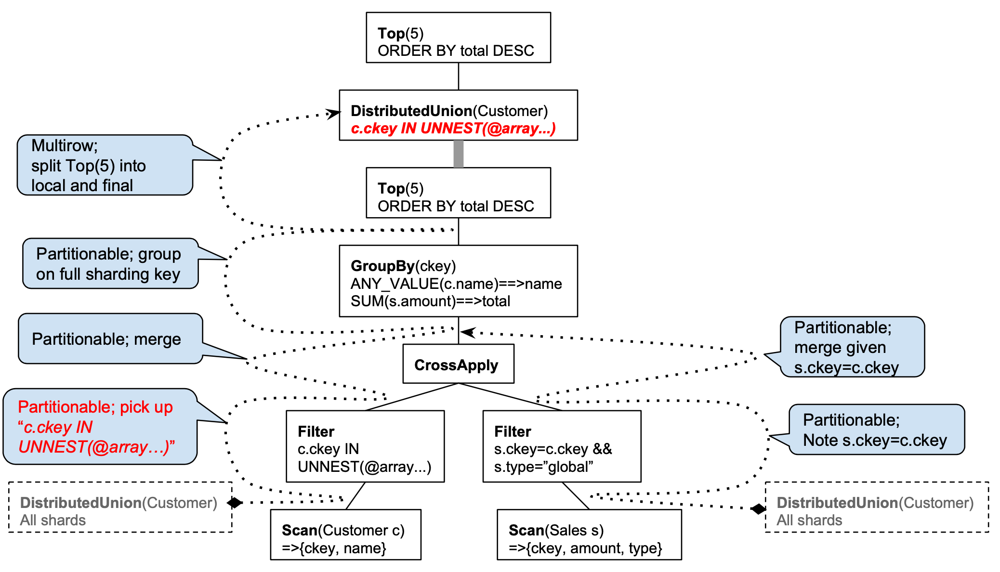
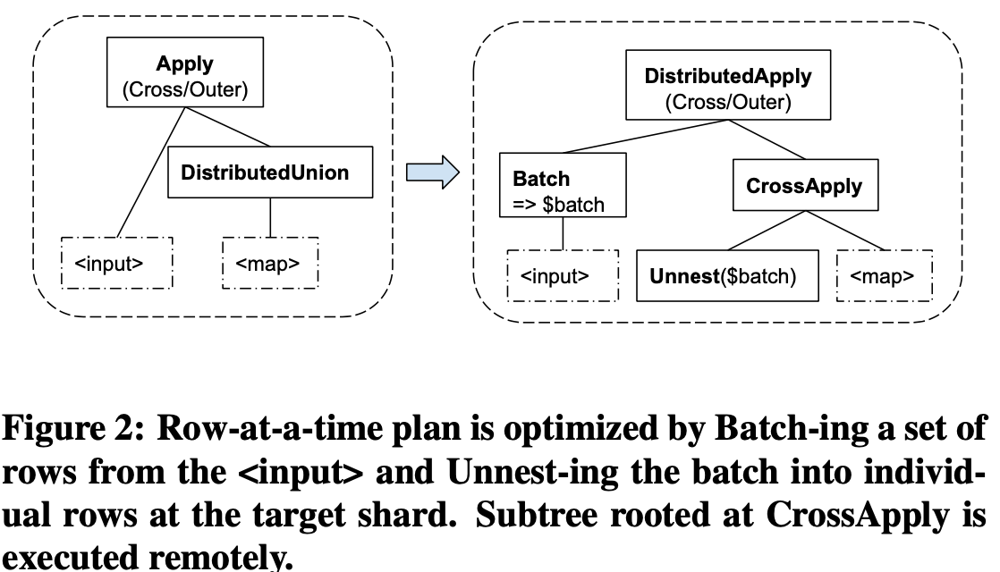
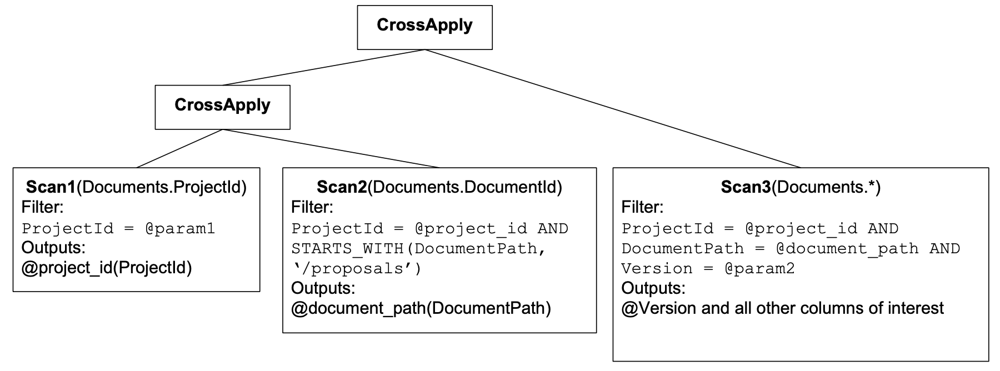

# Spanner: Becoming a SQL System

OSDI’12 (key-value store offering multi- row transactions, external consistency, and transparent failover across datacenters) -> [SIGMOD '17](https://dl.acm.org/doi/proceedings/10.1145/3035918) (strongly-typed schema system + SQL query processor), this paper focuses on "database system" aspects:

- distributed query execution in the presence of resharding
- range extraction that drives query routing and index seeks
- query restarts upon transient failures
- common SQL dialect across multiple query systems at Google including the F1, Dremel, BigQuery
- improved blockwise-columnar storage format. 

The above techniques are not novel, but show Google's strong engineering capablity.

## Recap

- Spanner is a 1) horizontally row-range sharded, 2) geo-replicated 3) relational database system. 

- parent-child relationships, child table co-located with parent table, interleaved.

- transactions use a replicated write-ahead redo log, Paxos consensus algorithm. A given group may be assigned multiple shard. replicate log records – each group replica receives log records via Paxos.

- concurrency control uses a combination of pessimistic locking and timestamps.
  - blind write and read-modify-write trx, strict two-phase locking ensures serializability 
  - Reads can be done in lock-free *snapshot transactions*. Strong reads may have to wait for the nearby replica to become fully caught up.
  - A replica can serve reads at a times- tamp T as long as it has applied all Paxos log records ≤ T, or has heard from the leader that there will be no more log records to apply at timestamps ≤ T.

- RPC framework: coprocessor framework, hide much of the complexity of locating data.  finds the nearest replica of that group that is sufficiently up-to-date for the specified concurrency mode. Handle shards move, transparently reroutes requests. auto-retry.

- replica stores data in an Append-only Distributed FS called *Colossus* based on LSM.

- query compiler transforms query into relational algebra tree. The optimizing compiler then uses schema and data properties to rewrite the initial algebraic tree into an efficient execution plan via transformation rules, using equivalent rewrites. Some transformations are well-known in the database community, like pushing pred- icates toward scans, picking indexes, or removing subqueries. Plan cache.

## QUERY DISTRIBUTION

What is this about? Executes code in parallel on multiple machines hosting the data to serve both online and long running queries.

### Distributed query compilation

**Distributed Union** operator: ship a subquery to each shard, concatenate the results. building block for complex queries.

```
Scan(T) ⇒ DistributedUnion[shard ⊆ T](Scan(shard))

// operations as projection and filtering pushdown, sorting can also be pushed down.
F(Scan(T)) = OrderedUnionAll[shard ⊆ T](F(Scan(shard)))

// Joins pushdown thanks for table interleaving, local joins on table shards

// push top, group by, use multi-stage processing - partial local Top or local aggregation are pushed to table shards below Distributed Union while results from shards are further merged or grouped on the machine executing the Distributed Union.
Op(DistributedUnion[shard ⊆ T](F(Scan(shard)))) = OpFinal(DistributedUnion[shard ⊆ T](OpLocal(F(Scan(shard))))
```

Sample query:

```SQL
SELECT ANY_VALUE(c.name) name,
       SUM(s.amount) total
FROM Customer c JOIN Sales s ON c.ckey=s.ckey
WHERE s.type = ’global’ AND
      c.ckey IN UNNEST(@customer_key_arr)
GROUP BY c.ckey
ORDER BY total DESC
LIMIT 5
```



Highlights:

- interleaved Customer and Sales table, co-locate join
- sharding key filter expression, pushdown filter.
- TOP 5 rows preselected on each shard, multi-stage processing - partial local Top

### Distributed Execution

Distributed Union minimizes latency by using coprocessor framework to route a subquery request to the nearest replicas that can serve the request in parallel.

### Distributed joins

batched apply join.

single-machine, key-based equi-joins (like base table with secondary index lookup join) join easy vs. cross-machine Apply Join, Cross Join, or Nested Loop Join expensive. 

Left side of a key-based join is selective enough.




## QUERY RANGE EXTRACTION

Because Spanner is horizontally row-range sharded, so it needs optimization to avoid scanning large data.

- Distribution range extraction: shard level
- Seek range extraction: in-shard level, what fragments of the relevant shard to read, full-shard scans vs. seeks into smaller key ranges.
- Lock range extraction

Example:

```
SELECT d.*
FROM Documents d
WHERE d.ProjectId = @param1
  AND STARTS_WITH(d.DocumentPath, ’/proposals’)
  AND d.Version = @param2
```

### Compile-time rewriting

Normalize and rewrite a filtered scan expression into a tree of **correlated self-joins** that extract the ranges for successive key columns. 



### Filter tree - dynamic runtime

## QUERY RESTARTS

Handle 

- Failures: transient failures, Simpler programming model: no retry loops. Streaming pagination through query results.
- Resharding
- Binary rollouts, rolling upgrades.

## COMMON SQL DIALECT

Common data model, type system, syntax, semantics, and function library that the systems share across F1, Dremel, BigQuery.

Protocol Buffers as first class types, so no Postgres SQL language.

## BLOCKWISE-COLUMNAR STORAGE

Spanner used significant parts of the Bigtable code base, on-disk data format & block cache.

The *SSTable* (sorted string table) data format inherited from Bigtable is optimized for schemaless NoSQL data consisting primarily of large strings. It is self-describing and therefore highly redundant, and traversal of individual columns within the same locality group is particularly inefficient.

**Ressi** is the new low-level storage format for Spanner, for both OLTP and OLAP workloads.

Ressi stores a database as an LSM tree, whose layers are periodically compacted. block, PAX format.

A multi-level index provides fast binary search for random key access.

recent values vs. an inactive file

Ressi’s fundamental data structure is the vector, which is an ordinally indexed sequence of homogeneously typed values. Within a block, each column is represented by one or multiple vectors. Ressi can operate directly on vectors in compressed form.

## LESSONS LEARNED AND CHALLENGES

The idea of HTAP database: the critique of [one-fits-all systems](https://cs.brown.edu/~ugur/fits_all.pdf), combining OLTP, OLAP, and full-text search capabilities in a single system remains at the top of customer priorities. It is our goal to make Spanner perform well and be cost-effective across a broad spectrum of use cases over time.

## FAQ

Q: Why Multi-Paxos?

A: a single long-lived leader is elected and can commit multiple log entries in parallel to achieve high throughput

Q: A multi-level index in Ressi?

A: //TODO