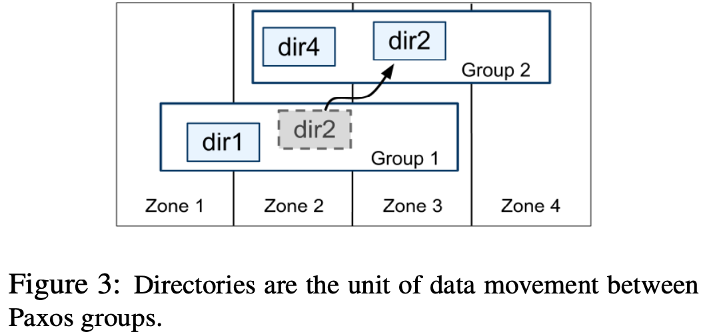

# Spanner: Google’s Globally-Distributed Database

https://www.cs.princeton.edu/courses/archive/fall13/cos518/papers/spanner.pdf

## 1. Introduction

### What is Spanner?

Google’s scalable, multi-version, globally-distributed, and synchronously-replicated database. 

Externally-consistent distributed transactions.

Shards data across many sets of Paxos state machines in data-centers spread all over the world. Auto-reshard, auto migrate to balance load and failures.

Replication is cross-datacenter, used for global availability and geographic locality.

### History

Initial customer was F1, a rewrite of Google Ads, 5 replica in US. 

Bigtable: eventually-consistency. No strong consistency. No cross-row transactions.

Megastore: semi-relational data model,  poor write throughput.

### Interesting features

* **Dynamically replication config**
  * where DC, how far is from user, how far from replica, replica number.

* **Externally consistent reads and writes** 
  * How? commit timestamps to transactions, The timestamps reflect serialization order, the serialization order satisfies external consistency (or equivalently, **linearizability**, if a transaction T1 commits before another transaction T2 starts, then T1’s commit timestamp is smaller than T2’s. TrueTime API using GPS and atomic clocks that exposes clock uncertainty (<10ms), If the uncertainty is large, Spanner slows down to wait out that uncertainty)

# 2. Architecture


- zonemaster: assigns data to spanservers.

- spanserver: serve data to clients.

- location proxies: used by clients to locate the spanservers assigned to serve their data.

- placement driver: handles automated movement of data across zones due to replication constraints or to balance load.


- Spannserver: manage 100 ~ 1000 tablet.

- tablet:

  - contains X rows of data with data structure like (key:string, timestamp:int64) → string

  - stored in a set of of B-tree-like files and a write-ahead log, reside on Colossus (the successor to the GFS).

- Paxos state machine (Paxos group): for each tablet, across zone.
- lock table: concurrency control.
- transaction manager: distributed transactions. participant leader + the other replicas in the group will be referred to as participant slaves. Two-phase commit, coordinator leader + coordinator slaves. (这些个leader又会选出一个大leader，称为coordinator leader，作为两阶段提交的coordinator)



- directory (bucket): Range sharding, a set of contiguous keys that share a common prefix, unit of data placement. good for config. e.g. *North America, replicated 5 ways with 1 witness*. Movedir used to add or remove replicas.
- fragments: shard a directory into multiple *fragments* if it grows too large.

# 3. Data model

schematized semi-relational tables.

Must has PK, so that rows are sorted in lexicographic order placed in directory.

```sql
INTERLEAVE IN PARENT Users ON DELETE CASCADE;
// For locality + performance.
```


# 4. TrueTime API

 

TTinterval: an interval with bounded time uncertainty. 1ms~7ms, <10ms.(see diagram)

TT.now: returns a *TTinterval* that is guaranteed to contain the absolute time during which *TT.now*() was invoked.

How to? time master: either equiped with GPS (majority) or atomic clocks. 


# 5. Concurrency Control


#### Read-write Trx

How to guarantee externally consistent transactions: **If the start of a transaction T2 occurs after the commit of a transaction T1, then the commit timestamp of T2 must be greater than the commit timestamp of T1.**

Implementatino with TrueTime API: Start + **Commit-wait**. Example: https://zhuanlan.zhihu.com/p/44254954.

//TODO detailed process.

#### Snapshot read

Make sure t > Tsafe (see below diagram). T(Paxos safe) is the ts of the highest-applied Paxos write, T(TM safe) is the ts transactions in between the two phases of two-phase commit.

Achieve non-blocking reads in the past.


#### Lock-free read-only transactions

# FAQ

### 1. Why Spanner supports external consistency without using centralized solutions?

Spanner的TureTime API设计非常巧妙, 保证了绝对时间一定是落在TT.now()返回的区间之中. 基于这个保证, 使得分布在全球的spanserver分配的timestamp都是基于同一参考系, 具有可比性. 进而让Spanner能够感知分布式系统中的事件的先后顺序, 保证了External Consistency.

### 2. What is Spanner's unique contribution to database industry?

1 为了解决跨DC/跨AZ数据一致性和可用性的问题，在数据库领域引入了Paxos这些共识协议

2 TrueTime+2PC的分布式事务，除了TrueTime外，复活了2PC的分布式事务机制，虽然2PC的分布式事务机制很早就出现，但是由于2PC事务机制在性能/故障恢复时间/工程复杂性等原因，以前一直不温不火，数据库领域应对扩展性大量还是采用2PL+共享缓冲区的机制，Spanner通过paxos这种可用性机制配合，一定程度上缓解了2PC的问题，后面大量的NewSQL也采用了类似机制

3 Everything on KV、KV on Everything，Spanner本质上不是一个传统上的数据库，表达和存储是完全解耦的，即可以提供KV访问，也可以提供SQL Query。这套架构在SQL重负载下其实性能没有优势，但是扩展性好。

4 online schema change，号称在线schema升级，这个就比较厉害了。

5 验证了分布式 MVCC 的高性能实现，如果不是MVCC，lock，但是缺点是性能较差。特别是对于一些workload中只读事务占比较大的系统来说不可接受。为了让只读事务不加任何锁，需要引入多版本。为业界指明一条发展方向。

总之，spanner是一个DC级（跨DC多活、DC级扩展性）的数据管理系统，在数据库本身特性上未必比得上传统数据库，但是从一个分布式系统的角度看，称得上是集大成。

### 3. How does Spanner implement with high performance, high availability, and high scalability?

Performance : Truetime API, INTERLEAVED IN PARENT locality, move data close to client

Scale-out -> Sharding 

Availability -> Replication, Paxos, strong consistency

#### Links

https://zhuanlan.zhihu.com/p/20868175

https://zhuanlan.zhihu.com/p/44254954

https://zhuanlan.zhihu.com/p/270606437

https://zhuanlan.zhihu.com/p/35473260

