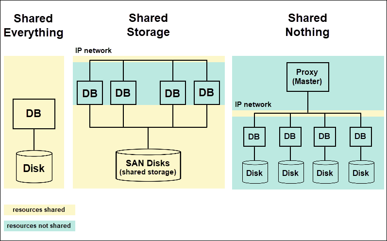
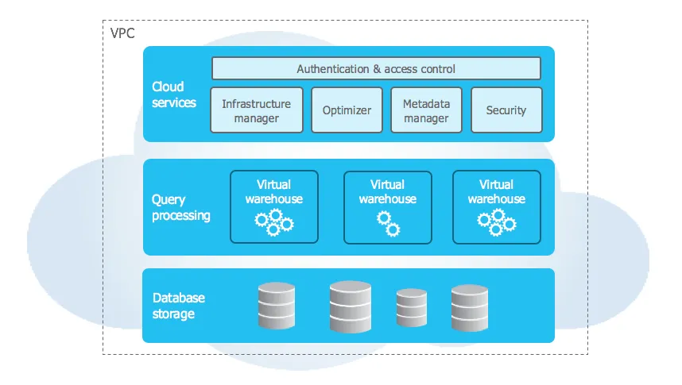

# The Snowflake Elastic Data Warehouse

SIGMOD 2016

## ABSTRACT

We live in the golden age of distributed computing. Pub- lic cloud platforms now offer virtually unlimited compute and storage resources on demand. At the same time, the Software-as-a-Service (SaaS) model brings enterprise-class systems to users who previously could not afford such sys- tems due to their cost and complexity. Alas, traditional data warehousing systems are struggling to fit into this new environment. For one thing, they have been designed for fixed resources and are thus unable to leverage the cloud’s elasticity. For another thing, their dependence on complex ETL pipelines and physical tuning is at odds with the flex- ibility and freshness requirements of the cloud’s new types of semi-structured data and rapidly evolving workloads.

We decided a fundamental redesign was in order. Our mission was to build an enterprise-ready data warehousing solution for the cloud. The result is the Snowflake Elastic Data Warehouse, or “Snowflake” for short. Snowflake is a multi-tenant, transactional, secure, highly scalable and elas- tic system with full SQL support and built-in extensions for semi-structured and schema-less data. The system is offered as a pay-as-you-go service in the Amazon cloud. Users up- load their data to the cloud and can immediately manage and query it using familiar tools and interfaces. Implemen- tation began in late 2012 and Snowflake has been generally available since June 2015. Today, Snowflake is used in pro- duction by a growing number of small and large organiza- tions alike. The system runs several million queries per day over multiple petabytes of data.

In this paper, we describe the design of Snowflake and its novel multi-cluster, shared-data architecture. The paper highlights some of the key features of Snowflake: extreme elasticity and availability, semi-structured and schema-less data, time travel, and end-to-end security. It concludes with lessons learned and an outlook on ongoing work.

## 1. INTRODUCTION

### 1.1 Why we design a new DW?

Snowflake was founded in 2012, runs completely on cloud infrastructure for demanding data needs. 

**Reason 1: Cloud env**. Traditional data warehousing were designed to run on static clusters, making them a poor architectural fit to cloud (AWS, Azure, GCP). The diff is 
- economies of scale *(xu: for cloud provider)*
- extreme scalability and availability
- cost: a pay-as-you-go cost model that adapts to unpredictable usage demands  *(xu: for cloud customers)*

**Reason 2: Data**. 
- structure (schema-less, semi-structure)
- volume (ERP/CRM vs. Internet web logs/IoT/social media..) 
- rate (slow-moving vs. shorter data staleness mins/sub-hour)

### 1.2 Key features of Snowflake

- **Software-as-a-Service (SaaS) and DaaS (database-as-a-service) Experience**: No need to manage hosts and softwares and hire DBA.
- **Elastic**: **Storage and compute resources can be scaled independently and seamlessly.**
- **Highly Available**: tolerates node, cluster, DC failures. No downtime during software or hardware upgrades.
- **Cost-efficient**: pay-as-you-go. pays for compute-hours or TB/scans. best price/performance.
- **Relational**: ANSI SQL and ACID.
- **Semi-Structured**: JSON and Avro.
- **Durable**: no data loss: cloning, undrop, and cross-region backups.

## 2. STORAGE VERSUS COMPUTE



*from https://phoenixnap.com/kb/shared-nothing-architecture*

Snowflake uses **multi-cluster, shared-data, separates storage and compute architecture** *(xu: can be seen as share-storage)* vs. traditional share nothing DW.

Reasons are fixed pool of nodes have drawbacks in Cloud env:
- **Heterogeneous Workload**: hardware is homogeneous, workload (high I/O band- width, light compute loading vs. low I/O bandwidth, heavy compute complex query) is not.
- **Membership Changes**: resize -> reshuffle data, more frequent.
- **Online Upgrade**: norm.

## 3. ARCHITECTURE

Snowflake is a SOA composed of highly fault tolerant and independently scalable services. 

3 Layers: `Data Storage` + `Virtual Warehouses` + `Cloud Services`



*source: https://docs.snowflake.com/en/user-guide/intro-key-concepts*

### 3.1 Data Storage

Why AWS S3 as blob store not build from scratch? 

- Performance could vary due to higher access latency, HTTPS over CPU overhead, no append only (over-)written.

*vs.*

- simple PUT/GET(parts of file with offset)/DELETE, availability and strong durability guarantees hard to beat. 

So Snowflake focuses on local caching (warm) and skew resilience techniques in the Virtual Warehouses layer, not blob store. 

How does it work?

- Central persistant data stroage on cloud.

- Tables are horizontally partitioned into immutable files (=blocks or pages in a traditional DW). 

- Column are grouped together and heavily compressed, PAX or hybrid columnar. 

- Each table file has a header, which contains the offsets of each column within the file.

- No data indices.

- Not only for table data, but spilling temp data generated by query operators (massive joins) avoiding OOM (unlick original Presto).

- Metadata such as catalog objects, which table consists of which S3 files, statistics, locks, transaction logs, etc. is stored in a scalable, transactional KV store, which is part of the Cloud Services layer.

### 3.2 Virtual Warehouses

MPP (massively parallel processing) 

**T-Shirt sizes of VM**

| Size     | Description | Number of Servers per Cluster |
| -------- | -------  | -------  |
| XS  | Extra small    | 1 |
| S  | Small    | 2 |
| M  | Medium    | 4 |
| L  | Large    | 8 |
| XL  | Extra large    | 16 |
| 2XL  | Extra extra large    | 21 |
| 3XL  | Three times extra large    | 64 |
| 4XL  | Four times extra large    | 128 |

- **Elasticity and Isolation** *(Xu: Biggest differentiator at that time from other DW offerings!)*

virtual compute instances = compute resources = worker nodes = EC2 = ephemeral nodes, can created, destroyed, or **resized** at any point dynamically, elastic, on demand.  

Multiple VWs for a user. Performance isolation for queries between VMs for diff workloads. 

VW spawns a new worker process. Each worker process lives only for the duration of its query. No retries currently, long-running queries in future.

- **Local Caching and File Stealing**

LRU cache. Live for the duration of the worker node, shared among concurrent and subsequent queries.

- **Execution Engine**

**Columnar** storage and execution is generally considered superior to row-wise storage and execution for analytic workloads, due to more effective use of CPU caches, SIMD instructions, light- weight) compression.

**Vectorized execution** unlike MapReduce for example [42], Snowflake **avoids materialization of intermediate results**. Instead, data is processed in pipelined fashion, in batches of a few thousand rows in columnar format. This approach, pioneered by VectorWise (originally MonetDB/X100 [15]), saves I/O and greatly improves cache efficiency.

**Push-based execution** refers to the fact that relational operators push their results to their downstream operators, rather than waiting for these operators to pull data (classic Volcano-style model [27]). Push-based execution improves cache efficiency, because it removes control flow logic from tight loops [41].?

*41. T. Neumann. Efficiently compiling efficient query plans for
modern hardware. PVLDB, 4(9):539–550, 2011.*


### 3.3 Cloud Services

Highly for multi-tenant - access control, infrastructure management, query parsing and optimization, transaction manager, improves utilization and reduces operational overhead.

- **Query optimizer Cascades**- style approach with top-down cost-based optimization.

- ACID transactions via **Snapshot Isolation (SI), MVCC** given the fact that table files are immutable

- **min-max based pruning**, **small materialized aggregates** [38], **zone maps** [29], and **data skipping** [49]. 

- **dynamic filter (pruning)** hash join, collects statistics on the distribution of join keys in the build-side records. pushed to the probe side and used to filter and possibly skip entire files on the probe side.

- **bloom join**

## 4. FEATURE HIGHLIGHTS

- Pure Software-as-a-Service Experience
- Continuous Availability, always-on, customer-facing, no (un)planned downtime. Fault Resilience, S3 99.99% data availability and 99.999999999 (11 9s)% durability, cross AZ replication, stateless VM and Cloud service, a pool of standby nodes. Online Upgrade
- Semi-Structured and Schema-Less Data: VARIANT (JSON, Avro, or XML), ARRAY, and OBJECT, a self-describing, compact binary serialization which supports fast key-value lookup. VARIANT type allows Snowflake to be used in an ELT (Extract-Load-Transform) vs. ETL. hybrid columnar format.
- Time Travel and Cloning.
```
SELECT * FROM my_table AT(TIMESTAMP =>
  ’Mon, 01 May 2015 16:20:00 -0700’::timestamp);
SELECT * FROM my_table AT(OFFSET => -60*5); -- 5 min ago
SELECT * FROM my_table BEFORE(STATEMENT =>
  ’8e5d0ca9-005e-44e6-b858-a8f5b37c5726’);
```

## FAQ

### 1. What is share-nothing DW?

Shared-nothing architectures have become the dominant system architecture in high-performance data warehousing because of scalability and commodity hardware.

Every query processor node has its own local disks. Tables are horizontally partitioned across nodes and each node is only responsible for the rows on its local disks. 

### 2. Why B+ tree is not suitable for analytical load?

See 3.3.3

Limiting access only to data that is relevant to a given query is one of the most important aspects of query processing. Historically, data access in databases was limited through the use of indices, in the form of B+-trees or similar data structures. While this approach proved highly effective for transaction processing, it raises multiple problems for systems like Snowflake. 
- First, it relies heavily on random access, which is a problem both due to the storage medium (S3) and the data format (compressed files). 
- Second, maintaining indices significantly increases the volume of data and data loading time. 
- Finally, the user needs to explicitly create the indices—which would go very much against the pure service approach of Snowflake. Even with the aid of tuning advisors, maintaining indices can be a complex, expensive, and risky process.


