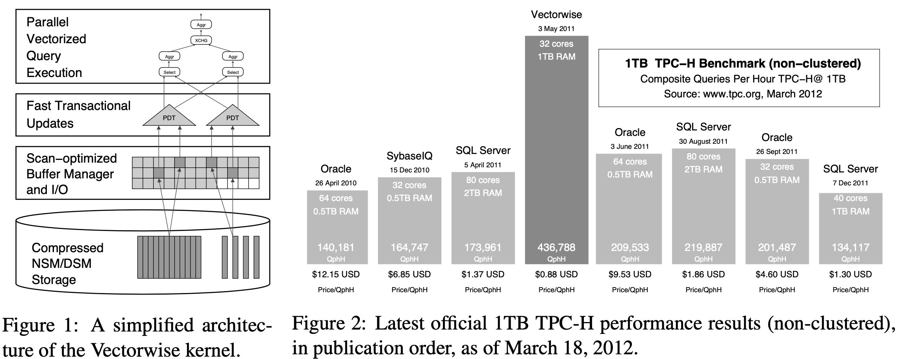

# Vectorwise: Beyond Column Stores

## Abstract

This paper tells the story of Vectorwise, a high-performance analytical database system, from multiple perspectives: its history from academic project to commercial product, the evolution of its technical architecture, customer reactions to the product and its future research and development roadmap.

One take-away from this story is that the novelty in Vectorwise is much more than just column-storage: it boasts many query processing innovations in its vectorized execution model, and an adaptive mixed row/column data storage model with indexing support tailored to analytical workloads.
Another one is that there is a long road from research prototype to commercial product, though database research continues to achieve a strong innovative influence on product development.

## History

- 2003 - 2008: Originated from the MonetDB/X100 research project from CWI. Inspired by vectorized query processing approach.

- 2008: CWI spun off as a start-up Vectorwise BV for commercial with full-fledged offerings.

- 2011: Combine X100 with Ingres DBMS and acquired by Ingres Corporation in 2011, a part of Actian Corp.

- 2012: A series of record-breaking TPC-H benchmarks were published.

## Vectorwise Architecture

- Ingres: admin tools, APIs, SQL parsing and a cost-based query optimizer based on histogram statistics. Ingres `CREATE TABLE` DDL which already supports various table types, was extended with a (default) `VECTORWISE` type

- Query execution and data storage are X100.

### Data Storage

- **Columnar store**: Generalized row/column storage based on **PAX**, A table is stored in multiple PAX partitions, each of which contains a group of columns. This allows providing both “**DSM/PAX**” (with each column in a separate PAX group) and “**NSM/PAX**” (with all columns in one PAX group), as well as all options in between. Block size 512KB.

- **PAX groups**: For very wide tables, **cluster** certain columns together in PAX partitions, limit the amount of PAX groups.

- **(De)Compression and Encoding**: Data compressed, using automatically selected compression schemes and automatically tuned parameters. Very low overhead of decompression. Store data compressed in buffer pool and decompress on the fly before processing, but exception is for simple forms of compression (e.g., RLE or dictionary-compressed strings. ).

*Xu: Why columnar store? Reduce IO becuause CPU is way faster than IO, so de(compress) and (de)encode is worth doing.*

- **Clustered index (sorted tables)**: one clustered index per table, tuple are ordered physically, allow push-down of range-predicates on the index keys. multi-dimensional indexing? z-index?

- **MinMax indices**: small materialized aggregates, simple metadata in block level, quick elimination of ranges of records during scan operations

*Small materialized aggregates: A light weight index structure for data warehousing. In Proc. VLDB, 1998.*

- **High-performance updates**: Positional Delta Trees (PDT) and data loading.

## Query Execution

Goal: gets most work done per CPU cycle.

Vectorized processing model reduces the interpretation overhead typically found in the tuple-at-a-time processing systems. Possibilities of exploiting performance-critical features of modern CPUs like **loop pipeling**, **super-scalar execution** and **SIMD instructions**. 

What is new?

1. X100 prototype was single-threaded, expand X100 to **multi-core CPUs**.

2. **Volcano-based parallelism** based on **exchange operators**. scale to multiple cores 

3. highly efficient **Bloom-filters** were applied to speed-up join processing.

4. **new CPU features** such a large TLB pages, and exploit the SSE4.2 instructions for optimizing processing of text data.

5. **just-in-time (JIT) compilation of complex predicates**.

6. **MPP architecture**.

--

FAQ1.  What is vectorized execution?

**Processing in chunks of cache-fitting vectors of data**. This allows to involve the principles of vector processing and single instruction, multiple data (SIMD)— to perform the same operation on multiple data simultaneously and exploit data level parallelism on modern hardware. It also reduces overheads found in traditional "row-at-a-time processing" found in most RDBMSes.

MonetDB/X100 - Vectorized query execution  strikes a balance between the full materialization of MonetDB and tuple-at-a-time pipelining used in most other database systems.
