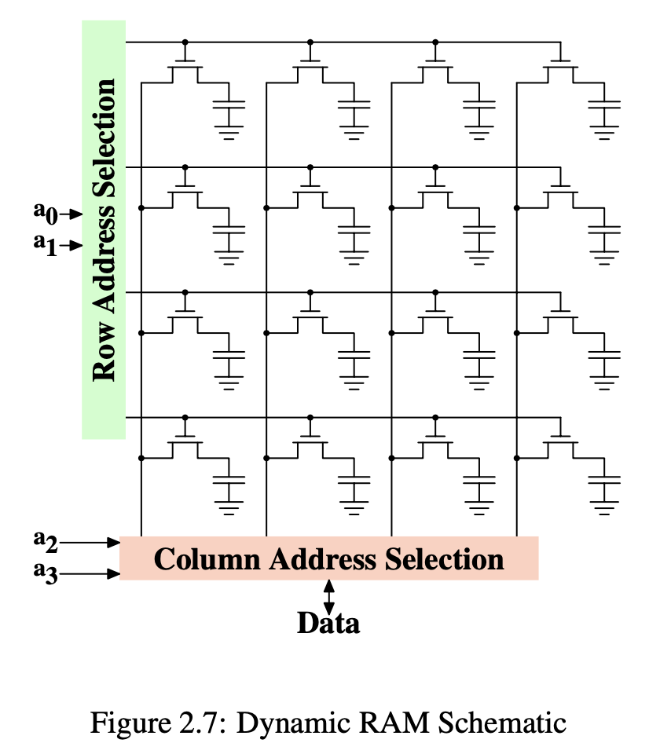
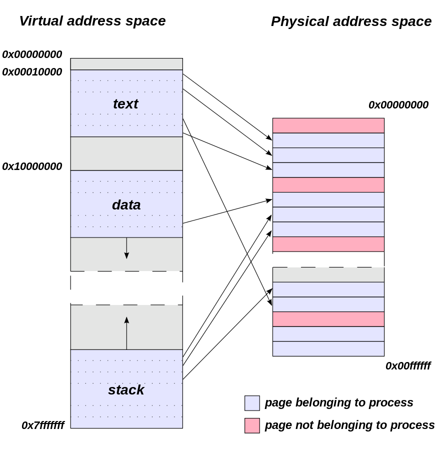

# What Every Programmer Should Know About Memory

As CPU cores become both faster and more numerous, the limiting factor for most programs is now, and will be for some time, memory access. Hardware designers have come up with ever more sophisticated memory handling and acceleration techniques, such as CPU caches, but these cannot work optimally without some help from the programmer. Unfortunately, neither the structure nor the cost of using the memory subsystem of a computer or the caches on CPUs is well understood by most programmers. This paper explains the structure of memory subsystems in use on modern commodity hardware, illustrating why CPU caches were developed, how they work, and what programs should do to achieve optimal performance by utilizing them.

## 2 Commodity Hardware Today


* All data communication from one CPU to another must travel over the same bus used to communicate with the Northbridge.
* All communication with RAM must pass through the Northbridge.
* The RAM has only a single port. 

**DMA** allows devices, with the help of the Northbridge, to store and re- ceive data in RAM directly without the intervention of the CPU.

Lead to CPU wait memory access.

We need more memory bus exists and more total available bandwidth increases. 

RAM (Random Access Memory) Types: **static RAM (SRAM)**, **dynamic RAM (DRAM)**

- DRAM Data is “dynamic”, meaning the charge on the bit cell is continuously bleeding away, so you have to “refresh” it periodically or your data is lost.

- SRAM (Static RAM) uses 6 transistors per data bit, so you can’t fit nearly as many on a chip, so it’s a lower density storage. Also, about half of those transistors are always “ON” (conducting current, burning power), so it’s not energy efficient. The advantages of SRAM are that it’s extremely fast, and that it doesn’t require refresh.


*from https://www.quora.com/What-is-the-difference-between-SRAM-and-DRAM*



## 3. CPU Caches

Reason: The speed difference between the cache and the main memory increased.

SRAM is used to make temporary copies of (to cache, in other words) data in main memory which is likely to be used soon by the processor. This is possible because program code and data has temporal and spatial locality. 

* **Temporal locality**: Data accesses are also ideally limited to small regions. Even if the memory used over short time periods is not close together there is a high chance that the same data will be reused before long
* **patial locality**.

All loads and stores have to go through the cache. FSB (Front Side Bus) facilitates the communication of the CPU(s) with the main memory.


Three levels of cache in regular use. L1d is the level 1 data cache, L1i the level 1 instruction cache.


The figure below shows a processor with four CPU cores.


*from https://medium.com/software-design/why-software-developers-should-care-about-cpu-caches-8da04355bb8a*

Cache line 64byte. CPU uses tag, set index, and cache line offset to locate cache line.


*from https://manybutfinite.com/post/intel-cpu-caches/*

Associativity:

* **Direct-mapped cache**: Direct-Mapped Cache is simplier (requires just one comparator and one multiplexer), as a result is cheaper and works faster. Given any address, it is easy to identify the single entry in cache, where it can be. A major drawback when using DM cache is called a conflict miss, when two different addresses correspond to one entry in the cache. Even if the cache is big and contains many stale entries, it can't simply evict those, because the position within cache is predetermined by the address.
* **N-way set associative cache**: A cache is divided into sets, and each set consists of "ways". 
* **Fully associative cache**: In order to check if a particular address is in the cache, it has to compare all current entries (the tags to be exact). For small caches like TLB.


*from https://mirror2.polsri.ac.id/wiki/wp/c/CPU_cache.htm*

Intel implements **inclusive caches** where each cache line in L1d is also present in L2.

Write Behavior 
* **write-through** cache: non-performant, cache -> main memory sync write. 
* **write-back** cache: performant, but cache line is only marked as dirty. Symmetric multi-processor (SMP) has cache coherency issue. Cache coherency protocols -  **MESI** (Modified, Exclusive, Shared, Invalid) aims to solve the problem. Store buffer, invalidate queue are designed to achieve better performance. C++ memory_order are what programmers can use to control multi-threaded programming in concurrency scenarios.

Processors -> cores -> hyper-threads. 

Hyper-threads, by definition share everything but the register set. The CPU is responsible for time- multiplexing the threads. This alone would not make much sense, though. The real advantage is that the CPU can schedule another hyper-thread and take advantage of available resources such as arithmetic logic units (ALUs) when the currently running hyper-thread is delayed. In most cases this is a delay caused by memory accesses.

## 4. Virtual Memory

Prep knowledge:

* Each program has virtual memory space. The memory of each process may be dispersed across different areas of physical memory.
* Physical memory usually means RAM.
* Virtual and Physical memory is split into pages (default 4KiB page).
* Last 12 bits (for 4KiB pages) are called offset.
* Remaining bits are called virtual and physical page numbers.
* Page table maps VPN (Virtual Page Number) to PPN.
* One page table per program.
* Page fault is an exception raised when corresponding data is not in RAM.



The virtual memory (VM) subsystem of a processor implements the virtual address spaces provided to each process. This makes each process think it is alone in the system. A virtual address space is implemented by the Memory Management Unit (**MMU**) of the CPU.

Virtual addresses used during execution which must to be translated with the help of the Memory Management Unit (MMU) into physical addresses. 

A **page table** is a data structure used by a virtual memory system in a computer to store mappings between virtual addresses and physical addresses. Multilevel page tables saves Page table memory footprint.

A **page table entry (PTE)** holds the mapping between a virtual address of a page and the address of a physical frame. There is also auxiliary information about the page such as a present bit, a dirty or modified bit, address space or process ID information, amongst others.

To optimizing page table access. The MMU stores a cache of recently used mappings from the OS's page table. This is called the translation lookaside buffer (**TLB**), which is an associative cache.


*from https://en.wikipedia.org/wiki/Page_table*

## 5. NUMA

Non-uniform memory access. Under NUMA, a processor can access its own local memory faster than non-local memory. Hypercubes.

The advent of NUMA is having many processors access the same memory - FSB bus over Northbridge has severe bottleneck, avoiding the performance hit when several processors attempt to address the same memory. 

NUMA vs. UMA (uniform memory access) or Symmetric multiprocessing or shared-memory multiprocessing(SMP).


## 6. What Programmers Can Do

### 6.1 Bypassing the Cache

When data is produced and not (immediately) consumed again, especially true for large data structures, like matrices, which are filled and then used later. Use non-temporal write operations. Non-temporal in this context means the data will not be reused soon, so there is no reason to cache it. Write directly to main memory, reducing cache pollution and improving overall performance.

These instructions are used if they process large data in one go. 

```
#include <emmintrin.h>
void _mm_stream_si32(int *p, int a);
void _mm_stream_si128(int *p, __m128i a);
void _mm_stream_pd(double *p, __m128d a);
#include <xmmintrin.h>
void _mm_stream_pi(__m64 *p, __m64 a);
void _mm_stream_ps(float *p, __m128 a);
#include <ammintrin.h>
void _mm_stream_sd(double *p, __m128d a);
void _mm_stream_ss(float *p, __m128 a);

#include <emmintrin.h>

void initialize_array(int* arr, int size, int value) {
    for (int i = 0; i < size; i += 4) {
        _mm_stream_si32(arr + i, value);
    }
}
```

### 6.2 Cache Access

**1. Cache access optimization**

Example: matrix multiplication

- Original
```
for (i = 0; i < N; ++i)
  for (j = 0; j < N; ++j)
    for (k = 0; k < N; ++k)
      res[i][j] += mul1[i][k] * mul2[k][j];
```

- Transposed
```
double tmp[N][N];
for (i = 0; i < N; ++i)
  for (j = 0; j < N; ++j)
    tmp[i][j] = mul2[j][i];
for (i = 0; i < N; ++i)
  for (j = 0; j < N; ++j)
    for (k = 0; k < N; ++k)
      res[i][j] += mul1[i][k] * tmp[j][k];
```

- Sub-Matrix
```
#define SM (CLS / sizeof (double))

for (i = 0; i < N; i += SM)
  for (j = 0; j < N; j += SM)
    for (k = 0; k < N; k += SM)
      for (i2 = 0, rres = &res[i][j],
           rmul1 = &mul1[i][k]; i2 < SM;
           ++i2, rres += N, rmul1 += N)
        for (k2 = 0, rmul2 = &mul2[k][j];
             k2 < SM; ++k2, rmul2 += N)
          for (j2 = 0; j2 < SM; ++j2)
            rres[j2] += rmul1[k2] * rmul2[j2];
```


2. To ensure **cache line alignment** of dynamically allocated objects, use `posix_memalign()` or attribute `((aligned(64)))` for compiler-allocated objects. Avoid cross cache line access.

3. Optimizing Level 1 **Instruction Cache Access**. 
* Reducing code footprint helps fit more instructions in the L1i cache, but needs to be balanced against other optimizations like loop unrolling/inlining. 
* Linear code execution without branches is ideal for prefetching into L1i.
* Compilers provide optimization levels (-O2, -O3) that enable loop optimizations and function inlining to improve performance.
* GNU C's __builtin_expect can hint the compiler to executed code is linear in memory while the rarely-executed code is moved somewhere where it does not hurt prefetching and L1i efficiency.
```
#define unlikely(expr) __builtin_expect(!!(expr), 0)
#define likely(expr) __builtin_expect(!!(expr), 1)

if (likely(a > 1))
```

4. Avoid the high costs of **cache misses**, L1 -> L2 -> L3. It is the programmer’s job to do the work in a way which minimizes cache misses.

### 6.3 Prefetching

Why: hide memory access latency by prefetching data into caches before it is needed.

The command **CPU pipeline** and **out-of-order (OOO) execution** capabilities of today’s processors can hide some latency but, at best, only for accesses which hit the caches.

**Hardware** can detect patterns of cache misses, like accesses to consecutive or strided cache lines, and kickstart prefetch of pages. However, minimize cache pollution by keeping unrelated data out is hard to achieve by hardware.

**Software prefetch** uses below intrinsic to load the data into cache.
```
#include <xmmintrin.h>
enum _mm_hint
{
  _MM_HINT_T0 = 3, //up to L1
  _MM_HINT_T1 = 2, //up to L2
  _MM_HINT_T2 = 1, //up to L3
  _MM_HINT_NTA = 0
};
void _mm_prefetch(void *p, enum _mm_hint h);
```

Instead of complex code to interleave prefetching with normal execution, a separate helper thread can be used just for prefetching data ahead of the main thread. Using **hyperthreads** (SMT threads on the same core) allows the helper thread to prefetch directly into the shared L1 data cache.

Modern hardware, like Network Interface Cards (NICs) and disk controllers, has the ability to write the received or read data directly into memory without involving the CPU. **DMA** places the packet into memory and then notifies the processor about the arrival. It is possible to load data into CPU Cache when transfering packet.

### 6.4 Multi-Thread Optimizations

Keeping data together maximizes cache utilization, but leads to **false sharing** issues when multiple threads write to the same cache line. Use **Thread-local** storage avoids false sharing.

Common atomic operations include:

- Bit test/set/clear
- Load-Link/Store-Conditional (LL/SC) instruction pairs
- Compare-and-Swap (CAS)
- Atomic arithmetic operations (x86/x86-64 only)

x86/x86-64 can use lock prefixes to make normal instructions atomic, avoiding overhead when single-threaded.


--

Von Neumann architecture


